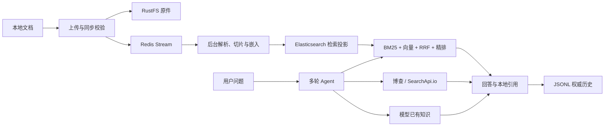

# SalmonMind

> 面向个人开发者的证据驱动 AI 项目理解与能力成长工作台。

SalmonMind 希望解决一个越来越常见的问题：AI 让项目完成得更快，但开发者对代码、设计取舍和真实贡献的理解未必同步增长。它把对话、个人文档、检索证据和后续能力验证组织在同一个 Workspace 中，帮助开发者把“项目做出来了”进一步沉淀为“我理解、能维护、能解释，也能证明”。

项目仍在持续开发。目前已经形成可独立使用的多轮 Agent 对话与本地文档 RAG 闭环；项目代码接入、网络资料入库、OCR 和模拟面试等能力尚未纳入当前版本。

## 愿景

SalmonMind 的长期目标不是再做一个通用聊天界面，而是建立一条围绕真实项目证据的成长闭环：

1. 汇集项目文档、个人笔记、提交与测试证据、简历、目标岗位和可信技术资料。
2. 梳理项目解决的问题、关键调用链、设计取舍、个人贡献、结果与局限。
3. 区分“已经掌握”“已有实现但尚未掌握”和“缺乏可靠证据”的内容。
4. 通过持续追问、学习与再次验证，把项目经历沉淀为可维护、可复述的个人能力。

知识库、RAG、网页搜索和 Agent 编排是实现这条闭环的基础设施，而不是为了展示技术栈而堆叠的目标。

## 已有功能

### 可恢复的多轮对话

- 基于 SSE 实时返回回答增量、运行状态、用量和最终结果。
- 新会话只在首次发送非空消息时创建，空白草稿不会污染会话列表。
- 对话历史以不可变 JSONL Entry 保存，通过 Active Path 表达重试和分支后的当前上下文。
- PostgreSQL 保存 Conversation 与 Run 元数据；Redis Checkpoint 仅用于运行加速，丢失后可以从权威历史恢复。
- 支持失败 Run 重试、长对话上下文压缩，以及刷新后的回答与引用恢复。

### 本地文档知识库

- 支持上传 TXT、Markdown、PDF 和 DOCX，并校验格式、大小与文件内容。
- 上传后通过 Redis Stream 异步派发任务，由 Server 内的有界后台线程使用 Apache Tika 解析。
- Knowledge 页面可以查看处理状态、解析元数据、失败原因、重试记录、Evidence 切片与检索诊断。
- 扫描型 PDF 会明确标记为 `OCR_REQUIRED`；当前版本不把无法解析的文档误报为成功。
- 原始文档保存在 RustFS，业务状态保存在 PostgreSQL，Elasticsearch 只承担可重建的检索投影。

### 混合检索与精排

- 同时执行 BM25 文本召回和向量召回。
- 使用 RRF（Reciprocal Rank Fusion）按排名融合两路候选，避免直接混合不可比较的原始分数。
- 通过硅基流动调用 `Qwen/Qwen3-Embedding-4B` 生成 2560 维向量，并使用 `Qwen/Qwen3-Reranker-4B` 精排。
- 检索诊断可展示关键词、向量、RRF 与精排阶段的顺序和分数。
- 向量或精排服务不可用时会显式标记降级，不把关键词兜底伪装成完整混合检索。

### 多来源 RAG 与可验证引用

- Agent 可以按问题选择本地知识检索、博查网页搜索或 SearchApi.io 网页搜索。
- 支持在同一个问题中组合本地文档与网页现状；检索无结果时仍可使用模型已有知识回答。
- 只有当前 Run 中真实返回、且被最终答案实际引用的来源才会生成 Citation。
- 本地来源使用 `L` 编号，网页来源使用 `W` 编号；旧轮次编号不会被误当成本轮证据。
- 历史只保存有界来源摘要，不长期保存大块工具结果，兼顾多轮理解、可恢复性与上下文预算。

完整的 Feature 003 能力、处理流程和验收边界见[功能报告](specs/features/003-local-document-rag-and-web-search/report.md)。

## 工作流程



## 技术栈

| 层次 | 主要技术 |
| --- | --- |
| 后端 | Java 21、Spring Boot 3.5、Spring Modulith、Spring AI / Spring AI Alibaba |
| 数据访问 | MyBatis-Plus、Flyway、PostgreSQL 17 |
| Agent 与模型 | ReactAgent、OpenAI-compatible Chat API、DeepSeek、硅基流动、Qwen3 Embedding / Reranker |
| 文档与检索 | Apache Tika、Elasticsearch 8、BM25、向量检索、RRF、Rerank |
| 异步与恢复 | Redis 7、Redis Stream、Consumer Group、Redisson Checkpoint |
| 对象存储 | RustFS（S3-compatible） |
| 前端 | React 19、TypeScript 6、Vite 8、React Markdown |
| 验证 | JUnit 5、Spring Modulith Test、Testcontainers、Oxlint |
| 本地运行 | Maven、npm、Docker Compose |

## 数据边界

| 数据 | 权威位置 | 说明 |
| --- | --- | --- |
| Conversation 正文与结构 | JSONL | 保存不可变 Entry 与 Active Path，是会话历史的权威来源 |
| Workspace、Conversation、Run、知识状态 | PostgreSQL | 保存业务元数据、状态与可修复索引 |
| Agent Checkpoint、文档处理队列 | Redis | 可恢复的运行态与异步队列，不替代业务权威数据 |
| 上传文档原件 | RustFS | 文档重建与重新索引的原始来源 |
| 关键词与向量索引 | Elasticsearch | 可丢弃、可从原件和业务状态重建的检索投影 |

## 快速开始

### 环境要求

- JDK 21
- Maven 3.9+
- Node.js 20+
- Docker Engine 与 Docker Compose v2

### 1. 准备本地配置

复制配置模板：

```powershell
Copy-Item apps/server/src/main/resources/application-dev-example.yml apps/server/src/main/resources/application-dev.yml
```

然后在 `application-dev.yml` 中填写需要的密钥。该文件已被 Git 忽略，不会进入仓库。

| 配置 | 是否必需 | 用途 |
| --- | --- | --- |
| `salmon.model.chat.api-key` | 对话必需 | 默认调用 DeepSeek `deepseek-v4-flash` |
| `salmon.model.embedding.api-key` | 文档索引与向量检索必需 | 通过硅基流动调用 Qwen3 Embedding 4B |
| `salmon.model.rerank.api-key` | 完整混合检索必需 | 通过硅基流动调用 Qwen3 Reranker 4B |
| `salmon.websearch.bocha.api-key` | 可选 | 启用博查网页搜索 |
| `salmon.websearch.search-api.api-key` | 可选 | 启用 SearchApi.io 网页搜索 |

模型或搜索 Key 未配置时 Server 仍可启动，但对应能力会在实际调用时明确报告未配置。

### 2. 启动基础设施

```powershell
docker compose up -d postgres redis elasticsearch rustfs
```

### 3. 启动后端

```powershell
mvn -f apps/server/pom.xml spring-boot:run
```

后端默认监听 `http://127.0.0.1:8080`，健康检查地址为 `http://127.0.0.1:8080/actuator/health`。

### 4. 启动前端

另开终端执行：

```powershell
npm install --prefix apps/web
npm run dev --prefix apps/web
```

浏览器打开终端提示的地址，默认是 `http://127.0.0.1:5173`。Vite 会把 `/api` 请求代理到后端。

### 5. 停止基础设施

```powershell
docker compose down
```

该命令会停止容器但保留本地数据。

## 验证

```powershell
mvn -f apps/server/pom.xml test
mvn -f apps/server/pom.xml package -DskipTests
npm run lint --prefix apps/web
npm run build --prefix apps/web
docker compose config
```

集成测试会通过 Testcontainers 使用 Docker。调用真实模型、网页搜索和完整文档索引还需要相应 API Key 与本地基础设施。

## 仓库结构

```text
apps/
  server/       Spring Boot 后端、Agent、Conversation 与 Knowledge 模块
  web/          React / Vite 前端
data/           Conversation JSONL 权威历史（内容不入 Git）
docs/           架构、开发与运维说明
infra/data/     本地基础设施数据（内容不入 Git）
specs/features/ 已确认的 Feature Spec、Plan 与功能报告
compose.yaml    PostgreSQL、Redis、Elasticsearch、RustFS 与 Server
```

## 文档导航

- [架构与模块边界](docs/architecture.md)
- [本地开发说明](docs/development.md)
- [部署与数据运维](docs/operations.md)
- [Feature 文档约定](specs/README.md)
- [Feature 003：本地文档 RAG 与网页搜索](specs/features/003-local-document-rag-and-web-search/spec.md)
- [Feature 003 功能报告](specs/features/003-local-document-rag-and-web-search/report.md)

## 当前边界

- 当前是单用户、单 Workspace 的本地应用，不包含登录、租户和权限系统。
- 本地知识来源暂限人工上传文档；项目代码、网络爬取笔记和自动同步尚未接入。
- 当前不做 OCR；扫描 PDF 会进入明确的待处理状态。
- 网页搜索只作为问答工具，不会自动写入本地知识库。
- Agent 自主触发、模拟面试和完整能力画像属于后续 Feature。
- 外部模型与搜索提供方的真实可用性取决于本地配置、账号配额和网络环境。

## 参与方式

SalmonMind 目前以个人产品和学习项目持续演进。欢迎通过 GitHub Issues 提交问题、使用反馈和边界清晰的改进建议；中大型能力会先在 `specs/features/` 中明确范围和验收标准，再进入实现。
