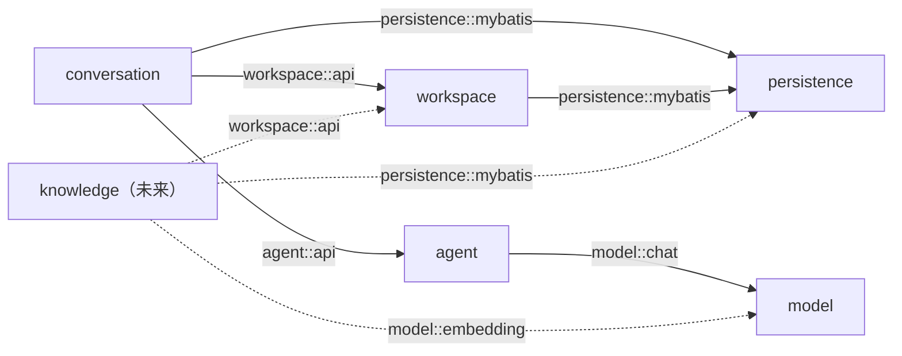

# 最小基座架构

## 当前目标

当前仓库提供本地 Workspace、可恢复的 Conversation 会话历史、模型适配边界与受控的进程内 Agent Loop。问答与聊天通过 Conversation 模块落地（创建、列表、打开、发送消息与失败 Run 重试）；知识检索、多用户等能力不属于当前基座。`apps/web` 提供基于 Workspace 的聊天页面，通过 `/api/conversations` 完成对话闭环。新增能力必须由真实 Feature 驱动，不能先创建空包或通用框架。

## 模块关系

| 模块 | 公开入口 | 当前职责 |
| --- | --- | --- |
| `persistence` | `mybatis` | 共享 PostgreSQL/MyBatis 技术能力（`PostgresUuidTypeHandler`） |
| `workspace` | `api` | 返回本安装唯一的 Workspace；Adapter 与 Controller 留在模块内部 |
| `model` | `chat` | `ChatModelProvider` / `ChatModelHandle`；OpenAI-compatible 生产 Adapter 与测试确定性 Adapter |
| `agent` | `api` | 会话感知的 `AgentSession`；`ReactAgentSessionAdapter` 封装 ReactAgent + RedisSaver + Checkpoint 叶子标记 |
| `conversation` | `api` | Conversation 创建、列表、打开、发送与重试；JSONL 权威历史、Active Path、恢复与 PostgreSQL 元数据索引 |

模块根包放 `package-info.java`，对外只通过 Named Interface（`api`、`chat`、`mybatis`）暴露。内部按职责分层：`application` 编排、`domain` 纯规则、`infrastructure/*` 技术 Adapter、`web` HTTP 转换；内部变化轴用 `application.port` 表达。禁止建立 `impl`、嵌套 `model`、逐层转发接口或空壳层。模块之间只依赖公开 Named Interface；依赖方向与模块集合由 Spring Modulith 结构测试校验。

`knowledge` 是已确定但尚未实施的能力，不创建空模块；首个 Knowledge Feature 必须按上图虚线落地，不能反向调用 Conversation 或 Agent。

## 知识数据模型（未来）

`knowledge` 落地后，`Source`、`SourceRevision`、`Evidence` 与 `IndexGeneration` 将承载知识管理：`Source` 是项目、文档、笔记、简历或职位描述等可信知识来源；`SourceRevision` 是不可变文本或 Markdown 版本，原件写入 RustFS；`Evidence` 是从 Revision 切分得到的可引用片段；`IndexGeneration` 是一次完整索引构建，新代次成功后才切换为 Active。PostgreSQL 保存业务元数据，RustFS 保存原件，Elasticsearch 保存派生 Evidence；Elasticsearch 不是权威数据源。上述模型当前只有数据约定，尚未有代码实现。

## 运行边界

- 默认 HTTP 监听 `127.0.0.1`；容器内由 Compose 显式改为 `0.0.0.0`，宿主端口仍只发布到 `127.0.0.1`。
- 模型或 Redis 未配置时应用仍可启动，只有实际调用对话能力才报告配置错误；Redis 短期状态可由 JSONL 权威历史重建。
- 业务 HTTP：`GET /api/workspace` 与 `/api/conversations` 五入口（列表、创建、打开、发送、重试）；`/actuator/health` 只表示进程存活，不代表模型提供方可用。
- 前端聊天页面通过 Vite 开发服务器代理 `/api` 到后端；发送期间同一 Conversation 的重复发送被禁用，其他 Conversation 仍可查看。
