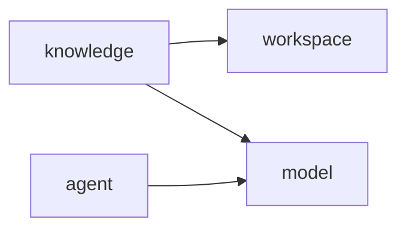

# 最小基座架构

## 当前目标

当前仓库只提供后续产品 Feature 可以依赖的稳定底座：一个本地 Workspace、可信知识原件与可重建索引、模型适配边界，以及一个受控的进程内 Agent Loop。

问答、聊天、Profile、Skill、Assessment、爬取、Web UI 和多用户系统都不属于当前基座。新增能力必须由真实 Feature 驱动，不能先创建空包或通用框架。

## 模块关系

| 模块 | 公开入口 | 当前职责 |
| --- | --- | --- |
| `workspace` | `WorkspaceRegistry` | 返回本安装唯一的 Workspace |
| `model` | `ModelGateway` | 执行 OpenAI-compatible Chat 与 Embedding 请求 |
| `knowledge` | `KnowledgeBase` | 管理 Source / Revision，重建 Evidence 索引并执行检索 |
| `agent` | `AgentRuntime` | 在步骤与工具输出预算内执行文本/工具循环 |

每个模块的根包是公开 API，`internal` 包只保存实现。模块之间只能依赖公开 API；Spring Modulith 结构测试负责校验允许的依赖和实际模块集合。

## 知识数据模型

- `Workspace`：本地安装的唯一工作空间。
- `Source`：项目、文档、笔记、简历或职位描述等可信知识来源。
- `SourceRevision`：Source 的不可变文本或 Markdown 版本；原件写入 RustFS。
- `Evidence`：从 Revision 切分得到的可引用片段。
- `IndexGeneration`：一次完整索引构建。新代次成功后才切换为 Active。

PostgreSQL 保存业务元数据，RustFS 保存原件，Elasticsearch 保存派生 Evidence。重建从 PostgreSQL 枚举 Revision、从 RustFS读取原件，重新切分并生成向量，再原子切换 Active Generation；因此 Elasticsearch 不是权威数据源。

## 运行边界

- 默认 HTTP 监听 `127.0.0.1`；容器内由 Compose 显式改为 `0.0.0.0`，宿主端口仍只发布到 `127.0.0.1`。
- Agent Run 不持久化，进程退出即结束；取消在一次模型或工具调用完成后协作生效。
- 模型、RustFS 或 Elasticsearch 未配置时，应用仍可启动，但相应端口会返回明确的未配置/基础设施异常。
- 当前没有业务 Controller；应用健康不代表模型提供方可用。
