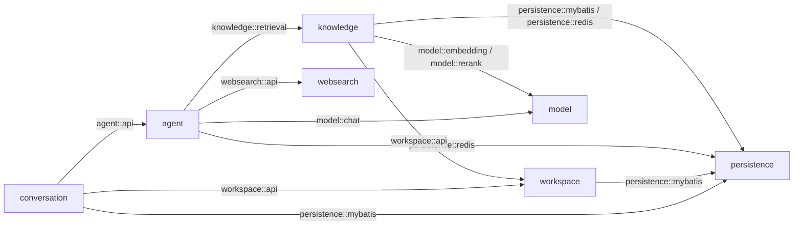

# SalmonMind 当前架构

## 当前目标

SalmonMind 当前提供单 Workspace 下的可恢复多轮 Agent 对话、本地文档知识库、混合检索与 SearchApi.io 网页搜索。系统强调两类边界：一类是模块之间只通过小型公开接口协作；另一类是跨 PostgreSQL、JSONL、Redis、RustFS 和 Elasticsearch 时明确谁是权威、谁可以重建。

知识库、检索和网页搜索已经形成可用闭环；项目代码接入、网络资料入库、OCR、多用户与自主触发 Agent 不属于当前版本。

## 模块关系

| 模块 | 公开入口 | 当前职责 |
| --- | --- | --- |
| `persistence` | `mybatis`、`redis` | PostgreSQL/MyBatis 与 Redis/Redisson 的共享技术能力，不承载业务流程 |
| `workspace` | `api` | 返回本安装唯一的 Workspace |
| `model` | `chat`、`embedding`、`rerank` | 隔离 Chat、Embedding、Rerank 模型合同及提供方适配 |
| `knowledge` | `api`、`retrieval` | 文档上传、异步处理、状态查询、Evidence 预览、诊断检索与有界本地召回 |
| `websearch` | `api` | SearchApi.io 的结构化搜索合同，隐藏鉴权和响应差异 |
| `agent` | `api` | 封装 ReactAgent、工具策略、Run 内来源登记、上下文预算和 Redis Checkpoint |
| `conversation` | `api` | 会话创建、列表、打开、发送与重试；编排 Agent 并维护 JSONL 权威历史和 PostgreSQL 元数据 |

模块根包使用 Spring Modulith 声明允许依赖，对外只通过 Named Interface 暴露合同。内部按职责组织为 `application` 编排、`domain` 规则、`infrastructure/*` 技术适配和 `web` HTTP 转换。Conversation 不直接访问检索引擎或网页提供方，Knowledge 与 WebSearch 也不反向依赖 Agent。

## 数据权威

| 数据 | 权威位置 | 恢复与一致性语义 |
| --- | --- | --- |
| Conversation Entry 与 Active Path | JSONL | 完整会话内容的权威来源；Redis 丢失后可据此重建上下文 |
| Workspace、Conversation、Run 元数据 | PostgreSQL | 保存状态、活动叶子和修复指针，不保存消息正文 |
| Knowledge Source、Revision 与处理状态 | PostgreSQL | 保存文档业务身份、不可变版本、处理尝试和当前索引代次 |
| 文档原件 | RustFS | 与 PostgreSQL 元数据共同构成知识重建来源 |
| Evidence 文本、BM25 与 2560 维向量 | Elasticsearch | 可丢弃的派生投影；只暴露 READY 且属于有效代次的内容 |
| Agent Checkpoint | Redis | 可重建的短期运行状态，不是历史权威 |
| 文档处理消息 | Redis Stream | 至少一次投递的异步队列；PostgreSQL 只保存少量恢复状态，不承担高频出入队 |

## 文档处理链路

上传请求只负责校验、原件落地、业务状态提交和 Redis Stream 入队，随后返回 `202 Accepted`。Server 内的有界后台线程通过 Consumer Group 消费任务，使用 Apache Tika 解析正文，按稳定规则生成 Evidence，再调用嵌入模型并发布 Elasticsearch 索引。

消息允许重复投递。消费者会根据 Revision、处理尝试和索引代次判断是否已经完成，避免重复 Evidence。只有整份文档的解析、嵌入、索引校验和业务状态全部完成后才进入 `READY`；进程退出、Redis 短暂不可用或部分索引写入都不会让半成品参与检索。

## 检索与回答链路

本地查询分别执行 BM25 与向量召回，在应用层使用 RRF 融合并去重，再调用精排模型生成有限 Evidence。Agent 可以在同一 Run 中选择本地检索、SearchApi.io 或模型已有知识。

每次工具运行只登记当前 Run 的有界来源。回答完成后，系统将正文中的短引用编号与本 Run 的真实来源核对，只把合法 Citation 随 Assistant Entry 写入 JSONL。原始工具结果不作为长期历史保存；后续轮次如果需要再次核验原文或实时信息，必须重新检索。

## Conversation、事务与 SSE

用户消息先进入 JSONL 权威历史，再启动 Agent。回答成功后，Assistant Entry 先持久化，随后用一个短 PostgreSQL 事务推进 Run 状态和 Conversation 活动叶子；事务提交完成后才发送最终 SSE 事件。

模型调用、工具调用、JSONL 写入和 SSE 网络传输不会被伪装成一个跨系统长事务。客户端在成功提交后断流不会把 Run 降级为失败，刷新时仍可从持久化状态恢复结果。工具启用后的每轮上下文都从 JSONL Active Path 重建，避免 Redis Checkpoint 成为无法恢复的隐藏历史。

## 运行边界

- 默认 HTTP 只监听 `127.0.0.1`；Compose 内部监听 `0.0.0.0`，宿主端口仍只发布到本机。
- 模型、Redis、RustFS、Elasticsearch 或网页搜索未配置时应用仍可启动，只有调用对应能力时返回稳定错误。
- `/actuator/health` 表示 Server 进程健康，不代表外部模型和搜索提供方一定可用。
- 前端通过 Vite 代理 `/api` 到后端；Knowledge 页面负责文档、处理状态、Evidence 和检索诊断的可视化。
- 模块依赖由 Spring Modulith 结构测试约束；关键存储与恢复路径通过集成测试验证。
