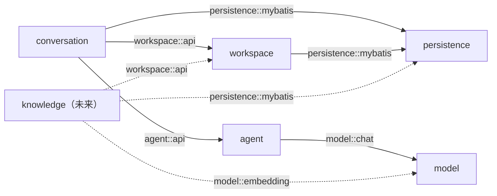
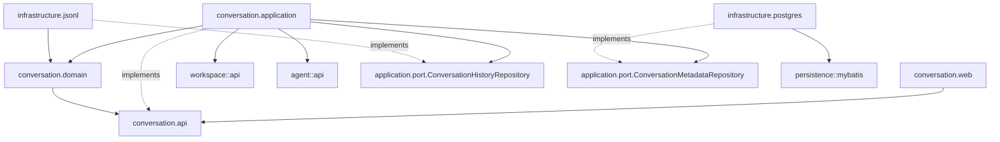

# Feature 001：基础 Agent 多轮对话实施计划

Status: Draft

## 计划编制基线与前置条件

本 Plan 最初编制时仓库已经具备：

- 单例 Workspace 及 `GET /api/workspace`。
- PostgreSQL、Flyway、MyBatis-Plus 和 Testcontainers PostgreSQL 测试基线。
- 能以 OpenAI-compatible 配置创建 `ReactAgent` 的 `agent` 模块，但公开入口仍是单次 `chat(String)`。
- React 19 + Vite 的 Workspace 壳层页面。
- PostgreSQL、Elasticsearch、RustFS 和 Server 的 Compose 配置；尚无 Redis。

当前工作区包含开发者尚未提交的既有修改。实施开始前必须重新读取 `git status`，只处理本 Feature 的重叠文件，不得重置、覆盖或顺手修复无关改动。

当前执行检查点：开发者确认已执行到第 2 步，随后因模块职责与依赖方向不够清晰而暂停。此次修订只调整后续实施计划，不重新判定第 2 步完成情况，也不重复运行其已有验证；接手时以原执行报告和当前工作区为证据，只补第 2.5 步重构实际影响的验证。

项目声明 Spring AI Alibaba BOM `1.1.2.2` 和 Spring AI `1.1.2`。官方制品已发布 `spring-ai-alibaba-agent-framework:1.1.2.2`；当前本机 Maven 缓存中可检查到的是 `1.1.2.0`。本地旧版字节码显示：

- `ReactAgent.Builder` 支持注入 `BaseCheckpointSaver`。
- `ReactAgent.call(..., RunnableConfig)` 支持稳定 `threadId`。
- `RedisSaver` 由 `RedissonClient` 构建，并提供 `get`、`put`、`list` 和 `release`。

这些信息只用于确定验证方向。实施时必须先解析项目实际使用的 `1.1.2.2` 依赖并以编译和聚焦集成测试确认，不得直接按 `1.1.2.0` 的字节码假定精确接口不变。

实施还需要以下授权：

- Plan 被确认不代表允许修改业务代码；进入实施需要开发者单独明确授权。
- 首次启动 Testcontainers Redis 或本地 Redis 前询问一次；获准后，后续步骤复用该结果，不重复申请或重复运行同一验证。
- 真实模型多轮 Smoke Test 涉及外部网络、凭据和可能费用，必须在自动化验证完成后单独询问。

## 实施范围与禁止范围

本 Plan 只交付：

- 单 Workspace 下多个 Conversation 的创建、列表、打开、发送和失败重试。
- PostgreSQL Conversation / Run 元数据。
- 本地版本化 JSONL 权威历史、Active Path、恢复和压缩索引合同。
- 单进程内按 Conversation 串行的完整 Run。
- Spring AI Alibaba `ReactAgent` + RedisSaver 短期状态。
- 非流式基础聊天页面和稳定错误展示。

禁止加入：RAG、工具调用、多 Agent、分支操作界面、实际状态压缩、流式输出、RustFS 聊天存储、多实例写入、登录、部署、删除与搜索 Conversation，以及与当前 Feature 无关的重构。

## 固定的模块与接口方向

### 系统模块图与依赖规则

模块首先按业务能力划分，而不是在项目根部按 `controller/service/repository` 横向切开。完整系统依赖图固定为：



实线是本 Feature 第 2.5 步后必须存在的模块和依赖；虚线是已确定但本 Feature 不实施的未来依赖。因为 RAG/知识能力不在本 Feature 内，`knowledge` 不创建空包、不加入当前模块集合；等第一个 Knowledge Feature 获批时再按虚线落地。

| 调用方模块 | 允许依赖 | 禁止依赖 |
| --- | --- | --- |
| `conversation` | `workspace::api`、`agent::api`、`persistence::mybatis` | `workspace`/`agent` 内部包、其他业务模块、全局 Mapper/PO |
| `workspace` | `persistence::mybatis` | `conversation`、`agent` |
| `agent` | `model::chat` | `conversation`、`workspace`、`persistence`、`model` 内部包 |
| `model` | 无其他项目模块依赖 | 任一业务模块；Provider Adapter 只依赖外部模型 SDK/Spring AI |
| `persistence` | 无其他项目模块依赖 | 任一业务实体、Repository 或业务规则 |
| `knowledge`（未来） | `workspace::api`、`model::embedding`、`persistence::mybatis` | `conversation`、`agent`、其他模块内部包 |

`persistence` 是经过复用证据确认的聚焦技术模块：当前 `PostgresUuidTypeHandler` 同时服务 Workspace 与 Conversation，因此从 `workspace.impl` 移入 `persistence::mybatis`。它不是全局基础设施杂物箱，不接收 Mapper、Entity、migration、JSONL、Redis 或业务配置。

箭头表示项目内编译期依赖，只允许单向流动。外部库依赖不画成业务模块边：`agent` 可以依赖 Spring AI Alibaba 和 Redisson，但 OpenAI-compatible ChatModel 的创建与配置属于 `model::chat`；各 PostgreSQL Adapter 可以依赖 MyBatis-Plus；JSONL Adapter 可以依赖 Jackson。共用同一个 PostgreSQL、Redis、Jackson、MyBatis 或文件系统不等于业务模块之间存在依赖。

未来增加 `knowledge`、对象存储等模块时，必须先把新边和能力所有者写入 Spec/Plan，再允许编码；不得通过互相调用、绕过公开入口或共享数据库实体消解边界。

跨模块协作遵循以下规则：

1. 需要立即返回结果的一对一调用，由发起业务流程的模块负责编排，并只调用能力所有者的 `api`。
2. 一个已经发生的事实需要通知多个消费者，且调用方不依赖同步返回值时，才使用领域事件；事件不能用来隐藏本应同步成立的前置条件。
3. 出现 A 调 B、B 又调 A 时，先检查业务流程所有权；通常应把编排留在发起方，或提取一个有真实业务含义的新模块，禁止用全局 Service Locator、`common` 或事件绕出循环依赖。
4. 两个模块需要同一种数据时，各自依赖数据所有者的公开查询能力；不得共同读写同一 Mapper、PO、JSONL 文件或 Redis Key。

本 Feature 实际存在的五个模块必须使用 Spring Modulith `allowedDependencies` 明确声明实线边；跨模块公开包使用 Named Interface `api`、`chat` 或 `mybatis`。`ApplicationModuleStructureTest` 必须验证当前模块集合准确为 `persistence`、`workspace`、`model`、`agent`、`conversation`，以及 Named Interface、允许依赖和无环结构，而不只验证 Spring Bean 能否启动。

### 基础设施归属与晋升规则

基础设施按职责分为三类，不建立一个容纳所有数据库、缓存、文件和外部 SDK 的全局 `infrastructure` 模块：

1. Docker Compose、数据库实例、Redis 实例、数据卷和部署配置属于运行环境基础设施，保留在 `compose.yaml`、`infra/` 和配置文件中。
2. 只服务一个业务模块的技术适配器属于该模块内部。例如 Conversation 的 PostgreSQL 元数据适配器和 JSONL 历史适配器分别放在 `conversation.infrastructure.postgres` 与 `conversation.infrastructure.jsonl`，不向其他业务模块公开。
3. 只有同时满足明确复用需求和独立能力边界时，才晋升为独立共享技术模块：至少有两个真实消费者或多个可替换 Adapter，并且具有独立配置、生命周期、故障语义或较重外部依赖。该模块只能暴露技术能力，不得携带任一业务模块的实体、Repository 或业务规则。当前 `persistence::mybatis` 因两个数据库消费者成立，`model::chat` 因生产/确定性测试 Adapter、独立模型配置和较重外部依赖成立。

因此，本 Feature 不预建 `common`、`utils`、全局 Repository 层、通用事件总线或空壳基础设施模块。后续若多个模块确实需要对象存储、模型网关等能力，再根据上述证据单独立项提取为具有具体能力名称的模块。

### `conversation` 深模块

`conversation` 是当前主要业务模块，模块内部调用方向固定为：



`api` 是外部 seam；`application.port` 只是 `conversation` 的内部 seam，不是 Named Interface，其他模块不得依赖。Spring 负责把 application 实现和 infrastructure Adapter 装配到相应 interface，调用方不得自行 `new` Adapter。

对外 `api` 只表达业务能力；`domain` 不依赖 Spring、MyBatis、Jackson、文件路径或 `agent` 类型；`application` 负责 PostgreSQL、JSONL 与 Agent 之间的操作顺序和失败语义；`infrastructure` 实现端口且不可反向成为业务入口；`web` 只做协议转换。

内部端口只为两个真实持久化变化轴建立：Conversation 元数据和 Conversation 历史。Agent 调用已经由 `agent::api` 提供外部 seam，不再包装一层 `ConversationAgentPort`。禁止形成 `Dao -> DaoImpl -> Repository -> RepositoryImpl -> Service` 的逐层转发链，也不为每个 Mapper、codec 或内部类创建接口。

`workspace` 与 `agent` 同样只公开最小 `api`，但不强制复制 `conversation` 的完整目录。某一层没有真实职责时可以不存在，避免为了目录对称制造空 Service、空 Repository 或单实现接口。

公开接口只表达五个用例：

1. 列出 Conversation。
2. 创建 Conversation。
3. 打开 Conversation。
4. 发送用户消息并等待完整回答。
5. 重试待回答的失败或中断 Run。

第 2.5 步完成时，`ConversationService` 的已实现 interface 收敛为 `create()`、`list()`、`open(UUID conversationId)`；不再要求 Controller 传入单例 Workspace ID。第 3 步在同一个 interface 上增加 `send(UUID conversationId, String text)` 与 `retry(UUID conversationId, UUID runId)`，返回 `ConversationRunResult`。Conversation application 自己通过 `workspace.api.WorkspaceRegistry.current()` 取得和校验当前 Workspace。

公开结果使用位于 `api` 的 Conversation、Entry、Run 稳定业务记录；不暴露 Mapper、PO、内部 domain 对象、文件路径、Spring AI Message、RunnableConfig、Redis Key 或框架异常。持久化历史中的用量值由 `conversation` 自己定义，`application` 在 Agent 结果边界完成映射，避免 Entry 类型反向依赖 `agent` 内部模型。

### 第 2.5 步完成后的目标目录与文件名

以下树是第 2.5 步的冻结目标。执行 Agent 应优先移动和重命名现有文件，不得保留旧 `*.impl`、`conversation.model`、`workspace.model` 兼容壳，也不得为了目录对称创建未列出的空类。

```text
apps/server/src/main/java/com/yuyu/salmonmind/
├── persistence/
│   ├── package-info.java
│   └── mybatis/
│       ├── package-info.java
│       └── PostgresUuidTypeHandler.java
├── workspace/
│   ├── package-info.java
│   ├── api/
│   │   ├── package-info.java
│   │   ├── Workspace.java
│   │   └── WorkspaceRegistry.java
│   ├── infrastructure/postgres/
│   │   ├── PostgresWorkspaceRegistry.java
│   │   ├── WorkspaceEntity.java
│   │   └── WorkspaceMapper.java
│   └── web/
│       └── WorkspaceController.java
├── model/
│   ├── package-info.java
│   ├── chat/
│   │   ├── package-info.java
│   │   ├── ChatModelException.java
│   │   ├── ChatModelHandle.java
│   │   └── ChatModelProvider.java
│   └── infrastructure/openai/
│       └── OpenAiCompatibleChatModelProvider.java
├── agent/
│   ├── package-info.java
│   ├── api/
│   │   ├── package-info.java
│   │   ├── AgentExecutionException.java
│   │   ├── AgentMessage.java
│   │   ├── AgentRequest.java
│   │   ├── AgentResult.java
│   │   ├── AgentSession.java
│   │   └── AgentUsage.java
│   └── infrastructure/reactagent/
│       └── ReactAgentSessionAdapter.java
└── conversation/
    ├── package-info.java
    ├── api/
    │   ├── package-info.java
    │   ├── AssistantMessagePayload.java
    │   ├── CompactionPayload.java
    │   ├── Conversation.java
    │   ├── ConversationDetail.java
    │   ├── ConversationException.java
    │   ├── ConversationService.java
    │   ├── ConversationSummary.java
    │   ├── Entry.java
    │   ├── EntryPayload.java
    │   ├── Run.java
    │   ├── TokenUsage.java
    │   └── UserMessagePayload.java
    ├── application/
    │   ├── ConversationApplicationService.java
    │   ├── ConversationRecoveryService.java
    │   └── port/
    │       ├── ConversationHistoryRepository.java
    │       └── ConversationMetadataRepository.java
    ├── domain/
    │   ├── ConversationHistory.java
    │   └── ConversationTitle.java
    └── infrastructure/
        ├── jsonl/
        │   ├── JsonlCodec.java
        │   └── JsonlConversationHistoryRepository.java
        └── postgres/
            ├── ConversationEntity.java
            ├── ConversationMapper.java
            ├── PostgresConversationMetadataRepository.java
            ├── RunEntity.java
            └── RunMapper.java
```

职责按文件冻结如下：

| 文件 | 唯一职责 |
| --- | --- |
| `ConversationApplicationService` | 实现 `ConversationService`；编排创建、列表和打开，不直接导入 Mapper、Entity、Jackson 或文件路径 |
| `ConversationRecoveryService` | 使用两个 Repository 协调 JSONL 权威历史与 PostgreSQL 可修复索引，不直接解析 JSON |
| `ConversationHistoryRepository` | Conversation 历史的创建、读取、追加、孤儿清理和压缩定位 interface |
| `ConversationMetadataRepository` | Conversation/Run 元数据的查询、创建和修复写入 interface；不接受或返回 MyBatis Entity |
| `ConversationHistory` | Header、Entry、字节偏移的内部不可变快照，并负责 Active Path 与压缩节点定位规则；小型 Header/offset 值使用嵌套 record，不再单建文件 |
| `ConversationTitle` | 临时标题与首条用户消息截断规则 |
| `JsonlConversationHistoryRepository` | 唯一文件 I/O Adapter；承接原 `ConversationFileStore` 的原子创建、追加、刷盘、torn-tail 修复和偏移读取 |
| `JsonlCodec` | JSONL v1 单行编码/解码；不执行文件 I/O，不导入 `agent` 类型 |
| `PostgresConversationMetadataRepository` | 唯一 MyBatis 元数据 Adapter；封装 Mapper、Entity 与 api/domain 值之间的映射 |
| `ChatModelProvider` | `model::chat` interface；返回包含 Spring AI `ChatModel`、provider 和 model 名的 `ChatModelHandle` |
| `OpenAiCompatibleChatModelProvider` | 生产模型 Adapter；独占 base URL、API key、model name 的读取、校验和延迟创建 |
| `ReactAgentSessionAdapter` | 实现 `AgentSession`，从 `ChatModelProvider` 获取模型，封装 ReactAgent、RedisSaver、Redisson 和 Checkpoint 叶子标记；不再创建 OpenAI ChatModel |
| `PostgresWorkspaceRegistry` | 实现 `WorkspaceRegistry`，封装 Workspace Mapper/Entity |
| `PostgresUuidTypeHandler` | 为所有 PostgreSQL 模块提供 UUID JDBC `OTHER` 转换，不包含业务判断 |

`ChatModelHandle` 暴露 Spring AI `ChatModel` 是一个受控的技术 interface：只允许 `agent.infrastructure.reactagent` 依赖，不能进入 `agent.api`、`conversation` 或 HTTP。确定性测试 Provider 作为测试内 Adapter，不为它新增生产源码文件。

以下文件属于后续步骤，**第 2.5 步不得提前创建**：

```text
conversation/application/ConversationExecutionQueue.java       # 第 3 步：按 Conversation 串行
conversation/application/ConversationRunCoordinator.java       # 第 3 步：发送/重试完整 Run 顺序
conversation/api/ConversationRunResult.java                     # 第 3 步：发送/重试稳定结果
conversation/web/ConversationController.java                    # 第 3 步：五个 HTTP 入口
conversation/web/ConversationExceptionHandler.java              # 第 3 步：稳定错误到 HTTP 映射
```

发送请求的简单 `text` DTO 默认作为 `ConversationController` 的 package-private 嵌套 record，不建立 `dto` 目录；只有后续出现第二个真实消费者时才允许单独成文件。

测试文件在第 2.5 步只移动和替换，不复制：

```text
apps/server/src/test/java/com/yuyu/salmonmind/ApplicationModuleStructureTest.java
apps/server/src/test/java/com/yuyu/salmonmind/workspace/WorkspaceModuleIntegrationTest.java
apps/server/src/test/java/com/yuyu/salmonmind/agent/infrastructure/reactagent/AgentCheckpointIntegrationTest.java
apps/server/src/test/java/com/yuyu/salmonmind/conversation/ConversationPersistenceIntegrationTest.java
apps/server/src/test/java/com/yuyu/salmonmind/conversation/infrastructure/jsonl/JsonlConversationHistoryRepositoryTest.java
```

`ConversationPersistenceIntegrationTest` 通过 `conversation.api` 验证模块行为；确需制造数据库落后状态时使用测试侧 SQL/JdbcTemplate，不导入 Entity 或 Mapper。JSONL 聚焦测试与 Adapter 同包，允许验证 torn-tail、坏行和字节偏移，但不得成为业务模块调用示例。

### 现有文件到目标文件的迁移表

| 当前文件/目录 | 第 2.5 步目标 | 处理规则 |
| --- | --- | --- |
| `conversation/Conversation*.java`、`Entry*.java`、`Run.java`、各 Payload | `conversation/api/` 同名文件 | 移动；新增 `TokenUsage`，Payload 不再导入 `AgentUsage` |
| `conversation/impl/MyBatisConversationService.java` | `conversation/application/ConversationApplicationService.java` | 重命名并改为只依赖两个内部 Repository、`workspace::api` 和未来需要时的 `agent::api` |
| `conversation/impl/ConversationRecovery.java` | `conversation/application/ConversationRecoveryService.java` | 重命名；Mapper 与文件 I/O 下沉到 Adapter |
| `conversation/impl/ConversationFileStore.java` | `conversation/infrastructure/jsonl/JsonlConversationHistoryRepository.java` | 重命名并实现 History Repository；Active Path 规则移入 `ConversationHistory` |
| `conversation/impl/JsonlCodec.java` | `conversation/infrastructure/jsonl/JsonlCodec.java` | 移动；改用 `conversation.api.TokenUsage` |
| `conversation/impl/ConversationTitle.java` | `conversation/domain/ConversationTitle.java` | 移动，保持纯 Java |
| `conversation/impl/*Mapper.java`、`conversation/model/*Entity.java` | `conversation/infrastructure/postgres/` | 移动；只由 Postgres Adapter 使用 |
| 新文件 | `conversation/application/port/*Repository.java` | 从当前 Service/Recovery 对 Mapper 与 FileStore 的真实调用提炼，不增加逐层转发接口 |
| 新文件 | `conversation/domain/ConversationHistory.java` | 从原 `JsonlHistory`、Active Path 和 compaction 定位逻辑提炼 |
| `agent/*.java` | `agent/api/` 同名文件 | 移动并建立 Named Interface `api` |
| `agent/impl/ReactAgentAdapter.java` | `agent/infrastructure/reactagent/ReactAgentSessionAdapter.java` | 移动和重命名；模型创建迁到 `model`，Redis/Checkpoint 行为不变，不拆出公开 Redis seam |
| `ReactAgentAdapter` 内的 OpenAI-compatible 模型配置与创建 | `model/chat/*`、`model/infrastructure/openai/OpenAiCompatibleChatModelProvider.java` | 提取为 `model::chat`；Agent 只消费 `ChatModelHandle` |
| `workspace/Workspace.java`、`WorkspaceRegistry.java` | `workspace/api/` | 移动并建立 Named Interface `api` |
| `workspace/WorkspaceController.java` | `workspace/web/WorkspaceController.java` | 移动，只依赖 `workspace.api` |
| `workspace/impl/MyBatisWorkspaceRegistry.java` | `workspace/infrastructure/postgres/PostgresWorkspaceRegistry.java` | 移动和重命名 |
| `workspace/impl/WorkspaceMapper.java`、`workspace/model/WorkspaceEntity.java` | `workspace/infrastructure/postgres/` | 移动 |
| `workspace/impl/PostgresUuidTypeHandler.java` | `persistence/mybatis/PostgresUuidTypeHandler.java` | 移入共享技术模块，并把 MyBatis 扫描配置改为新包 |

完成迁移后，`conversation.impl`、`conversation.model`、`agent.impl`、`workspace.impl`、`workspace.model` 必须不存在；OpenAI-compatible 模型配置不得继续留在 Agent；不得保留代理类、deprecated 壳或双套 Bean。

### `package-info.java` 与 Named Interface 声明

执行 Agent 必须按下表声明，不得自行放宽依赖：

| 文件 | 必须表达的声明 |
| --- | --- |
| `persistence/package-info.java` | `@ApplicationModule(allowedDependencies = {})` |
| `persistence/mybatis/package-info.java` | `@NamedInterface("mybatis")` |
| `workspace/package-info.java` | `@ApplicationModule(allowedDependencies = {"persistence :: mybatis"})` |
| `workspace/api/package-info.java` | `@NamedInterface("api")` |
| `model/package-info.java` | `@ApplicationModule(allowedDependencies = {})` |
| `model/chat/package-info.java` | `@NamedInterface("chat")` |
| `agent/package-info.java` | `@ApplicationModule(allowedDependencies = {"model :: chat"})` |
| `agent/api/package-info.java` | `@NamedInterface("api")` |
| `conversation/package-info.java` | `@ApplicationModule(allowedDependencies = {"workspace :: api", "agent :: api", "persistence :: mybatis"})` |
| `conversation/api/package-info.java` | `@NamedInterface("api")` |

`application.port`、`domain`、`infrastructure` 和 `web` 都不是 Named Interface。Java `public` 只在框架确有需要时使用，不等于允许其他模块调用；跨模块合法性以 Named Interface 和 Modulith 验证为准。

本 Feature 不创建 `knowledge/package-info.java` 或 `model/embedding/package-info.java`。未来 Knowledge Feature 落地时，预期声明为 `@ApplicationModule(allowedDependencies = {"workspace :: api", "model :: embedding", "persistence :: mybatis"})`，但必须由该 Feature 再确认具体 interface，不能现在用空包占位。

### 固定调用链

第 2.5 步已有用例：

```text
创建：ConversationService.create
  -> ConversationApplicationService
  -> WorkspaceRegistry.current
  -> ConversationHistoryRepository.create
  -> ConversationMetadataRepository.create

列表：ConversationService.list
  -> ConversationApplicationService
  -> WorkspaceRegistry.current
  -> ConversationMetadataRepository.list

打开：ConversationService.open
  -> ConversationApplicationService
  -> WorkspaceRegistry.current
  -> ConversationMetadataRepository.find
  -> ConversationRecoveryService
       -> ConversationHistoryRepository.read
       -> ConversationHistory（Active Path / Compaction 定位）
       -> ConversationMetadataRepository.repair
  -> ConversationDetail
```

第 3 步新增用例：

```text
发送/重试：ConversationController
  -> ConversationService
  -> ConversationApplicationService
  -> ConversationExecutionQueue（按 conversationId 串行）
  -> ConversationRunCoordinator
       -> ConversationRecoveryService
       -> ConversationHistoryRepository.append(user)
       -> ConversationMetadataRepository.startRun
       -> AgentSession.complete
            -> ReactAgentSessionAdapter
            -> ChatModelProvider（model::chat）
            -> ReactAgent + RedisSaver + Checkpoint leaf marker
       -> ConversationHistoryRepository.append(assistant)
       -> ConversationMetadataRepository.finishRun
  -> ConversationRunResult
```

失败路径仍由 `ConversationRunCoordinator` 保持既定顺序：Agent 失败时不追加 Assistant Entry，只完成失败 Run；JSONL 已成功而 PostgreSQL 落后时由下一次 `ConversationRecoveryService` 修复。PostgreSQL Adapter 与 JSONL Adapter 永远不互相调用，`agent` 永远不回调 `conversation`，`workspace` 永远不知道 Conversation 的存在。

### `agent` 模块 seam

把现有 `BaseAgent.chat(String)` 收敛成会话感知的 Agent 接口。`conversation` 只传入：

- 稳定 Conversation / thread 身份。
- 期望能够复用的 Checkpoint 叶子 ID。
- 预分配的回答叶子 ID。
- 从 JSONL Active Path 投影出的完整模型可见消息。

Agent 返回最终文本、提供方、模型和可获得的用量。`ReactAgentSessionAdapter` 封装 ReactAgent、RedisSaver、Redisson 和 Checkpoint 判断，通过 `model::chat` 获取 ChatModel；第 3 步的测试 `AgentSession` Adapter 直接返回确定性回答。生产/测试两种 Agent Adapter 证明 `agent::api` seam 成立，不再为每个内部类建立额外 interface。

Checkpoint 标记使用独立 Redis Key 保存其对应的 JSONL 叶子：

- 标记等于当前用户 Entry 的 `parentId` 时，可以复用 Checkpoint，只向 ReactAgent 发送最新用户消息。
- 标记缺失、指向不存在 Entry 或与期望叶子不一致时，先释放旧 Checkpoint，再以完整模型可见消息重建。
- ReactAgent 成功返回后，将标记更新为预分配的 Assistant Entry ID。
- 若模型成功后 JSONL 尚未追加 Assistant 就发生中断，下一次重试会发现标记与 JSONL 不一致并重建，不采用幽灵回答。

具体 Redis Key、序列化器和清理调用由第 1 步针对 `1.1.2.2` 验证后落定，但上述一致性语义不可改变。

## 固定的数据与 HTTP 合同

### PostgreSQL

新增 Flyway `V003` migration，并把 conversation migration 目录加入 Flyway locations。

`conversations` 至少包含：

- `id UUID` 主键。
- `workspace_id UUID`，引用唯一 Workspace。
- `title VARCHAR(120)`。
- `history_format_version INTEGER`。
- `active_leaf_entry_id UUID NULL`。
- `last_confirmed_seq BIGINT NOT NULL`。
- `latest_compaction_entry_id UUID NULL`。
- `latest_compaction_seq BIGINT NULL`。
- `latest_compaction_byte_offset BIGINT NULL`。
- `created_at`、`updated_at`。

三个压缩索引字段必须同时为空或同时非空，并通过读取 JSONL 对应行校验；它们不是跨存储外键。
新建但尚无消息的 Conversation 使用“新对话”作为临时标题；首条用户 Entry 与数据库索引提交成功时，再更新为该消息的单行截断文本。

`conversation_runs` 至少包含：

- `id UUID` 主键。
- `conversation_id UUID` 外键。
- `trigger_entry_id UUID`。
- `status`：`RUNNING | SUCCEEDED | FAILED | INTERRUPTED`。
- `error_code NULL`。
- `started_at`、`ended_at NULL`。

使用 PostgreSQL partial unique index 保证每个 Conversation 最多一个 `RUNNING` Run。消息正文不得进入数据库。

### JSONL v1

默认文件为 `data/conversations/<conversation-id>/events.jsonl`，数据根目录可配置。Server 容器必须显式挂载该业务数据目录；它不得与 `infra/data/` 混用。

第一行为 Header：

```json
{"type":"conversation","formatVersion":1,"conversationId":"uuid","createdAt":"ISO-8601"}
```

后续每行是一个完整 Entry，固定公共字段为：

```json
{"formatVersion":1,"conversationId":"uuid","id":"uuid","seq":1,"parentId":null,"type":"user_message","createdAt":"ISO-8601","payload":{}}
```

类型化 payload：

- `user_message`：`text`、`runId`。
- `assistant_message`：`text`、`runId`、`provider`、`model`、可空 `usage`。
- `compaction`：`summary`、`coveredThroughEntryId`、完整 `retainedTail`、`tokensBefore` 和可空生成元数据；本 Feature 只支持编码、读取和索引校验，不生成此 Entry。

写入规则：

1. 每个 Conversation 由一个进程内队列拥有，队列覆盖读取、恢复和完整 Run。
2. 预分配 Entry / Run ID；每条用户 Entry 都携带 Run ID，使 JSONL 已写而数据库未写时仍可恢复。
3. 只追加带换行符的完整 UTF-8 单行 JSON，并在更新数据库前强制刷盘。
4. 创建、torn-tail 修复等重写操作使用同目录临时文件和原子移动。
5. 只有最后一行属于 JSON 语法截断时才允许删除；完整但非法的末行及任意中间坏行都返回 `CONVERSATION_HISTORY_CORRUPTED`。

历史页面始终从完整 JSONL 构建活动路径，以便未来仍能显示压缩前原始消息。模型上下文读取可以从已校验 Compaction offset 开始，使用摘要、保留尾部和后续 Active Path；没有 Compaction 时读取完整 Active Path。

### HTTP

路径固定为：

- `GET /api/conversations`
- `POST /api/conversations`
- `GET /api/conversations/{conversationId}`
- `POST /api/conversations/{conversationId}/messages`
- `POST /api/conversations/{conversationId}/runs/{runId}/retry`

发送请求只包含 `text`。创建请求第一版不需要参数。响应使用以下稳定形状：

- 列表项：Conversation ID、Workspace ID、标题、当前 Run 摘要、创建和更新时间。
- 详情：Conversation 元数据、按 Active Path 排列的可见消息、可空待处理 Run。
- 发送 / 重试结果：更新后的 Conversation、触发用户 Entry、Assistant Entry 和终态 Run。
- 错误：`{ "code": "STABLE_CODE", "message": "用户可理解信息" }`。

HTTP 状态保持简单：输入校验 400、未找到 404、Conversation 状态冲突 409、模型或 Redis 依赖失败 503、历史损坏 500。不得把内部路径、Redis Key、凭据或原始堆栈返回前端。

## 有序实施步骤

### 第 1 步：技术基线与接口冻结

目标是在大规模写代码前消除框架和依赖不确定性。

工作：

1. 解析 Maven 实际依赖树，确认 Agent Framework / Graph Core 的最终版本均符合 `1.1.2.2` BOM，不允许混入旧缓存版本。
2. 按实际 POM 增加 RedisSaver 所需 Redisson 依赖；不同时引入 Spring Data Redis 和第二套 Redis 客户端。
3. 用 `1.1.2.2` 编译验证 `ReactAgent.builder().saver(...)`、`RunnableConfig.threadId(...)`、`RedisSaver.release(...)` 及 List<Message> 重建调用。
4. 固定 Agent 请求 / 结果、Checkpoint 叶子标记和 Redis 失败映射。
5. 加入 Redis 配置项，但保持应用在模型未配置时仍可启动；只有进入对话调用才报告模型或 Redis 配置错误。

验证：

- 只运行一次依赖树检查和 Server compile。
- 获得 Redis 授权后，只运行一次聚焦的 `AgentCheckpointIntegrationTest`，使用确定性 ChatModel + 真实 Redis，覆盖 thread 隔离、Checkpoint 复用、release 后重建和 Redis 不可用映射；不调用外部模型。

停止条件：

- `1.1.2.2` 无法解析或与 Spring AI / Spring Boot 基线不兼容。
- RedisSaver 无法支持稳定 thread、释放旧 Checkpoint 或完整消息重建。
- 修复需要更换 Agent 框架、Redis 客户端或改变 Spec 中的数据权威。

命中任一条件时停止，不开始数据库、JSONL 或页面实现。

### 第 2 步：Conversation 持久化核心

目标是先让 Conversation 在不调用真实 Agent 的情况下可靠创建、读取和恢复。

工作：

1. 建立 `conversation` 的持久化用例与稳定业务结果，内部建立 MyBatis PO / Mapper；最终公开位置由第 2.5 步统一收敛到 `api`。
2. 添加 V003 migration、数据库约束和 UUID TypeHandler 使用方式；不得把 UUID 转为字符串绕开 PostgreSQL 类型。
3. 实现 JSONL Header / Entry codec、原子创建、串行追加、强制刷盘、Active Path 构建和 corruption 分类。
4. 实现 Conversation 创建、列表和详情读取。
5. 实现数据库索引与 JSONL 的 reconciliation：
   - JSONL 比数据库更新时，以合法 JSONL 推进数据库索引。
   - 携带 Run ID 的待回答用户 Entry 缺少 Run 行时，重建为 `INTERRUPTED`，允许重试。
   - JSONL 已有 Assistant 而数据库仍落后时，补齐 Run 终态和活动叶子。
   - 数据库指向不存在 Entry、Header 身份不一致或文件中部损坏时拒绝继续。
6. 实现 Compaction ID / seq / byte offset 的定位与校验；无压缩时保持三个字段为 `NULL`。

验证：

- `JsonlConversationStoreTest`：只覆盖追加顺序、父子路径、末尾截断修复、中间损坏拒绝、Compaction offset 校验。
- `ConversationPersistenceIntegrationTest`：使用临时数据目录和 Testcontainers PostgreSQL，覆盖创建、列表、重启读取、JSONL 领先数据库后的修复和孤儿文件不展示。

本步骤不测试 Controller、ReactAgent 或前端，避免同一行为分层重复测试。

停止条件：

- 需要让 PostgreSQL 保存消息正文才能完成恢复。
- 无法在不破坏原始 Entry 的前提下恢复索引。
- 实际文件系统不支持同目录原子发布，且没有保持相同故障语义的方案。

### 第 2.5 步：模块边界纠偏

这是因第 2 步实现暴露出的结构问题插入的纠偏步骤，不增加新的产品能力，也不改变原五个交付步骤的编号。完成前不得进入第 3 步。

目标是在 Run 编排和 HTTP 闭环继续扩张依赖之前，把已实现的 Conversation 持久化整理为可以从目录直接读出职责和依赖方向的深模块。

工作：

1. 保持 V003 schema、JSONL v1 格式、恢复语义、公开业务行为和数据权威不变，只移动职责、包和必要类型。
2. 将当前混合编排、Mapper、PO、JSONL 和恢复逻辑的实现拆为：application 用例服务、恢复协调器、PostgreSQL Adapter、JSONL Adapter 与纯 domain 规则；避免仅转发调用的薄层。
3. 按冻结目录迁移 `workspace`、`agent`、`conversation`，建立三个 `api` Named Interface；把复用的 UUID TypeHandler 移入 `persistence::mybatis`，把 Agent 内的 OpenAI-compatible 模型创建提取到 `model::chat`，并按声明表写死五个当前模块的 `allowedDependencies`。
4. 把持久化 Entry 的用量值从 `agent` 类型中解耦，在 application 边界显式映射；domain 和 JSONL codec 不得导入 Agent 框架类型。
5. 更新 Modulith 结构断言，使当前模块集合准确包含 `persistence`、`workspace`、`model`、`agent`、`conversation`；删除尚未实现的 `knowledge` 空预期，并验证非法内部包依赖和循环依赖会失败。
6. 调整既有测试位置和入口：模块行为测试通过 `conversation.api`，JSONL 聚焦测试可以直接验证模块内部 Adapter；不得复制原测试或为相同场景再建一套测试。
7. 检查仓库根部异常生成物的来源；只有确认它们是本 Feature 构建或解包产生、且不属于开发者资产时，才在报告中列明后清理。来源不明则停止并询问，不擅自删除。
8. 架构经验证后，同步更新 `AGENTS.md`、`docs/development.md` 和 `docs/architecture.md` 的模块约定与实际依赖图，使后续代码不再继续按旧的根包 + `impl`/嵌套 `model` 规则扩张；稳定文档只写已落地的五个模块，`knowledge` 明确标为未来方向而不是当前能力。

验证：

- 不为计划修订运行测试。实施第 2.5 步后，把既有 `JsonlConversationStoreTest` 移动/重命名为 `JsonlConversationHistoryRepositoryTest`，并与移动后的 `ConversationPersistenceIntegrationTest` 各运行一次；未受影响的第 2 步结果直接沿用，不保留旧测试类。
- 因 `ReactAgentSessionAdapter` 的模型创建被真实改到 `model::chat`，移动后的 `AgentCheckpointIntegrationTest` 需要运行一次受影响场景；它同时验证确定性 ChatModel Provider，不再新增重复的 Model 单元测试。
- `ApplicationModuleStructureTest` 在本步骤运行一次，验证五个当前模块、Named Interface、允许依赖和无环结构；第 3 步不再机械重跑。
- 通过 `rg` 或等价静态检查确认：`conversation.api`、`agent.api`、`workspace.api` 只依赖 JDK；`conversation.domain` 不导入 Spring、MyBatis、Jackson、`conversation.infrastructure` 或 `agent`；生产主代码中只有 `agent.infrastructure.reactagent` 导入 `model.chat`；旧 `*.impl`、`conversation.model`、`workspace.model` 包、Conversation 对 `AgentUsage` 的导入、Agent 对 OpenAI provider/config 类型的直接创建均已消失。报告中给出结果。

停止条件：

- 重构要求改变现有 HTTP 行为、数据库 schema、JSONL 格式、恢复语义或数据权威。
- 产生 `conversation <-> agent`、`conversation <-> workspace` 的双向依赖，或必须开放 Mapper、Entity、内部 Repository、文件路径才能继续。
- 需要立即建立全局基础设施、`common`、通用事件总线或与当前 Feature 无关的新业务模块。
- 无法确认异常生成物是否属于开发者资产。

### 第 3 步：Run 编排与 HTTP 闭环

目标是使用确定性 Agent Adapter 完成完整后端产品行为。

工作：

1. 实现按 Conversation ID 分片的进程内队列；同一 Conversation 的打开、恢复、发送和重试串行，不同 Conversation 不共享全局锁。
2. 发送时预分配 Run / User / Assistant ID，按以下顺序执行：
   - 恢复并校验 Conversation。
   - 校验输入、上下文限制和既有 Run 状态。
   - 追加用户 Entry。
   - 数据库事务创建 `RUNNING` Run 并推进活动叶子和标题。
   - 调用 Agent。
   - 追加 Assistant Entry。
   - 数据库事务完成 Run 并推进活动叶子。
3. Agent 失败时不写 Assistant Entry，只把 Run 置为 `FAILED`；重试复用原用户 Entry，并创建新的 Run 记录关联同一触发 Entry。
4. 启动或首次读取时把遗留 `RUNNING` Run 恢复为 `INTERRUPTED`。
5. 使用现有 `salmon.agent.max-prompt-chars` 对投影后的模型上下文实施第一版硬限制；不静默裁剪。
6. 实现五个 HTTP 入口、统一错误映射和稳定 DTO。

验证：

- 一个 `ConversationModuleIntegrationTest` 通过 HTTP 和确定性 Agent Adapter 覆盖创建、列表、两轮上下文、Conversation 隔离、失败、刷新后重试、重试不重复用户 Entry、上下文超限和稳定错误。
- 在同一测试类中用可控阻塞 Agent 覆盖同 Conversation 顺序与不同 Conversation 并行，不另建重复的队列单元测试。
- 沿用第 2.5 步的 Modulith 结构验证；只有本步骤确实修改模块声明或跨模块依赖时，才补跑一次并说明原因。

停止条件：

- HTTP DTO 必须暴露 Spring AI、Redis 或文件内部类型才能工作。
- 并发正确性需要多实例锁或分布式队列。
- 重试必须重复追加用户消息才能调用 Agent。

### 第 4 步：生产 Agent 与 Redis 接入

目标是把第 3 步已经成立的编排接到真实 ReactAgent / RedisSaver，不改变 Conversation 行为。

工作：

1. 用第 1 步确认的接口完成生产 Agent Adapter，并沿用模型延迟初始化。
2. 从 Conversation ID 派生稳定 thread ID；Redis Key 使用固定前缀并且不包含用户正文或凭据。
3. 实现 Checkpoint 叶子命中、缺失、不一致和幽灵叶子恢复。
4. Redis 连接或 Saver 操作失败时返回 `REDIS_UNAVAILABLE`，不退回进程内 MemorySaver。
5. Compose 增加 Redis 服务、healthcheck、`infra/data/redis` 卷和 Server 依赖；业务 JSONL 目录单独挂载到 Server。
6. 更新 `.env.example` 和本地运行配置，但不把真实凭据写入仓库。

验证：

- 若第 1 步的聚焦 Redis 测试已覆盖且相关代码未变化，不重复运行；代码变化时只补受影响场景并说明原因。
- 只新增一个 `ConversationRedisRecoveryIntegrationTest`，通过 conversation 公开 seam + 生产 ReactAgent + 确定性 ChatModel + 真实 Redis 验证：两轮复用、删除 Checkpoint 后从 JSONL 重建、错误叶子标记后重建、Conversation 隔离。
- `docker compose config` 只运行一次；不在本步骤启动 RustFS 或调用真实模型。

停止条件：

- ReactAgent 的实际 Checkpoint 内容无法与 JSONL 叶子建立可校验关系。
- RedisSaver 清理或重建会跨 Conversation 污染 thread。
- 需要把 Redis 提升为消息历史权威。

### 第 5 步：前端闭环与最终验收

目标是在现有 Workspace 壳层上完成可使用的非流式聊天页面。

工作：

1. 将页面组织为 Workspace 顶栏、Conversation 侧栏、当前消息区和输入区；不另建演示路由。
2. 增加前端 Conversation client 和明确的 loading / empty / ready / sending / error 状态。
3. 支持创建、选择、刷新恢复、Enter 发送、Shift+Enter 换行、失败 Run 重试和窄屏布局。
4. 使用 `react-markdown` 渲染基础 Markdown；不启用原始 HTML，不使用 `dangerouslySetInnerHTML`。
5. 发送期间禁用当前 Conversation 的重复发送；其他 Conversation 仍可查看。
6. 只在功能成立后更新 README 和稳定 docs，说明真实启动依赖、数据目录和当前限制。

验证：

- `npm run lint` 一次。
- `npm run build` 一次。
- 自动化后端验证结果直接沿用前四步报告，不机械重跑。
- 由实际执行者手工检查桌面与窄屏下的创建、选择、两轮发送、等待、刷新恢复、错误和重试流程。
- 自动化全部通过后询问开发者是否允许真实模型 Smoke Test；获准后只执行一次：两个 Conversation、每个至少两轮、清除其中一个 Checkpoint 后继续，并记录模型、环境和结果。

停止条件：

- 页面需求引出路由系统、全局状态框架、流式协议或新的产品操作。
- 真实模型表现暴露的是 Prompt / 模型产品决策，而不是既定实现缺陷。

命中后停止并返回讨论，不在本 Feature 内临时扩展。

## 验证复用表

| 验证 | 首次运行位置 | 后续规则 |
| --- | --- | --- |
| Maven 依赖树与 Server compile | 第 1 步 | 依赖未变化不重复 |
| `AgentCheckpointIntegrationTest` | 第 1 步，经 Redis 授权 | 生产 Agent 代码未变化不重复 |
| JSONL 聚焦测试 | 第 2 步 | JSONL codec / store 未变化不重复 |
| PostgreSQL + JSONL 持久化测试 | 第 2 步 | migration / persistence 未变化不重复 |
| 第 2 步既有测试的受影响用例 | 第 2.5 步 | 只因包移动或职责拆分补跑一次，不复制测试 |
| Modulith 结构测试 | 第 2.5 步 | 模块声明或跨模块依赖未变化不重复 |
| 领域层静态依赖检查 | 第 2.5 步 | 领域包依赖未变化不重复 |
| HTTP + 编排集成测试 | 第 3 步 | 只在行为相关代码变化后补跑受影响用例 |
| Conversation + Redis 恢复测试 | 第 4 步 | 只运行该跨模块新增层级，不重跑第 1 步同场景 |
| `docker compose config` | 第 4 步 | Compose 未变化不重复 |
| 前端 lint / build | 第 5 步 | 前端未变化不重复 |
| 真实模型 Smoke Test | 第 5 步，经单独授权 | 同版本只执行一次 |

执行 Agent 的阶段报告必须列出实际命令、结果、代码版本和未运行项。接手 Agent 以该报告为证据，只补代码变化或覆盖缺口导致的必要验证。

## 风险、恢复点与统一停止规则

主要风险按优先级排序：

1. Spring AI Alibaba `1.1.2.2` 的 RedisSaver 精确接口和恢复语义不符合假设。
2. JSONL 已刷盘而 PostgreSQL 事务失败，造成索引落后。
3. 模型成功但 Assistant Entry 未落盘，Redis 留下幽灵 Checkpoint。
4. 同 Conversation 并发或进程中断留下无法解释的 Run。
5. 模块互相调用、共享内部类型或全局基础设施模块形成新的隐式耦合。
6. 前后端并行开发导致 DTO 和失败状态不一致。

五个交付步骤与插入的第 2.5 步共同构成恢复点：每一步完成后必须能单独说明新增行为和验证结果；不得在当前步骤存在 blocker 时继续下一步。普通实现错误由原执行 Agent 在本步骤范围内修复。出现下列情况必须停止并回到 Spec / Plan：

- 改变 JSONL、PostgreSQL 或 Redis 的数据权威。
- 改变公开 HTTP 行为、错误语义或模块职责。
- 需要多 Server、多 Agent、工具调用、流式输出或实际压缩。
- 需要破坏性迁移、删除已有数据或覆盖开发者工作区。
- 一次聚焦修复后仍无法满足当前步骤的关键验收。

## 实施报告要求

每一步的执行报告必须包含：

1. 完成的行为与未完成项。
2. 修改文件及模块职责。
3. 请求入口、主要调用链和数据流。
4. 实际运行的验证命令、结果和环境；明确哪些结果是沿用而非重跑。
5. JSONL、PostgreSQL、Redis 三者在成功和失败路径上的最终状态。
6. 已知限制、风险和下一步是否可开始。
7. 当前 `git status`；不得提交、推送、创建 PR 或自动进入下一步。

## 最终完成标准

五个交付步骤和第 2.5 步全部完成且通过相应验证后，Feature 进入 `Implemented`，等待开发者按 Spec 的 Acceptance Criteria 验收。只有开发者确认页面行为、关键代码流程、数据流转和验证证据后，Spec / Plan 才进入 `Accepted`。

确认本 Plan 只允许把状态改为 `Planned`，不授权实施、提交、推送或创建 PR。
