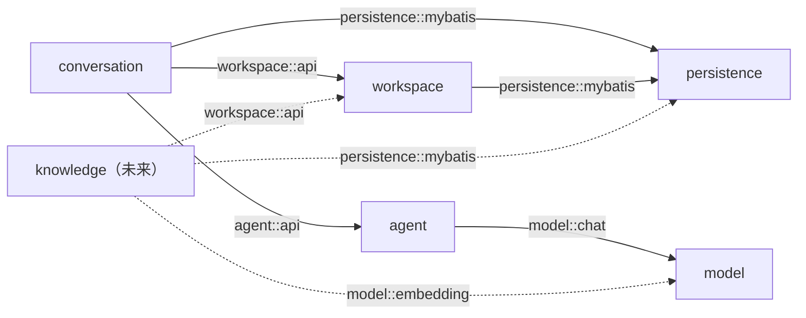
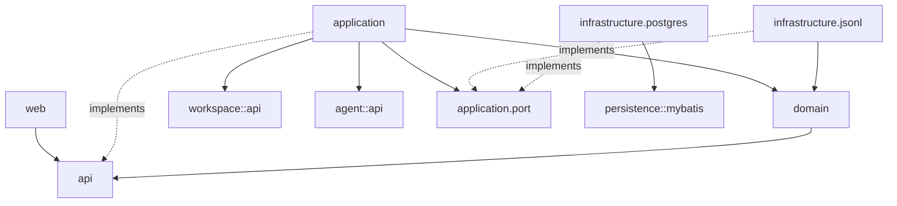

# Feature 001：基础 Agent 多轮对话

Status: Specified

## Problem Statement

SalmonMind 当前只有单 Workspace 的前后端连通页面，以及只能接收一段字符串并返回一次完整回答的基础 `BaseAgent`。系统没有 Conversation、可恢复的对话历史、稳定的多轮上下文、前端聊天入口或明确的失败恢复语义。

开发者需要先获得一个最小但真实可用的 Agent 对话闭环：可以在当前 Workspace 中创建、打开并继续多轮对话；刷新页面或重启服务后仍能查看历史；Agent 使用 Redis 保存短期状态；权威会话记录以本地追加式 JSONL 保存，并为后续状态压缩留下稳定索引。该闭环必须保持单 Agent、无 RAG 和本地运行边界，不能提前扩展成多 Agent 平台。

## Solution

在唯一 Workspace 下增加 Conversation 能力和基础聊天页面：

- 用户可以创建多个 Conversation、查看列表、打开历史并继续对话。
- 每个 Conversation 使用独立、追加式 JSONL 文件保存不可变 Entry；消息正文不进入 PostgreSQL 或 RustFS。
- PostgreSQL 保存 Conversation、Run 和 JSONL 读取索引等元数据。
- Spring AI Alibaba `ReactAgent` 使用 RedisSaver 保存会话级短期状态，稳定 thread ID 与 Conversation 对应。
- 同一 Conversation 的完整 Agent Run 在单 Server 进程内串行执行，不同 Conversation 可以并行。
- 第一版返回完整回答，不提供流式输出；前端展示生成、失败和重试状态。
- 第一版建立 Compaction Entry 与最新压缩索引的结构合同，但不实现压缩触发、摘要生成或裁剪规则。

## Domain Terms

### Workspace

本地安装中唯一的工作空间。所有 Conversation 都属于该 Workspace，本 Feature 不改变单 Workspace 产品边界。

### Conversation

用户可以创建、重新打开并继续的对话。Conversation 持有显示元数据和当前活动路径索引，不直接在数据库中保存消息正文。

### Entry

Conversation JSONL 中的一条不可变上下文节点。Entry 一旦成功追加就不更新或删除，通过 `id`、`parentId` 和 `seq` 表达身份、逻辑父节点和稳定写入顺序。

第一版实际产生三类 Entry：

- `user_message`：用户输入。
- `assistant_message`：Agent 的最终完整回答和必要的模型元数据。
- `compaction`：为未来上下文压缩预留的自包含检查点；本 Feature 不主动生成。

“Turn”只可以作为界面上理解一问一答的展示概念，不是权威持久化实体，也不建立一行一轮的 `conversation_turns` 模型。

### Active Path

从 Conversation 当前活动叶子沿 `parentId` 回到根节点得到的逻辑上下文路径。第一版没有分支操作界面，但读取与上下文构建必须以 Active Path 为准，不能把 JSONL 中物理位置靠后的所有 Entry 都视为当前上下文。

### Agent Run

一次处理动作：从一个待回答的 `user_message` 开始，调用 Agent 并以最终 `assistant_message`、明确失败或中断结束。Run 状态属于执行元数据，不替代 Conversation Entry。

### Agent Checkpoint

RedisSaver 保存的 ReactAgent 内部短期状态。它用于加速和恢复 Agent 执行，但不是用户历史或 Conversation 的权威来源；Redis 状态缺失或与当前活动叶子不一致时，必须从 JSONL Active Path 重建，不能静默丢失上下文。

### Compaction Entry

未来压缩产生的不可变 Entry。它保存摘要、被摘要历史的结束节点、原样保留的近期消息和压缩前用量。原始 Entry 始终保留在 JSONL 中；压缩只改变模型可见上下文，不删除权威历史。

## Data Authority

| 数据 | 权威位置 | 说明 |
| --- | --- | --- |
| Workspace 与 Conversation 元数据 | PostgreSQL | 支持列表、状态、活动叶子和索引查询 |
| 用户消息、Agent 回答和未来压缩节点 | `data/conversations/` 下的 JSONL | 不可变、追加式的权威会话历史 |
| ReactAgent 短期状态 | Redis | 可由权威 JSONL 重建，不作为历史页面数据源 |
| 知识原件和未来大型附件 | RustFS | 本 Feature 不写入聊天历史 |
| 容器内部数据 | `infra/data/` | 只供 PostgreSQL、Redis、RustFS 等基础设施使用，业务代码不得直接读取 |

## User Stories

1. 作为本地开发者，我希望在唯一 Workspace 中创建一个新 Conversation，以便开始一次独立的 Agent 对话。
2. 作为本地开发者，我希望看到已有 Conversation 列表，以便重新打开之前的对话。
3. 作为本地开发者，我希望一个 Conversation 中的 Agent 能理解此前消息，以便进行真实的多轮追问。
4. 作为本地开发者，我希望不同 Conversation 的上下文互相隔离，以便同时讨论不同主题。
5. 作为本地开发者，我希望刷新页面后仍能看到完整历史，以免浏览器状态成为会话权威。
6. 作为本地开发者，我希望 Server 重启后仍能打开并继续历史 Conversation，以免进程生命周期导致历史丢失。
7. 作为本地开发者，我希望 Redis Checkpoint 丢失后系统能够从 JSONL 恢复上下文，以免缓存丢失变成隐蔽的 Agent 失忆。
8. 作为本地开发者，我希望模型未配置、Redis 不可用或模型调用失败时看到明确错误，以便判断应该修复配置还是重试。
9. 作为本地开发者，我希望生成期间页面明确显示状态并避免重复发送，以免同一 Conversation 出现不可解释的并发顺序。
10. 作为本地开发者，我希望失败的用户消息可以在刷新后识别并重试，以免重新输入或在模型上下文中留下重复问题。
11. 作为本地开发者，我希望长对话达到当前上下文硬限制时收到明确提示，以免系统静默丢弃旧历史。
12. 作为项目维护者，我希望消息历史保持稳定的 JSONL 格式并带版本，以便未来导入、导出、压缩和迁移时不必推翻第一版数据。

## Behavior and Failure Semantics

### Conversation 创建与列表

- 创建 Conversation 时，Server 为其生成稳定 ID，在配置的数据根目录创建独立目录和 `events.jsonl`，写入带格式版本、Conversation ID 和创建时间的 Header，然后保存 PostgreSQL 元数据。
- 数据根目录通过配置指定，默认是项目根目录 `data/`；Conversation 文件位于 `data/conversations/<conversation-id>/events.jsonl`。
- 文件创建使用同目录临时文件和原子发布，避免进程中断留下被数据库引用的半个 Header。
- PostgreSQL 写入失败时，新创建但未被引用的文件不构成有效 Conversation；系统应尽力清理，无法清理时将其视为可识别的孤儿文件，而不是自动展示。
- 新 Conversation 在首条用户消息成功追加后，用该消息的单行截断文本形成标题，不额外调用模型生成标题。
- 列表按最近更新时间倒序返回，只读取 PostgreSQL 元数据，不扫描所有 JSONL 正文。

### JSONL Entry 合同

- Header 是文件第一行，不参与 Entry 树。
- 每个 Entry 至少包含格式版本、Conversation ID、Entry ID、单 Conversation 内递增的 `seq`、`parentId`、类型、时间戳和类型化 payload。
- 首个 Entry 的 `parentId` 为 `null`；后续上下文 Entry 指向其逻辑父节点。
- `seq` 表示 Server 接受写入的稳定顺序，用于重放和定位；因果关系由 `parentId` 表达。
- JSONL 只追加完整单行 JSON。追加成功必须先持久化文件，再更新 PostgreSQL 中可修复的索引指针。
- 读取时允许把不完整的最后一行视为未确认写入并安全截断；文件中部或完整行的结构错误属于历史损坏，必须返回明确错误，不能跳过后继续对话。
- `assistant_message` 保存用户可见文本、提供方、模型和必要用量信息，不保存凭据，也不要求保存模型的私有推理内容。

### 多轮发送

- 发送内容必须是去除首尾空白后非空的文本，并受服务端明确长度限制；前端限制不能替代服务端校验。
- 每个 Conversation 使用独立的进程内串行队列。完整 Run 包括追加用户 Entry、同步或重建 Redis Checkpoint、调用模型、追加助手 Entry和更新元数据。
- 不同 Conversation 的队列相互独立，可以并行执行。
- 用户 Entry 追加成功后成为待回答活动叶子，并创建一个 RUNNING Run。该 Conversation 在它得到回答或明确失败前不能接受新的普通用户消息。
- Agent 调用使用由 Conversation ID 派生的稳定 thread ID。Agent Checkpoint 必须同时关联当前活动叶子身份；Checkpoint 不存在或叶子不匹配时，从 JSONL Active Path 恢复模型可见消息后再调用。
- 模型成功返回非空回答后，Server 追加以待回答用户 Entry 为父节点的 `assistant_message`，再更新活动叶子、Run 状态和 Conversation 更新时间。
- 模型调用失败时不伪造 Assistant Entry；Run 标记为 FAILED，活动叶子仍是待回答用户 Entry，历史页面可以识别该状态。
- 重试失败 Run 时复用同一个待回答用户 Entry，创建新的 Run 并重建或校验 Checkpoint，不追加重复的用户消息。
- Server 异常退出后遗留的 RUNNING Run 在恢复时转为可解释的中断失败，允许用户重试。

### 历史恢复与索引

- 历史页面从 JSONL 构建 Active Path，PostgreSQL 只提供 Conversation 定位和索引，不返回消息正文副本。
- Conversation 元数据保存活动叶子 ID、最后确认的 Entry 序号，以及最新 Compaction Entry 的 ID、序号和字节偏移；从未压缩时三个压缩字段均为 `NULL`。
- Compaction Entry 自身包含 Conversation ID，因此 PostgreSQL 的最新压缩 ID 与 Entry 形成可相互校验的逻辑索引；两者不是跨存储外键。
- 有最新压缩索引时，读取器先按字节偏移定位并校验 Conversation ID、Entry ID 和序号，再读取其后的 Entry，并根据 `parentId` 选择通向活动叶子的路径。
- 压缩索引缺失或校验失败时，可以扫描完整 JSONL 修复 PostgreSQL 索引；不能在未校验的情况下直接采用错误偏移。
- PostgreSQL 指针更新失败但 JSONL 已成功追加时，以 JSONL 为权威，通过下一次读取或启动恢复修复索引。

### 上下文限制

- 本 Feature 不做自动压缩、手动压缩、摘要更新或静默裁剪。
- 在没有有效 Compaction Entry 的情况下，上下文达到配置硬限制时返回 `CONTEXT_LIMIT_REACHED`，提示用户创建新 Conversation。
- 未来压缩成功后才允许把 Compaction Entry 的摘要与保留尾部用于模型上下文；原始历史仍完整展示。

### 前端行为

- 页面沿用现有 Workspace 壳层和视觉基线，展示 Workspace 名称、连接状态、Conversation 列表、当前消息区、“新对话”和底部输入框。
- 初始空状态说明用户可以开始新对话，不生成伪造的欢迎消息。
- `Enter` 发送，`Shift+Enter` 换行；空文本不可发送。
- 第一版使用普通请求和完整响应。等待期间显示生成状态并禁用当前 Conversation 的重复发送。
- Assistant 文本按安全的基础 Markdown 展示，至少支持段落、列表、行内代码和代码块；禁止执行原始 HTML。
- 刷新页面后从 Server 重新读取 Conversation 和历史，不依赖浏览器内存恢复。
- 失败时保留用户消息，显示稳定错误和重试动作；重试不能在历史中追加重复用户消息。

### HTTP 合同

第一版提供以下用例入口：

- 列出当前 Workspace 的 Conversation。
- 创建 Conversation。
- 读取一个 Conversation 的活动历史和当前 Run 状态。
- 向 Conversation 发送一条用户消息并等待完整回答。
- 重试一个失败或中断的待回答 Run。

HTTP 路径使用 `/api/conversations` 根资源。正常响应使用稳定的 Conversation、Entry 和 Run 结果，不向前端暴露 Spring AI Alibaba 类型、Redis Key 或本地绝对路径。

至少区分以下稳定错误：

- `CONVERSATION_NOT_FOUND`
- `CONVERSATION_BUSY`
- `CONVERSATION_AWAITING_RETRY`
- `CHAT_MODEL_NOT_CONFIGURED`
- `CHAT_MODEL_FAILED`
- `REDIS_UNAVAILABLE`
- `CONTEXT_LIMIT_REACHED`
- `CONVERSATION_HISTORY_CORRUPTED`

输入错误返回 4xx；Conversation 状态冲突返回 409；模型或 Redis 未配置/不可用返回可区分的服务错误；后端日志保留诊断原因，但 HTTP 响应不返回凭据、内部路径或原始堆栈。

## Implementation Decisions

### 应用模块依赖图

完整系统模块依赖图固定为：



实线由本 Feature 的架构纠偏落地；虚线是已确定但本 Feature 不实施的未来边。RAG/Knowledge 不在当前范围，因此不创建 `knowledge` 空模块；首个 Knowledge Feature 必须按虚线依赖，不能反向调用 Conversation 或 Agent。

| 调用方模块 | 允许依赖 | 禁止依赖 |
| --- | --- | --- |
| `conversation` | `workspace::api`、`agent::api`、`persistence::mybatis` | 其他模块内部包、共享 Mapper/Entity、反向回调 |
| `workspace` | `persistence::mybatis` | `conversation`、`agent` |
| `agent` | `model::chat` | `conversation`、`workspace`、`persistence`、`model` 内部包 |
| `model` | 无其他项目模块依赖 | 任一业务模块；Provider Adapter 只依赖外部模型 SDK/Spring AI |
| `persistence` | 无其他项目模块依赖 | 任一业务实体、Repository 或业务规则 |
| `knowledge`（未来） | `workspace::api`、`model::embedding`、`persistence::mybatis` | `conversation`、`agent`、其他模块内部包 |

模块之间只通过 Named Interface 调用。`conversation` 负责发起和编排对话流程；`workspace`、`agent` 不得回调 `conversation`；`model` 只提供模型技术能力，不知道 Agent、Knowledge 或 Conversation。若未来出现双向调用需求，必须先重新确定流程所有者或提取有真实业务含义的新模块，不能用事件、`common`、全局 Service Locator 或共享数据库内部类型绕过循环依赖。

同步一对一且调用方需要结果的协作使用能力所有者的 `api`；只有已经发生的事实需要通知多个消费者、并且调用方不依赖同步返回值时才使用领域事件。本 Feature 不引入领域事件。

### 模块内部方向与目录合同

目录按业务模块组织，每个复杂模块内部再按职责分层，不在项目根部建立统一的 `controller/service/repository/infrastructure` 横向目录：

```text
com.yuyu.salmonmind/
├── persistence/
│   └── mybatis/                 # 共享 PostgreSQL/MyBatis 技术能力
├── workspace/
│   ├── api/                     # Workspace Named Interface
│   ├── infrastructure/postgres/
│   └── web/
├── model/
│   ├── chat/                    # ChatModel Provider Named Interface
│   └── infrastructure/openai/
├── agent/
│   ├── api/                     # Agent Named Interface
│   └── infrastructure/reactagent/
└── conversation/
    ├── api/                     # Conversation 唯一外部 seam
    ├── application/
    │   └── port/                # 仅模块内部的历史与元数据 seam
    ├── domain/                  # 纯业务规则
    ├── infrastructure/
    │   ├── jsonl/
    │   └── postgres/
    └── web/
```

`conversation` 内部依赖方向固定为：



- `api` 只包含稳定用例 interface、结果和错误合同，只依赖 JDK。
- `application` 负责编排 Workspace、JSONL、PostgreSQL 与 Agent 的调用顺序，不直接导入 Mapper、Entity、Jackson 或文件路径。
- `domain` 负责 Active Path、标题和历史定位等纯规则，不依赖 Spring、MyBatis、Jackson、文件 I/O 或 Agent 类型。
- `application.port` 只定义 Conversation 历史与元数据两个真实变化轴，属于模块内部 seam，不是 Named Interface。
- `infrastructure.jsonl` 和 `infrastructure.postgres` 分别实现内部 port，二者不得互相调用；跨存储恢复由 application 协调。
- `web` 只依赖 `conversation.api`，负责 HTTP 转换和状态码映射。
- 简单模块不强制复制完整目录；没有真实职责的层可以不存在，禁止空 Service、空 Repository、单纯转发实现和为每个内部类建立 interface。

第 2.5 步完成后不得保留 `conversation.impl`、`conversation.model`、`agent.impl`、`workspace.impl` 或 `workspace.model`。具体冻结文件名、每个文件的唯一职责和现有文件迁移表以同目录 `plan.md` 的“第 2.5 步完成后的目标目录与文件名”为准。

### 模块职责与公开 interface

- `conversation` 是前端和其他模块使用的主要深模块，拥有 Conversation 用例、Run 串行化、PostgreSQL 元数据协调、JSONL 历史、上下文构建、错误语义和 Controller。
- `ConversationService` 在 Feature 完成时只提供 `create()`、`list()`、`open(conversationId)`、`send(conversationId, text)`、`retry(conversationId, runId)` 五个用例；调用方不传单例 Workspace ID，Conversation application 通过 `workspace::api` 自己取得并校验当前 Workspace。
- `workspace::api` 只公开当前 Workspace 查询和稳定 Workspace 结果；Workspace PostgreSQL Mapper/Entity 留在自身 Adapter 内。
- `model::chat` 只公开 `ChatModelProvider`、`ChatModelHandle` 和稳定模型配置失败。`ChatModelHandle` 可以携带 Spring AI `ChatModel`，但只允许 `agent.infrastructure.reactagent` 使用，不能进入任何业务 `api` 或 HTTP。
- OpenAI-compatible base URL、API key、model name 的读取、校验和 ChatModel 创建属于 `model.infrastructure.openai`；`agent` 不得自行创建 provider ChatModel。
- `agent::api` 只公开会话感知的请求、结果和稳定失败；不向调用方暴露 `ReactAgent`、`RunnableConfig`、Spring AI Message、RedisSaver、Redisson 或 `ChatModelHandle`。
- Agent 请求必须携带稳定 thread 身份、期望活动叶子、预分配回答叶子和可用于重建的模型可见上下文；Agent 实现负责判断复用还是重建 Checkpoint。
- Conversation 持久化 Entry 使用自身的 `TokenUsage`，application 在 Agent 结果边界从 `AgentUsage` 显式映射，JSONL/domain 不依赖 `agent` 类型。

### 基础设施归属

- Compose、数据库/Redis 实例、数据卷和部署配置属于运行环境基础设施。
- 仅服务一个业务模块的技术 Adapter 留在该模块内部，例如 Conversation JSONL 和 PostgreSQL Adapter、Workspace PostgreSQL Adapter、ReactAgent Adapter。
- 只有至少两个真实消费者或多个真实 Adapter，并且形成独立技术能力时，才允许晋升为共享技术模块。当前 `PostgresUuidTypeHandler` 同时服务 Workspace 与 Conversation，因此归属聚焦的 `persistence::mybatis`；Chat 模型具有生产/确定性测试 Adapter、独立配置和较重外部依赖，因此归属 `model::chat`。这些模块不得吸收业务 Mapper、Entity、migration、JSONL 或 Redis。
- 不建立 `common`、`utils`、全局 Repository 层、通用事件总线或容纳所有外部技术的全局 infrastructure 模块。

### PostgreSQL 元数据

`conversations` 至少保存：Conversation ID、Workspace ID、标题、JSONL 格式版本、活动叶子 Entry ID、最后确认序号、最新 Compaction Entry ID / 序号 / 字节偏移、创建时间和更新时间。

`conversation_runs` 至少保存：Run ID、Conversation ID、触发用户 Entry ID、状态、开始与结束时间、稳定错误码。消息正文不复制进该表。

数据库必须保证同一 Conversation 同时最多存在一个 RUNNING Run。运行期队列提供单进程顺序，数据库约束负责阻止绕过队列产生的冲突。

### 本地文件与基础设施

- `data/conversations/` 是业务管理的权威会话目录并保持 Git 忽略；`infra/data/` 只保存容器内部数据，两者不能混用。
- Server 容器运行时必须显式挂载 Conversation 数据目录，避免容器重建丢失历史。
- Compose 增加 Redis，并为 Redis 数据划分独立的 `infra/data/redis`；Redis 内容仍被视为可由 JSONL 重建的 Agent 状态。
- JSONL 文件由每 Conversation 的单写入队列拥有。第一版只支持一个 Server 实例，不声称支持多个进程或多个实例同时写同一 Conversation。

### 未来演进边界

- 多 Agent、并行工具或多 Server 实例不能直接共享当前单写者文件模型。未来需要在 Session 层增加 Lane、Run 因果关系和跨进程 Writer Lease，或替换为具备并发控制的数据库 Session Backend。
- JSONL 是稳定序列化与本地权威格式，不要求永远是唯一 Backend；未来 Backend 必须保持 Entry、Active Path、Compaction 和恢复语义。
- 工具调用未来应保留模型协议的消息分组：工具调用可以作为 Assistant Message 的内容块，工具结果作为带 `toolCallId` 的独立 Entry；本 Feature 不启用工具。

## Testing Decisions

### 测试 seam

- 主要通过 `conversation::api` 和 HTTP 行为测试 Feature，而不是分别为 Controller、Mapper 和文件辅助类堆叠重复单元测试。
- Conversation 测试使用临时数据目录、Testcontainers PostgreSQL 和可控 Agent 替身，验证外部行为与持久化结果。
- RedisSaver 与 thread ID 隔离使用一个聚焦的真实 Redis 集成测试，不把外部模型调用混入确定性测试。
- 该 Agent/Redis 集成测试通过测试侧 `ChatModelProvider` 提供确定性 ChatModel，同时覆盖 `agent -> model::chat` seam；不再为相同行为增加一套 Model 单元测试。
- JSONL 恢复逻辑复杂且是权威数据 seam，可以补少量聚焦测试覆盖追加顺序、Active Path、最后一行中断修复、文件中部损坏拒绝和压缩索引校验。
- Spring Modulith 结构测试必须验证五个当前模块、Named Interface、`allowedDependencies` 和无环依赖；尚未实现的 `knowledge` 不进入当前模块集合。Conversation 模块行为测试不得导入 Mapper 或 Entity。

### 必须覆盖的行为

- 创建、列表、打开和标题生成。
- 同一 Conversation 的多轮上下文与不同 Conversation 隔离。
- 用户与 Assistant Entry 的父子关系、稳定序号和数据库索引更新顺序。
- 同 Conversation Run 串行、不同 Conversation 可并行，以及数据库阻止重复 RUNNING Run。
- 模型失败后用户 Entry 保留、失败状态可恢复、重试不重复追加用户消息。
- Server 中断后的 RUNNING Run 恢复语义。
- Redis Checkpoint 命中、缺失和活动叶子不匹配时的 JSONL 重建。
- 模型未配置、Redis 不可用、上下文超限和历史损坏的稳定错误。
- 前端构建、Conversation 列表、消息显示、生成禁用、刷新恢复和失败重试的实际页面闭环。

### 验证边界

- 自动化测试不调用付费模型。
- 真实模型多轮 Smoke Test 与真实页面验收在实施完成后单独询问开发者，经允许再执行。
- 执行 Agent 汇报过的同版本测试结果不得由接手 Agent 重复运行；只补缺失或代码变化后受影响的验证。
- 不为简单渲染和薄适配层建立大量低价值测试。

## Out of Scope

- RAG、知识检索、Evidence 引用和 Workspace 知识注入。
- 多 Agent、子 Agent、Lane、并行工具和分布式 Writer Lease。
- 工具注册、工具调用展示和工具结果持久化实现。
- 自动或手动状态压缩、摘要 Prompt、压缩阈值和裁剪规则。
- Conversation 分支、树形导航、编辑历史和回到旧节点继续。
- SSE、WebSocket 或其他流式输出。
- 文件上传、图片、多模态、附件和 RustFS 聊天存储。
- Conversation 删除、归档、重命名、全文搜索、导入和导出界面。
- 模型选择、Prompt 管理、Token / 费用仪表盘和 Agent 可观测平台。
- 登录、多用户、权限、远程访问和公开部署。
- 多 Server 实例和跨进程并发写入。

## Acceptance Criteria

1. 用户可以在现有 Workspace 页面创建至少两个 Conversation，并在列表中分别打开。
2. 每个 Conversation 可以完成至少两轮真实对话；在开发者允许的 Smoke Test 中，第二轮能使用第一轮信息。
3. 刷新浏览器和重启 Server 后，Conversation 列表与活动历史仍可读取。
4. Redis 正常时 ReactAgent 使用稳定 Conversation thread ID；清除单个 Conversation 的 Checkpoint 后，下一次调用从 JSONL Active Path 重建且不静默失忆。
5. 每个 Conversation 都有独立的版本化 JSONL；用户消息和 Agent 回答是不可变 Entry，并具有正确 `seq` 与 `parentId`。
6. PostgreSQL 不保存消息正文，但能稳定列出 Conversation、定位活动叶子、识别待回答/失败 Run，并保留可空的最新压缩索引。
7. 同一 Conversation 的并发请求按队列处理或在状态不允许时返回明确冲突；不同 Conversation 不被同一全局锁串行化。
8. 模型失败后刷新页面仍能看到待回答消息和失败状态，重试不会新增重复用户 Entry。
9. 模型未配置、Redis 不可用、上下文超限和 JSONL 损坏都有可区分错误，前端不显示内部堆栈或凭据。
10. 前端在桌面与窄屏上可完成创建、选择、发送、等待、阅读、刷新恢复和失败重试；Assistant Markdown 不执行原始 HTML。
11. 自动化验证、前端构建、Compose 配置检查和经授权的真实 Smoke Test 均由实际执行者报告，后续 Agent 不重复运行同版本测试。
12. 开发者验收时能够获得并理解请求入口、Conversation 队列、JSONL 追加、PostgreSQL 索引、Redis Checkpoint、恢复和失败路径的完整说明。
13. Spring Modulith 验证确认当前项目模块准确包含 `persistence`、`workspace`、`model`、`agent`、`conversation`，依赖符合本 Spec 的实线有向图；尚未实现的 `knowledge` 不以空模块存在，旧 `*.impl`、`conversation.model`、`workspace.model` 包、跨模块内部类型引用和循环依赖均不存在。

## Further Notes

- 当前基线中的 `BaseAgent.chat(String)` 不具备 Conversation ID、Checkpoint 一致性或历史重建语义，不能直接作为本 Feature 的最终模块合同。
- 当前 `apps/web` 只读取 `GET /api/workspace`，本 Feature 将在该壳层上增加真实 Conversation 页面，而不是另建独立演示页面。
- 当前 Compose 尚无 Redis；PostgreSQL、RustFS 和 Elasticsearch 的既有职责不得因本 Feature 混淆。
- 同目录 Plan 已存在并保持 `Draft`；它需要结合 Spring AI Alibaba 1.1.2.2 的真实接口验证 RedisSaver 初始化、Checkpoint 重建和清理能力，不能凭框架印象决定实现细节。
- 本文件已由开发者确认并进入 `Specified`；本次架构补充不改变产品与数据合同。确认 Spec 或 Plan 仍不代表允许实施。
