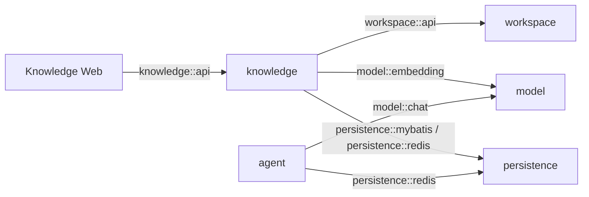

# Feature 003 Stage 02 Plan：异步文档入库与 Knowledge 可视化

Status: Implemented

## 1. Stage 目标

Stage 02 交付一个不依赖聊天的本地文档入库闭环：用户上传单个文档后，请求快速返回；Server 内后台 Worker 经 Redis Stream 异步完成 Tika 解析、切片、文档 Embedding 和 Elasticsearch 索引；用户可以在 Knowledge 页面持续看到状态，最终查看 READY 文档的解析信息与 Evidence 预览，或看到可理解的失败原因并重试。

本 Stage 的完成边界是：

```text
上传 TXT / MD / PDF / DOCX
→ RustFS 原件与 PostgreSQL 元数据落地
→ Redis Stream 排队
→ 后台线程解析、切片、Embedding、索引
→ PostgreSQL 发布 READY
→ Knowledge 页面可查看状态与 Evidence
```

Stage 02 必须完成文档 Embedding 与索引，否则文档不能诚实地进入 Spec 已定义的 `READY`。查询侧 BM25、向量召回、RRF、Rerank、诊断检索和 `search_local_knowledge` 均留在 Stage 03。

## 2. 重新设计后的原则

上一版 Plan 过度重复 Spec，并提前设计了没有调用方的 Stage 03 接口。新版按以下原则收紧：

1. **只有一个对外 Knowledge interface**：`knowledge::api` 只提供上传、列表、详情、Evidence 预览和重试；复杂入库实现全部留在模块内部。
2. **不预建检索 interface**：本 Stage 不创建 `knowledge::retrieval`、Search Service、RRF DTO 或 Agent Tool 类型，Stage 03 有真实调用方时再建立 seam。
3. **Job 就是处理尝试**：每次上传创建 Job 1；用户重试时为同一 Revision 新增下一条 Job，不再额外建立一套 Attempt 实体和状态。
4. **先通过技术硬 Gate，再铺开功能**：Redisson Stream、Tika 解析和 Elasticsearch 2560 维 mapping 任一不成立时立即停止，不先写完整业务后再发现基础能力不可用。
5. **以第一条 READY 链路驱动设计**：先让一个 TXT 完整穿过真实 Redis、对象存储、PostgreSQL 和 Elasticsearch；再补齐 Markdown、PDF、DOCX 和恢复场景。
6. **接口是主要测试面**：通过 `knowledge::api`/HTTP 观察状态与结果；只对状态机、切片等纯规则补少量聚焦测试，不为 Controller、Mapper、每个内部 port 建重复测试。

## 3. 当前基线与实施前置

### 3.1 当前代码事实

- 当前分支为 `codex/feature-003-local-document-rag`，Feature Spec 状态为 `Specified`。
- `V002__initialize_knowledge.sql` 只有 Source、Revision、Index Generation 和 Evidence 元数据表，没有 Ingestion Job、处理状态和完整文档格式。
- RustFS、Redis 7、Elasticsearch 8.13 已在 Compose 中预留；应用已有 S3 SDK、Redisson 和 Knowledge 配置，但尚无 Knowledge Java 模块、Tika、Elasticsearch Client 或 Embedding 实现。
- Agent 当前自行拥有 RedissonClient 生命周期。Stage 02 引入第二个真实 Redis 消费者后，才满足把连接能力提取为 `persistence::redis` Named Interface 的条件；Checkpoint Key 与 Stream 业务语义仍分别属于 Agent 和 Knowledge。
- 当前工作区已有 Stage 01 的 Conversation/Web 未提交修改。本 Plan 只替换自身文件，不覆盖、不吸收这些修改。

### 3.2 实施前置

开始 Stage 02 代码前必须同时满足：

1. Stage 01 的 Tool Runtime、SSE 成功提交点和新对话懒创建已经在同一代码版本上完成验证并由开发者验收；
2. 工作区中的 Stage 01 修改已经明确归属，不与 Stage 02 混成无法审查的一批改动；
3. 本 Plan 已由开发者确认并标记为 `Planned`；
4. 开发者另行明确允许进入 Stage 02 实施。

确认 Plan 不等于允许修改代码、调用真实 SiliconFlow、提交、推送或创建 PR。

## 4. 实施范围与禁止范围

### 4.1 本 Stage 包含

- `knowledge` 业务模块及 `knowledge::api` Named Interface；
- `model::embedding` Named Interface和硅基流动 Adapter，固定 `Qwen/Qwen3-Embedding-4B`、2560 维；
- `persistence::redis` 共享、延迟初始化的 RedissonClient provider，并迁移 Agent 使用该 provider；
- TXT、Markdown、PDF、DOCX 单文件上传、真实类型校验、RustFS 原件存储；
- PostgreSQL Source、Revision、Ingestion Job、Index Generation、Evidence 元数据；
- Redis Stream Consumer Group、Server 内有界后台 Worker、Pending reclaim 与低频补投；
- 进程内 Tika 3.3.x 解析、规范化、结构优先切片，不启用 OCR；
- Elasticsearch Evidence 文本与 2560 维向量索引；
- Knowledge 页面中的上传、列表、状态、详情、Evidence 预览和失败重试。

### 4.2 本 Stage 禁止

- 不实现 BM25/kNN 查询、RRF、Rerank、诊断搜索接口或检索调参页面；
- 不创建 `knowledge::retrieval`，不注册 `search_local_knowledge`，不修改 Agent Prompt 或 Conversation 引用持久化；
- 不实现博查、网页搜索、网页入库、本地项目扫描、目录监听或 OCR；
- 不支持删除、替换版本、批量上传、标签或权限；
- 不把 PostgreSQL 当作常规 dequeue/claim 队列，不建立通用 Queue 模块；
- 不把 Tika 类型、Object Key、物理索引名、Stream ID 或向量暴露到 HTTP；
- 不因配置缺失阻止普通启动和已有 Chat；
- 不调用付费外部接口、不删除 Docker 容器/卷、不提交或推送，除非开发者分别授权。

## 5. 模块设计



图中 Agent 到 Model 的标签以实际 Named Interface 为准；关键约束是 Knowledge 不依赖 Agent/Conversation，Conversation 也不直接访问 Knowledge。

### 5.1 Knowledge 外部 interface

`knowledge::api` 只表达调用方必须知道的行为：

- 上传一个文档并返回已接收的摘要状态；
- 列出当前 Workspace 的文档；
- 读取文档详情与 Job 历史；
- 分页预览 READY Revision 的 Evidence；
- 为可重试失败创建下一条 Job。

HTTP 继续使用 Spec 固定的 `/api/knowledge/documents` 根资源。Controller 只做 multipart/HTTP 转换；上传顺序、状态机、恢复和发布 READY 都由 Knowledge application 编排。

### 5.2 Knowledge 内部 seams

以下变化轴只作为 Knowledge 内部 port，不成为跨模块 Named Interface：

- 原件存储：RustFS/S3 Adapter；
- 队列：Redis Stream Adapter；
- 文档解析：Tika Adapter；
- Evidence 索引：Elasticsearch Adapter；
- 元数据：MyBatis/PostgreSQL Adapter。

`model::embedding` 是跨模块 interface，因为模型调用、鉴权和 OpenAI-compatible HTTP 细节属于 Model 模块；生产使用 SiliconFlow Adapter，测试使用确定性 2560 维 Adapter。

`persistence::redis` 只提供共享 RedissonClient 生命周期和连接错误语义，不提供 `enqueueKnowledgeJob()` 等业务方法。Agent 继续拥有 Checkpoint/marker，Knowledge 继续拥有 Stream key、group、message 和 ACK 规则。

## 6. 数据与运行时合同

### 6.1 PostgreSQL 权威

- `KnowledgeSource`：本 Stage 只创建 `DOCUMENT`。
- `SourceRevision`：不可变原件版本；一次上传创建 Source + Revision 1，重试不创建新 Revision。
- `IngestionJob`：一次处理尝试；同一 Revision 的 `attempt_number` 单调递增且唯一。
- `IndexGeneration`：固定 provider/model/dimensions、切片版本、mapping 版本和物理索引；首个 Generation 允许以零计数创建并成为 Active。
- `Evidence`：只保存稳定 ID、Generation、Revision、ordinal、位置、摘要和字符数；正文与向量留在 Elasticsearch。

Job 状态固定为：

```text
PENDING_DISPATCH → QUEUED → PARSING → EMBEDDING → INDEXING → READY
                           └────────→ OCR_REQUIRED
任一处理阶段 ───────────────────────→ FAILED
FAILED(retryable) ──用户重试──→ 同一 Revision 的下一条 PENDING_DISPATCH Job
```

UI 使用最新 Job 展示状态；历史 Job 只用于诊断。`READY`、`OCR_REQUIRED`、`FAILED` 为单条 Job 终态，旧消息不得覆盖更新 attempt 的状态。

### 6.2 上传提交点

```text
临时文件流式接收、限额、SHA-256 与实际媒体类型校验
→ RustFS 写入不可变原件
→ PostgreSQL 事务创建 Source + Revision + Job(PENDING_DISPATCH)
→ 事务提交后 XADD
→ 成功则更新 QUEUED；失败则保留 PENDING_DISPATCH
→ HTTP 202 返回当前状态
```

RustFS 成功而数据库失败时只尽力删除本次已知 Object；删除失败记录诊断，不扩大清理范围。数据库成功而 Redis 失败时，低频、限批补投器只修复这条双写缝隙，不承担日常队列消费。

### 6.3 Worker 提交点

Worker 使用独立 Stream/Consumer Group、阻塞读取和有界 Spring 线程池：

```text
读取/claim 消息
→ 根据 jobId + attempt 校验是否仍可处理
→ 下载原件并用 Tika 解析
→ 规范化、切片
→ 批量生成 2560 维 Embedding
→ 用稳定 Evidence ID 幂等写 Elasticsearch
→ 验证整份 Revision 的索引结果
→ PostgreSQL 事务写 Evidence 元数据并将 Job 标为 READY
→ XACK；XDEL 仅尽力执行
```

只有 PostgreSQL `READY` 是“本 Revision 已发布”的业务权威。最终事务失败时，Elasticsearch 中间文档可以残留，但不能被 Stage 03 检索；重试按相同稳定 ID 覆盖或按 Revision 清理。进程退出后消息保留在 Pending Entries，超时后由其他 consumer reclaim 并从原件幂等重做。

### 6.4 解析与索引版本

- 只启用 TXT、Markdown、PDF、DOCX 所需的 Tika parser；关闭 OCR、宏、嵌入附件递归和外部程序型 parser。
- 扫描 PDF/无可用正文进入 `OCR_REQUIRED`；加密 PDF、损坏文件、解析超限进入具有稳定错误码的 `FAILED`。
- chunk-v1 优先标题、段落、列表和表格边界；固定最大 1200 字符、相邻重叠 150 字符，空切片不入库。
- Active Generation 固定 SiliconFlow `Qwen/Qwen3-Embedding-4B`、`dimensions=2560`、document instruction v1、chunk-v1 和 mapping-v1。
- Elasticsearch mapping-v1 至少包含 CJK 可检索正文、引用元数据和 `dense_vector(2560, cosine)`；本 Stage 只写入，不提供查询用例。

## 7. 有序实施步骤

| ID | 检查点 | Blocked by | 可验证结果 |
| --- | --- | --- | --- |
| S2-01 | 基础能力硬 Gate 与共享 Redis prefactor | Stage 01 已验收 | 锁定依赖下 Stream reclaim、Tika fixture、ES 2560 mapping 成立；Agent Redis 行为不回归 |
| S2-02 | 文档异步提交闭环 | S2-01 | TXT 上传后快速返回，原件/元数据可靠，页面可看到 PENDING_DISPATCH/QUEUED |
| S2-03 | TXT 首条 READY 纵向链路 | S2-02 | Worker 将 TXT 完整处理到 READY，页面可查看 Evidence；重复消息不重复产物 |
| S2-04 | 四格式、恢复与 Knowledge UI 验收 | S2-03 | TXT/MD/PDF/DOCX、失败/重试/重启恢复和最终页面闭环全部成立 |

### 7.1 S2-01：硬 Gate 与最小基础

1. 增加锁定版本的 Tika 最小 parser 依赖与 Elasticsearch Java Client，不升级 Spring AI/Alibaba 等无关核心依赖。
2. 用最小集成 Gate 验证：Redisson 3.22 能对 Redis 7 完成 Consumer Group 读取、ACK 和 Pending reclaim；Tika 能按安全配置解析四个小 fixture；Elasticsearch 8.13 接受 2560 维 cosine mapping 并写入一个向量文档。
3. 增加 `persistence::redis` 延迟 provider，迁移 Agent 使用它；保持 Redis 未配置时应用启动、Checkpoint 复用/重建、Tool Runtime 行为不变。
4. 建立有真实职责的 `knowledge` 与 `model::embedding` 模块骨架，更新 Modulith 预期依赖；不创建 Stage 03 类型。

任一 Gate 失败即停止本 Stage。此时只保留最小失败证据，不继续写完整业务，也不通过换模型、降维或数据库队列绕过。

### 7.2 S2-02：异步提交闭环

1. 新增前向 Flyway migration，补齐 PDF/DOCX、Job、解析元数据、Generation 版本与零计数、Evidence 必要约束；不编辑 V002。
2. 实现 multipart 临时文件、50 MiB 上限、扩展名/声明类型/实际类型一致性、SHA-256 和安全文件名展示。
3. 完成 RustFS 写入、PostgreSQL 提交、Stream XADD 与 `PENDING_DISPATCH → QUEUED` 顺序；所有外部 Adapter 延迟初始化。
4. 交付 Knowledge 页面最小纵向入口：Chat/Knowledge 切换、单文件上传、文档列表和状态刷新。
5. 验证正常 TXT、空文件、伪装格式、超限以及 RustFS/DB/Redis 三处失败顺序；上传请求不得等待 Worker。

### 7.3 S2-03：TXT 首条 READY 链路

1. 建立 Consumer Group、后台消费循环、有界执行器、状态 compare-and-set 和终态 ACK。
2. 先只开放 TXT Worker：Tika → Parsed Document → chunk-v1 → 批量 Embedding → Elasticsearch bulk upsert → PostgreSQL READY。
3. 实现 SiliconFlow Embedding Adapter 的请求/响应校验；自动化测试使用确定性 2560 维 Adapter，不访问外网。
4. Detail 页面增加 Job 历史、解析元数据和 Evidence 分页预览；未 READY 文档不返回 Evidence 正文。
5. 覆盖空正文、返回维数错误、Embedding/ES/最终数据库失败、同一消息重复 delivery；任一场景不得发布半套 READY。

S2-03 是本 Stage 第一条真正完成的产品纵向切片。完成前不能把 QUEUED 文档描述为“知识库可用”。

### 7.4 S2-04：格式、恢复与验收收口

1. 在同一 Tika Adapter 内依次开放 Markdown、PDF、DOCX，补结构位置；位置不可稳定获取时使用诚实的 section/chunk 序号，不伪造页码。
2. 落地扫描 PDF `OCR_REQUIRED`、加密 PDF、损坏文件、字符/页数/时间等解析上限。
3. 实现低频 PENDING_DISPATCH 补投、Pending reclaim、过期 attempt 拒绝覆盖、最大自动重试与 poison message 收束。
4. 实现用户重试：复用 Revision/原件，新增下一 attempt Job；OCR_REQUIRED 不提供无效重试。
5. 收口 Knowledge 页面：终态停止轮询、页面不可见时降频、旧响应不能覆盖新 attempt，详情展示格式/大小/SHA/时间/错误/Evidence 数与位置。
6. 执行完整 Stage 验证和一次隔离的本地手工流程，报告后停在 Stage 02，不进入检索或 Agent Tool。

## 8. 数据迁移与兼容

- 只新增 V004 或当时下一个可用序号的前向 migration；绝不修改已经存在的 V002/V003。
- 已有 Source/Revision 不推断为 READY。无法可靠映射的预留数据保持不可检索，不伪造 Job 或 Generation 成功记录。
- PostgreSQL UUID 继续使用仓库既有 public TypeHandler 与 `autoResultMap=true` 规则。
- Redis Stream/Group 与 Agent Checkpoint 使用不同前缀，不迁移或清空既有 Checkpoint。
- Elasticsearch 为 Generation 新建物理索引，不原地改未知旧 mapping；RustFS 不扫描或删除非本 Feature 生成的对象。
- Stage 02 不改变 Conversation JSONL、Run、SSE 或前端已有会话数据合同。

## 9. 验证计划

### 9.1 自动化边界

- 纯规则测试：Job 状态转换、确定性 Evidence ID、chunk-v1 边界。
- 一组共享基础设施的 Knowledge 集成测试：Testcontainers PostgreSQL、Redis、S3-compatible 对象存储和 Elasticsearch 8.13，覆盖从 `knowledge::api`/HTTP 到最终状态；不为每个 Adapter 单独重复启动容器。
- 四个小型真实 fixture：TXT、Markdown、PDF、DOCX；另有扫描/加密/损坏等最小失败 fixture。
- Embedding 使用确定性 2560 维 Adapter；SiliconFlow HTTP Adapter 只用本地 HTTP stub 验证模型名、dimensions、batch 和错误映射。
- Web 不为本 Stage 新增测试框架，只执行 lint/build 与聚焦手工验收。

### 9.2 实施中验证

S2-01 先运行 Gate 与既有 Agent 回归；Gate 通过后才开始 Knowledge 业务。后续每个检查点只运行受影响的 Knowledge 聚焦测试。已在同一最终代码版本上可信通过的测试不机械重跑。

最终代码版本运行一次：

```text
mvn -f apps/server/pom.xml test
docker compose -f compose.yaml config --quiet
npm run lint --prefix apps/web
npm run build --prefix apps/web
git diff --check
git status --short --branch
```

### 9.3 手工验收

使用隔离测试数据完成一轮：

1. 分别上传四种支持格式，确认请求快速返回、聊天仍可操作；
2. 观察 QUEUED 到 READY，打开详情查看位置化 Evidence；
3. 上传扫描、加密或损坏 PDF，确认终态和用户动作正确；
4. 暂停/恢复 Redis 或重启测试 Server，确认 pending job 可以继续且 Evidence 不重复；
5. 对可重试 FAILED 执行重试，确认原件/Revision 不重复、Job attempt 增加；
6. 确认页面不存在查询框、RRF/Rerank 分数或“已用于聊天”的假入口。

真实 SiliconFlow Smoke 必须另行取得开发者授权。获准后只上传一个短文档，确认模型名、2560 维和 READY；不得在报告中打印 API Key 或文档正文。

## 10. Stage 验收标准

1. 四种白名单文档同步校验、异步处理和状态展示符合 Spec；
2. 正常出入队由 Redis Stream Consumer Group 承担，PostgreSQL 只保存业务状态和补投依据；
3. Worker 为有界后台线程，重复投递、重启和单文档失败不会产生重复 READY Evidence 或阻塞其他文档；
4. Tika 类型不越过 Knowledge 内部 seam，扫描 PDF 不会以零切片 READY；
5. Active Generation 固定 Qwen3-Embedding-4B/2560，真实 ES 8.13 mapping Gate 成立；
6. 只有整份 Evidence 索引验证和 PostgreSQL 提交完成后才发布 READY；
7. 页面能上传、查看进度/详情/Evidence 并重试，同时没有提前暴露 Stage 03 能力；
8. Redis/RustFS/Elasticsearch/Embedding 配置缺失不会阻止应用和现有 Chat 启动；
9. Agent Checkpoint/Tool Runtime、Conversation 和 Modulith 结构在共享 Redis 改造后无回归；
10. 开发者能够从实施报告说明上传、队列、Worker、Tika、Embedding、索引、READY 与恢复的完整调用链。

## 11. 风险、停止条件与恢复点

### 11.1 必须停止并回到讨论

- Stage 01 尚未验收或工作区修改与 Stage 02 重叠；
- Redisson 3.22 无法可靠完成所需 Stream reclaim，解决需要升级核心依赖或改用数据库队列；
- Elasticsearch 8.13 不接受 2560 维 mapping，或实现要求静默降维/换模型；
- Tika 无法在禁用 OCR/外部 parser/嵌入附件的前提下满足四格式与诚实位置合同；
- 实现需要改变 Source/Revision/Job/Generation 权威、状态机、公开 HTTP 或 Feature 范围；
- 需要 Conversation 直接依赖 Knowledge、Knowledge 反向依赖 Agent，或需要根级通用 tools/queue 模块；
- 恢复只能通过清空 Stream/Index、删除未知对象或修改用户已有数据完成；
- Stage 03 的检索语义必须提前实现才能保证 Stage 02 数据正确。

普通 Adapter、配置、fixture 或实现错误由原执行 Agent 在本 Stage 内诊断修复，不作为扩展范围的理由。

### 11.2 可恢复检查点

- S2-01：只有技术 Gate、共享 Redis 和模块基础，无 Knowledge 产品承诺；
- S2-02：上传与排队可见，Worker 尚未发布 READY；
- S2-03：TXT 完整到 READY，是首个可演示闭环；
- S2-04：四格式、恢复、重试和 Knowledge 页面完成，等待开发者验收。

## 12. 实施报告要求

执行 Agent 完成或停止时一次性报告：

1. S2-01 至 S2-04 的完成/阻塞状态；
2. 上传到 READY 的调用链、每个提交点和数据权威；
3. Stream group/consumer、Pending reclaim、ACK 与补投的非敏感证据；
4. 四种格式的解析结果、位置降级和失败语义；
5. 2560 维 mapping 与 Embedding 请求校验范围，是否调用真实 SiliconFlow；
6. 重复投递、Server 重启和用户重试如何保持幂等；
7. Knowledge 页面实际可见行为与尚未存在的 Stage 03 能力；
8. 所有验证命令、结果和环境，哪些结果被可信复用而未重复运行；
9. 当前 Git 状态、隔离前缀/容器说明和无关修改；
10. 明确停点：`Stage 02 等待开发者初审；未进入 Stage 03，未提交、未推送、未创建 PR。`

开发者确认本 Plan 后才把状态改为 `Planned`；Stage 02 实施仍需单独授权。
