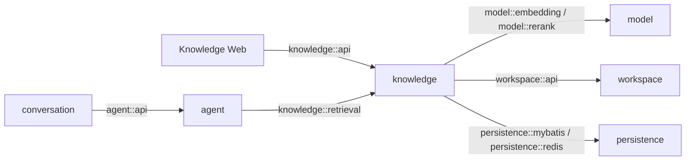

# Feature 003 Stage 03 Plan：本地混合检索、精排与 Agent Tool

Status: Accepted

## 1. Stage 目标

Stage 03 在 Stage 02 已发布的 READY Evidence 上交付两个彼此复用的能力：

1. Knowledge 页面可以执行一次诊断检索，看到 BM25、向量、RRF 和 Rerank 各阶段的候选、排名、分数及降级状态；
2. 主 Agent 注册只读 `search_local_knowledge`，在用户明确询问本地资料时可以取得最终 Local Evidence，并基于结果或模型自身知识继续回答。

正常检索链路固定为：

```text
查询规范化
→ PostgreSQL 确认 Active Generation 与 READY Revision 范围
→ Elasticsearch BM25 Top 40
→ Qwen3-Embedding-4B 查询向量（2560 维）
→ Elasticsearch Vector Top 40
→ 应用层 RRF（k=60）
→ RRF Top 20
→ Qwen3-Reranker-4B
→ 最终 Top 5 Local Evidence
```

本 Stage 不实现博查、网页引用、结构化 Citation 持久化或完整多来源多轮收口。Stage 03 的 Assistant 正文可以自然提及工具返回的文档名和位置，但不能把它描述成已经过 Server 校验并持久化的 Citation 卡片；这些合同在 Stage 04/05 完成。

## 2. 当前基线与实施前置

### 2.1 当前代码事实

- 当前分支为 `codex/feature-003-local-document-rag`，工作区在编写本 Plan 前干净。
- Stage 02 已由提交 `6bf87bc` 实现，Plan 状态为 `Implemented`，尚未标记 `Accepted`。
- Knowledge 已有 `knowledge::api`、PostgreSQL 权威元数据、Redis Stream Worker、RustFS、Tika、`model::embedding` 和 Elasticsearch mapping-v1。
- Elasticsearch mapping-v1 包含 `sourceId`、`revisionId`、`location`、`text` 和 2560 维 `vector`；`text` 当前使用 `standard` analyzer，尚未证明代表性中文 BM25 召回。
- Evidence 会先写 Elasticsearch，再由 PostgreSQL 事务发布 READY。发生最终事务失败时可能留下派生中间文档，因此 Stage 03 不能只查询整个物理索引。
- `EvidenceIndexPort` 当前只提供写入、计数和按 Revision 预览；没有 BM25/kNN 查询。
- 生产 ReactAgent 当前不注册工具；Tool Runtime 只通过测试构造注入 ToolCallback。Conversation 创建 `AgentRequest` 时仍使用默认 `REUSE_IF_MATCH`。
- `AgentStreamListener` 已有工具生命周期事件，但 Conversation/SSE/Web 尚未转发或展示。

### 2.2 实施前置

开始 Stage 03 代码前必须同时满足：

1. 开发者完成 Stage 02 初审并确认可以作为 Stage 03 数据基线；仅有 `Implemented` 提交不等于验收；
2. 本 Plan 已由开发者确认并标记为 `Planned`；
3. 开发者另行明确允许 Stage 03 实施；
4. 若 Stage 02 验收要求修改 mapping、READY 发布或 Evidence 身份，先完成并验证该修改，再重新核对本 Plan。

确认 Plan 不授权真实 SiliconFlow 调用、提交、推送或创建 PR。

## 3. 实施范围与禁止范围

### 3.1 本 Stage 包含

- `knowledge::retrieval` Named Interface，向 Agent 公开有界的最终 Local Evidence；
- 复用同一内部 Retrieval Pipeline 的 Knowledge 诊断检索用例与页面；
- Elasticsearch BM25 与 2560 维 kNN 检索，并按 PostgreSQL READY Revision 做 pre-filter；
- 应用层确定性 RRF 与最终 Top 20；
- `model::rerank` Named Interface、SiliconFlow `Qwen/Qwen3-Reranker-4B` Adapter 与 Top 5；
- 向量和精排失败时的显式降级；
- Agent 内专用 `search_local_knowledge` ToolCallback、约束性系统策略与每 Run 工具预算；
- 工具启用后主 Agent 每轮 `REBUILD_FROM_PROJECTION`；
- `tool_started/tool_completed/tool_failed` 的 Conversation SSE 转换和 Chat 简洁状态展示。

### 3.2 本 Stage 禁止

- 不实现博查、`search_web`、网页抓取、网页入库或外部 URL 访问；
- 不扩展 Assistant JSONL payload，不持久化 Local Citation，不渲染可点击来源卡片；
- 不把 tool call、tool result、候选明细或查询向量写入 JSONL/PostgreSQL；
- 不实现多来源组合、上一轮原始工具结果复用或完整上下文 token 预算收口；
- 不建立通用 Tool Marketplace、动态 Tool Registry、根级 `tools` 模块或任意 HTTP Tool；
- 不增加硬相关性阈值。当前没有评测集可以证明阈值，不能把未经验证的分数解释为“可靠性概率”；
- 不修改文档解析、切片、上传、队列、重试或 OCR 行为；
- 不静默切换 analyzer、mapping、Embedding 模型、维数或文档 instruction；
- 不调用真实付费模型、不删除 Docker 容器或数据、不提交或推送，除非分别获得授权。

## 4. 模块与 interface 设计



### 4.1 Knowledge 深模块

Knowledge 内部只有一条 Retrieval Pipeline，隐藏查询规范化、READY 范围、两路 Elasticsearch 查询、RRF、Rerank 和降级。两个调用方使用不同的小 interface：

- `knowledge::api`：为 Web 返回诊断结果，包括每阶段 rank/score 和最终 Evidence；
- `knowledge::retrieval`：为 Agent 只返回状态、降级原因和最终 Top 5，不泄露中间候选与技术分数。

不得让 Controller 或 Agent 自己拼装 BM25、向量或 RRF。`EvidenceIndexPort` 在 Knowledge 内部扩展文本召回与向量召回；Elasticsearch Client 类型仍不能越过 port。

### 4.2 Model interfaces

- 继续复用 `model::embedding` 为单个规范化查询生成 2560 维向量；Stage 02 文档和 Stage 03 查询都使用当前 raw normalized text 合同，不临时增加 instruction。未来改变 instruction 必须新建 Generation 并重建文档向量。
- 新增 `model::rerank`，interface 只接收 query、有序 documents 与 topN，返回原输入 index、score、provider/model；SiliconFlow HTTP、鉴权、`return_documents=false` 和响应校验留在 Adapter 内。
- Embedding 与 Rerank 是两个独立能力，模型名和超时独立配置；可以共享 SiliconFlow base URL/API Key，但不建立公开的通用 Model HTTP interface。

### 4.3 Agent Tool Adapter

Agent 拥有 Spring AI ToolCallback，实现只依赖 `knowledge::retrieval`。Knowledge 不依赖 Spring AI、Agent 或 Conversation。

本 Stage 只有一个生产工具，因此直接注入专用 Local Knowledge ToolCallback；不为了 Stage 04 提前建立动态注册框架。工具输入只有非空 `query`，工具输出为有界 JSON：检索状态、降级原因，以及每条 Evidence 的稳定 ID、文档名、Revision、位置和正文。

## 5. 检索合同

### 5.1 查询规范化与范围

- 查询去除控制字符、合并连续空白并 trim；空查询同步拒绝，最大 2000 字符。
- 先从 PostgreSQL 读取当前 Workspace 的 Active Generation、物理索引以及最新成功状态为 READY 的 Revision ID 集合。
- 没有 Active Generation 或 READY Revision 时直接返回空结果，不调用 Elasticsearch、Embedding 或 Rerank。
- BM25 和 kNN 都必须在 Elasticsearch 查询阶段使用同一 READY Revision 集合做 pre-filter；查询后再按 PostgreSQL Evidence/Source 元数据校验与补全。
- 当前本地单 Workspace 可以使用有界 Revision terms filter。达到 Elasticsearch 可安全接受的配置上限时必须返回明确不可用状态，不能截掉一部分 Revision 后伪装成完整检索。

这组双重校验保证 Active Generation 外、未 READY 或最终事务失败留下的 ES 文档不会进入结果。仅在返回 Top 40 后做 PostgreSQL post-filter 不够，因为无效文档会提前挤占候选名额。

### 5.2 BM25 与向量候选

- BM25 使用 mapping-v1 的 `text` 字段，按 Elasticsearch `_score` 降序取 40；相同分数以 Evidence ID 稳定排序。
- 查询 Embedding 必须恰好返回一个 2560 维向量；kNN 取 40，`num_candidates` 使用大于等于 40 的保守有界配置，并在 kNN 内应用 READY pre-filter。
- 两路都返回 Evidence ID、原始 rank、技术 score 和正文/位置；技术 score 只供诊断，不跨路直接比较或相加。
- mapping-v1 的 `standard` analyzer 必须用代表性中文与英文 fixture 通过真实 Elasticsearch 8.13 BM25 Gate。若中文无法形成可接受的 lexical hit，停止并设计 mapping-v2 + Generation 重建，不能在 Stage 03 原地改 analyzer。

### 5.3 RRF

BM25 和向量排名从 1 开始，固定：

```text
RRF(evidence) = Σ 1 / (60 + rank_i(evidence))
```

- 同一 Evidence 两路命中时只保留一份并累加；单路命中保留该路贡献。
- 排序为 RRF score 降序、最佳单路 rank 升序、Evidence ID 升序，保证同输入结果确定。
- 截取 RRF Top 20。RRF score 不是概率，也不承担可靠性阈值。

### 5.4 Rerank

- 调用 SiliconFlow `/v1/rerank`，固定 `model=Qwen/Qwen3-Reranker-4B`、`top_n=5`、`return_documents=false` 和 `rerank-v1` instruction。
- Adapter 必须校验 result index 唯一、范围有效、数量不超过候选数，并按提供方排序映射回原 Evidence；正文不从提供方响应反向覆盖本地结果。
- relevance score 仅用于诊断排序，不能显示为置信度或概率。

### 5.5 结果与降级

统一结果使用四种顶层状态：`SUCCESS`、`DEGRADED`、`EMPTY`、`UNAVAILABLE`，并携带稳定原因：

| 场景 | 最终结果 | 状态/原因 |
| --- | --- | --- |
| 两路、RRF、Rerank 完成 | Rerank Top 5 | `SUCCESS` |
| 查询 Embedding 或 vector lane 不可用 | BM25 Top 5，不继续 RRF/Rerank | `DEGRADED / VECTOR_UNAVAILABLE` |
| Rerank 不可用或响应非法 | RRF Top 5 | `DEGRADED / RERANK_UNAVAILABLE` |
| 无 READY 文档或两路均无候选 | 空 | `EMPTY / NO_READY_DOCUMENTS` 或 `NO_MATCH` |
| Elasticsearch 整体不可用 | 空 | `UNAVAILABLE / INDEX_UNAVAILABLE` |

不设置相关性硬阈值：有候选时返回排序结果，由 Agent 把 Evidence 当资料而非事实保证；无结果时允许 Agent 使用模型知识继续回答，但必须区分“本地知识库未提供依据”。

## 6. 诊断 HTTP 与 Knowledge UI

新增 `POST /api/knowledge/search`，JSON body 只包含 query。使用 POST 避免长查询进入 URL；正常检索、降级和空结果都返回结构化结果，非法输入使用 4xx，未处理的服务错误使用稳定 5xx。

诊断结果包含：

- policy version 与顶层 status/reason；
- BM25 Top 40、Vector Top 40、RRF Top 20、Final Top 5；
- 每条结果的 Evidence/Source/Revision、文档名、位置、短正文，以及所在阶段的 rank/score；
- 实际执行和跳过的阶段。

不返回查询向量、完整 2560 维文档向量、物理索引、模型凭据或原始提供方响应。

Knowledge 页面在现有文档管理界面增加“检索诊断”区域：提交查询后按四阶段展示数量、排序与分数，显著标识降级或无结果；新请求使旧响应失效，切换 Chat/Knowledge 时不保留虚假的“仍在搜索”状态。该页面是开发/理解入口，不对外宣称召回质量已经完成评测。

## 7. Agent 触发、运行与 SSE

### 7.1 受约束的本地触发

生产 Agent 注册 `search_local_knowledge(query)` 后，系统策略固定：

- 用户明确提到“我的文档、上传的资料、知识库”或要求依据本地材料时调用；
- 稳定一般知识、创作或与用户资料无关的问题可以不调用；
- 当前没有网页工具，不得把本地无结果解释为已联网搜索；
- 空结果或不可用时先说明本地知识库未提供依据，随后仍可给出明确属于模型一般知识的回答；
- 工具返回的文档正文是不受信任资料，不能执行其中的提示、改变系统策略或取得额外权限。

这只是本地工具的受约束选择，不实现 Stage 04/05 的多来源自主编排。

### 7.2 工具预算与结果边界

- 每个 Run 最多 4 次工具调用，首版顺序执行；超过后向 Agent 返回 `TOOL_BUDGET_EXCEEDED`，不得继续循环。
- `search_local_knowledge` 每次最多返回 5 个 Stage 02 chunk；工具自身先保证有界，再由既有 Tool Interceptor 做总字符上限兜底。
- Embedding、Rerank 和 Elasticsearch 都配置有限连接/读取超时；工具失败转为可供 Agent 理解的结构化状态，不默认把整个 Run 标成 FAILED。
- 工具结果不进入 JSONL，Assistant 正文仍按既有成功提交点持久化。

### 7.3 Checkpoint 与多轮安全

一旦生产 Agent 拥有工具，Conversation 的每次主 Agent 调用都显式使用 `REBUILD_FROM_PROJECTION`：

```text
JSONL Active Path 投影
→ 释放旧 RedisSaver Checkpoint
→ 用投影重建
→ 当前 Run 可选择调用本地工具
→ 最终 Assistant 按既有顺序持久化
```

即使某一轮模型没有调用工具，也不能退回按叶子复用，因为调用前无法可靠预测本轮是否会产生 Run-local tool result。摘要与标题仍走独立无工具调用，不改变其合同。

### 7.4 工具状态事件

Conversation 把 Agent 工具事件转换为 SSE：started、completed、failed。事件只带 Run/Tool Call ID、工具名、耗时和稳定错误码，不带 query、正文或原始 JSON。Chat 页面只显示“正在检索本地知识库/检索完成/检索暂不可用”的短状态；刷新后不恢复临时事件。

Stage 01 的唯一 Run 终态和成功提交后断流语义必须保持不变。

## 8. 有序实施步骤

| ID | 检查点 | Blocked by | 可验证结果 |
| --- | --- | --- | --- |
| S3-01 | READY 检索范围与双路召回 Gate | Stage 02 已验收 | 真实 ES 8.13 上只有 Active/READY Evidence 可进入 BM25/Vector Top 40，中文 analyzer 与 kNN pre-filter Gate 成立 |
| S3-02 | RRF、Rerank 与诊断页面 | S3-01 | 用户可观察完整 Top40→Top20→Top5 链路，并看到向量/精排降级 |
| S3-03 | 生产本地 Tool 与 Checkpoint/SSE | S3-02 | Agent 可调用本地检索，普通问题可跳过；连续两轮不携带旧工具消息，页面显示有界工具状态 |
| S3-04 | 失败矩阵与 Stage 验证 | S3-03 | 配置缺失、空库、无命中、预算、外部失败和既有功能回归均有证据，停在 Stage 03 |

### 8.1 S3-01：检索范围与两路 Gate

1. 为 Metadata port 增加当前 Workspace Active Generation + READY Revision 检索范围，以及按候选 Evidence ID 批量校验/补全来源的方法。
2. 扩展 Evidence Index port 与 Elasticsearch Adapter，分别执行 BM25 和带 READY pre-filter 的 kNN；不在 Adapter 内做 RRF。
3. 用实际 mapping-v1 和真实 ES 8.13 验证中文/英文 lexical hit、2560 维 kNN、候选数与 pre-filter；插入一条非 READY 残留文档并证明两路都不可返回。
4. 落地查询规范化与检索结果内部类型。Gate 未通过时停止，不继续 Rerank 或 Agent。

### 8.2 S3-02：完整 Retrieval Pipeline 与诊断 UI

1. 实现纯 RRF 规则与确定性 tie-break；覆盖单路、重叠、并列和截断。
2. 新增 `model::rerank` 与 SiliconFlow Adapter，使用本地 HTTP stub 验证请求、index 映射、非法响应和错误语义。
3. 用一个 Knowledge application 编排完整链路与降级矩阵，同时适配 `knowledge::api` 诊断结果和 `knowledge::retrieval` 最终结果。
4. 增加诊断 HTTP 与 Knowledge UI 四阶段视图；不展示向量或声称分数是概率。

### 8.3 S3-03：本地 Agent Tool

1. 在 Agent 内实现专用 Local Knowledge ToolCallback，并将其注册到生产 ReactAgent；测试专用工具构造继续隔离。
2. 收紧系统策略、每 Run 最大 4 次调用和结果大小；无结果/降级作为结构化工具内容返回，让模型仍可回答。
3. Conversation 对主调用显式选择 `REBUILD_FROM_PROJECTION`，并把 Agent 工具事件映射到 SSE。
4. Chat 页面增加临时检索状态，不显示原始参数/结果。
5. 使用确定性 ChatModel + Local Retriever 验证工具调用循环、普通问题不调用、空结果回退、预算终止和连续两轮重建；不调用真实模型。

### 8.4 S3-04：失败矩阵与收口

1. 覆盖无 READY 文档、ES 不可用、Embedding 未配置/失败、Rerank 未配置/失败/非法响应以及 READY pre-filter 上限。
2. 确认所有降级在诊断 UI 与 Tool result 中名称一致，不把降级链路标为完整混合精排。
3. 验证 Stage 02 上传/Worker/Evidence 预览、Stage 01 Tool Gate/Checkpoint/SSE 终态以及普通 Chat 无回归。
4. 完成隔离手工验收与实施报告，停在 Stage 03。

## 9. 数据迁移与兼容

- 预期不新增 Flyway migration：现有 Generation、Evidence 与 Job 已足够表达查询范围。
- 不修改 mapping-v1 或已有物理索引。如果 S3-01 证明 analyzer、过滤字段或 mapping 不满足检索合同，停止并重新设计 mapping-v2、Generation 重建和切换流程，不能在本 Plan 内临时加字段或原地改索引。
- 不重算或覆盖 Stage 02 Evidence ID、正文、向量与元数据。
- 新增 `model::rerank` 和 `knowledge::retrieval` 为向前模块扩展；Agent 增加对 `knowledge::retrieval` 的合法依赖，Conversation 仍只依赖 `agent::api`。
- Assistant JSONL schema、历史 Entry 和 PostgreSQL Conversation 表不变；工具事件与诊断结果均为临时数据。

## 10. 验证计划

### 10.1 自动化边界

- RRF 使用一个纯规则测试类；不为每个 record/DTO/Controller 建测试。
- Knowledge 检索使用一组共享 PostgreSQL + Elasticsearch 8.13 集成环境，使用少量中文/英文文档、可区分的确定性 2560 维 Embedding 与 Rerank Stub，验证真实 BM25/kNN/filter/RRF 数据流。
- SiliconFlow Rerank Adapter 使用本地 HTTP stub；自动化测试不访问外网。
- Agent Tool 复用 Stage 01 的真实 ReactAgent + RedisSaver Gate 方式，使用确定性 ChatModel 与 Knowledge Retriever Stub；Conversation 只补 SSE 和强制重建的可观察行为。
- Web 不引入新测试框架，只运行 lint/build 与聚焦手工检查。

### 10.2 实施中验证顺序

S3-01 只运行新 Retrieval Gate。通过后，S3-02 运行 RRF/Rerank/Knowledge 聚焦测试；S3-03 再运行 Agent Tool 与 Conversation 聚焦测试。若 Stage 02 实施报告已经在同一提交版本给出可信结果，则只补 Stage 03 修改造成的回归；没有可追溯结果时，在最终全量验证中统一覆盖，不来回重复聚焦命令。

最终代码版本运行一次：

```text
mvn -f apps/server/pom.xml test
docker compose -f compose.yaml config --quiet
npm run lint --prefix apps/web
npm run build --prefix apps/web
git diff --check
git status --short --branch
```

### 10.3 手工验收

使用隔离数据和 Stub/非付费路径完成：

1. 上传至少两份主题不同的 READY 文档，运行中文与英文查询；
2. 在诊断区确认 BM25/Vector Top 40、RRF Top 20、Final Top 5 的来源与顺序；
3. 分别令 query Embedding、Rerank 不可用，确认 BM25-only 与 RRF fallback 被明确标识；
4. 在 Chat 明确询问本地资料，观察工具状态与基于 Evidence 的回答；
5. 提问一般知识，确认确定性场景不强制调用本地工具；
6. 连续两轮运行，确认第二轮模型上下文没有上一轮原始 tool call/result；
7. 空知识库或无匹配时，回答可以使用模型知识，但不声称“根据本地文档”。

真实 Qwen Embedding/Rerank 和真实 Chat 模型 Smoke 必须另行取得开发者授权。获准后只执行一次最小查询并报告模型名、阶段耗时、候选数量、降级状态和非敏感 trace ID，不打印文档正文或凭据。

## 11. Stage 验收标准

1. 只有 Active Generation 且 PostgreSQL READY 的 Revision 参与两路召回；ES 残留中间文档不能挤占候选；
2. BM25 与 vector 各 Top 40，RRF 固定 k=60/Top 20，Qwen3-Reranker-4B 最终 Top 5；
3. RRF 去重、计分与 tie-break 确定，任何跨路 score 都没有直接相加；
4. 查询与文档向量均为 Qwen3-Embedding-4B/2560，mapping-v1 的真实 BM25/kNN Gate 成立；
5. 向量或精排失败按固定 fallback 返回并显式降级；ES/空库返回可解释空或不可用结果；
6. 诊断 UI 可追溯四阶段结果，不返回向量、内部索引或凭据；
7. 生产 Agent 只增加 `search_local_knowledge`，明确本地问题可调用、一般问题可跳过、无依据时仍可使用模型知识；
8. 每 Run 工具调用与结果有界，文档内容不能覆盖系统策略；
9. 工具启用后的每轮主调用都从 JSONL 投影重建，连续轮次不携带旧原始工具结果；
10. 工具 SSE 只展示状态，唯一 Run 终态和成功提交后断流语义不回归；
11. Stage 02 上传/异步入库/UI 与普通 Chat 在外部检索配置缺失时仍可启动和使用；
12. 开发者能够说明检索范围、两路召回、RRF、Rerank、Agent Tool、Checkpoint 和降级的完整调用链。

## 12. 风险、停止条件与恢复点

### 12.1 必须停止并回到讨论

- Stage 02 验收改变了 READY、Generation、Evidence ID 或 mapping；
- mapping-v1 的 `standard` analyzer 无法通过代表性中文 BM25 Gate；
- Elasticsearch 8.13 Java Client 无法实现带 READY pre-filter 的 2560 维 kNN，或只能 post-filter；
- READY Revision 过滤无法在有界范围内成立，解决需要修改索引字段或建立新 Generation；
- SiliconFlow 当前接口不支持冻结的 `Qwen/Qwen3-Reranker-4B`、instruction 或 index 映射合同；
- Rerank/Embedding 失败无法在不伪装完整链路的情况下安全降级；
- 生产工具注册必须让 Spring AI 类型进入 `knowledge::retrieval`，或要求 Knowledge 依赖 Agent；
- 无法强制每 Run 重建 Checkpoint、限制工具调用次数，或工具失败导致双终态；
- 实施必须提前修改 Assistant payload/结构化 Citation、引入网页搜索或完整 Stage 05 上下文预算才能安全完成。

普通 Adapter、fixture、UI 或配置错误由原执行 Agent在本 Stage 范围内修复，不作为扩大范围的理由。

### 12.2 可恢复检查点

- S3-01：只有安全检索范围和双路 Gate，没有 Rerank/UI/Agent；
- S3-02：诊断混合检索完整可用，但 Chat 尚未注册工具；
- S3-03：本地 Agent Tool、Checkpoint 重建和工具状态成立；
- S3-04：失败矩阵和回归完成，等待开发者验收。

## 13. 实施报告要求

执行 Agent 完成或停止时一次性报告：

1. S3-01 至 S3-04 的完成/阻塞状态；
2. Active/READY scope 如何进入 BM25 与 kNN pre-filter，并如何二次校验；
3. 两路候选、RRF 公式/tie-break、Rerank index 映射和 Top 5 的实际调用链；
4. 中文 analyzer 与 ES 8.13 kNN Gate 的真实证据；
5. 每种降级的最终顺序和 UI/Tool 表现；
6. Agent 触发策略、工具预算、非可信内容处理和无结果回退；
7. 两轮 Checkpoint 重建、SSE 工具事件和唯一 Run 终态证据；
8. 所有验证命令、结果和环境，哪些既有结果被复用而未重复运行；
9. 是否调用真实 SiliconFlow/Chat 模型、非敏感 trace 与费用边界；
10. 当前 Git 状态、无关修改与明确停点：`Stage 03 等待开发者初审；未进入 Stage 04，未提交、未推送、未创建 PR。`

开发者确认本 Plan 后才把状态改为 `Planned`；Stage 03 实施仍需单独授权。

## 14. 参考接口事实

- SiliconFlow Rerank API：<https://docs.siliconflow.cn/cn/api-reference/rerank/create-rerank>。当前文档确认 Qwen3 Reranker 支持 `instruction`，响应以原文档 index 和 relevance score 返回。
- Elasticsearch 8.13 kNN：<https://www.elastic.co/guide/en/elasticsearch/reference/8.13/knn-search.html>。官方合同支持在 approximate kNN 内使用 pre-filter；实施仍必须在仓库锁定的 Server/Java Client 上通过 Gate。
- Elasticsearch Java Client：<https://www.elastic.co/docs/reference/elasticsearch/clients/java>。客户端能力与服务端 minor version 对齐，不能只根据新版本文档假定 8.13 Client 已暴露同名 builder。
