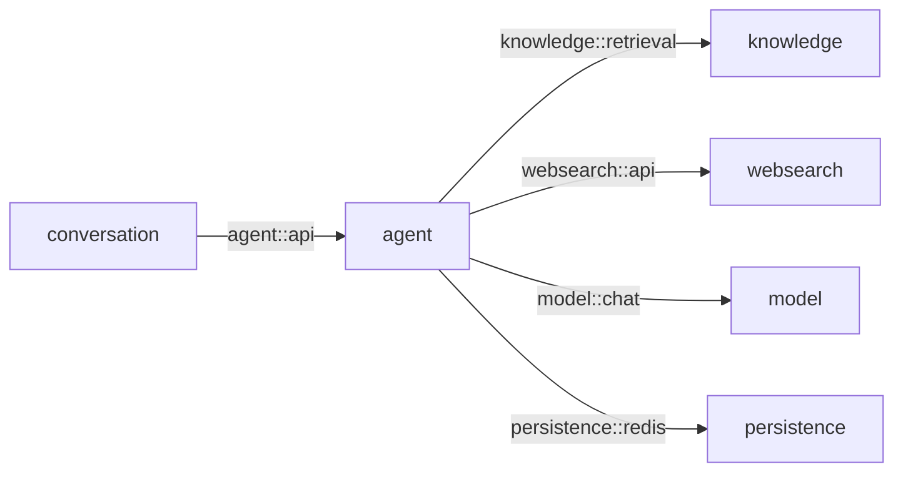

# Feature 003 Stage 04 Plan：博查 + SearchApi.io 双网页工具与可验证引用

Status: Implemented

## 1. Stage 目标

在 Stage 03 已可用的本地混合检索与 `search_local_knowledge` 之上，交付一个独立可验收的网页搜索与来源展示闭环：

1. 新增 `websearch` 深模块，用一个小型公开接口承载博查和 SearchApi.io 两个真实 Provider Adapter；
2. 主 Agent 生产环境同时注册 `search_local_knowledge`、`search_web_bocha`、`search_web_searchapi` 三个只读工具，并在统一的每 Run 4 次预算内有界选择；
3. 网页结果使用 Run-local `W1...Wn` 引用身份进入 Agent Loop，最终只持久化回答实际引用且经过 Server 核对的最小 Citation；
4. 同步收口 Stage 03 已返回稳定 Evidence ID 但尚未持久化来源卡片的问题，使 Local/Web Citation 使用同一条验证与持久化链路；
5. 在聊天页面展示提供方明确、可点击且刷新后仍存在的来源卡片，并覆盖未配置、鉴权、限流、超时、非法响应和隐私边界。

Stage 04 完成后，用户可以让 Agent 使用博查或 SearchApi.io 查询网页，也可以在同一回答中看到真实本地/网页来源。Stage 04 不宣称 Feature 003 已全部完成：Citation 摘要如何进入后续模型上下文、压缩计量、多来源长对话和最终端到端验收仍由 Stage 05 收口。

## 2. 当前基线与实施前置

### 2.1 当前代码事实

Plan 编写时基线为 `codex/feature-003-local-document-rag` 的 `76f74b6`：

- Stage 03 Plan 为 `Implemented`；本地 BM25 + Vector → RRF → Rerank、诊断 UI 和 `search_local_knowledge` 已进入生产调用链；
- 生产 `ReactAgentSessionAdapter` 仍以单个 `productionTool` 注册本地工具，测试工具使用独立列表，尚无多个生产工具的明确集合；
- 每 Run 4 次工具预算、顺序执行、工具生命周期 SSE 和 `REBUILD_FROM_PROJECTION` 已成立，不需要在本 Stage 重新设计；
- `ToolLifecycleInterceptor` 当前会对任意超长结果直接按字符截断。该行为可能截断 JSON 或 Citation 身份，不能直接承载结构化来源；
- `AgentResult` 与 `AssistantMessagePayload` 尚无 Citation；JSONL Codec、前端 Entry 类型和聊天消息只处理 Assistant 正文/模型/usage；
- 仓库中尚无 `websearch` 模块、网页搜索配置、Provider Adapter 或网页来源卡片；
- 工作区在 Plan 编写前为 clean。实施前必须重新检查当前分支、状态和提交，不得覆盖开发者或其他 Stage 的未提交修改。

Stage 03 已在同一代码版本报告过的测试不重复运行。Stage 04 修改 Agent、Conversation 和 Web 后，只补新增行为的聚焦验证，并在最终版本统一运行一次必要回归。

### 2.2 实施前置

- 开发者确认本 Plan 后才把状态改为 `Planned`；`Planned` 仍不代表允许实施，修改业务代码需要单独明确授权；
- 本 Plan 中的 SearchAPI 明确指 **SearchApi.io**，首版固定其 Google Search API `engine=google`，不是其他同名 Search API 产品；
- 博查使用原始 Web Search，SearchApi.io 只使用普通 `organic_results`；若现有账号/套餐只提供生成式答案或其他引擎，必须停止并回到讨论；
- 自动化验证只使用本地 HTTP Stub。真实博查/SearchApi.io 调用会把查询发送给外部服务且可能产生费用，必须在实施完成后另行取得开发者授权；
- Stage 03 的工具事件、Checkpoint 强制重建、唯一 Run 终态和成功提交后 SSE 断流语义是不可回归基线。

## 3. 实施范围与禁止范围

### 3.1 本 Stage 包含

- `websearch::api` 的统一查询/结果/失败合同；
- WebSearch 内部 Provider Port、博查 Adapter、SearchApi.io Adapter 与应用编排；
- 两个显式 Web ToolCallback 和三个生产工具的静态注册；
- 网页工具选择、首提供方失败后的有界第二选择、禁止联网与非可信内容策略；
- Run-local 来源注册表、`L`/`W` 引用编号、最终引用核对和最小 Citation 输出；
- Assistant JSONL 的向前兼容可选 Citation 字段；
- Local/Web 来源卡片、网页安全跳转和提供方/检索时间展示；
- provider-neutral 稳定错误、工具 SSE 的安全来源数量/提供方状态和隐私提示；
- Spring Modulith 依赖、配置示例、聚焦自动化和隔离手工验收。

### 3.2 本 Stage 禁止

- 不使用博查 AI Search、SearchApi.io AI Overview/Answer Box 或提供方生成答案代替 SalmonMind 最终回答；
- 不跟随搜索结果 URL，不下载网页全文，不做浏览器自动化、正文抽取、反爬绕过、网页入库或定时爬取；
- 不自动把网页结果写入 PostgreSQL Knowledge 表、RustFS 或 Elasticsearch；
- 不建立通用 Tool Marketplace、动态 Provider 发现、根级 `tools/common` 包或为未来 Provider 预建空类型；
- 不在 HTTP Adapter 内做隐藏自动重试、自动 Provider fallback 或并行双搜，避免重复计费与不可观察的外部调用；
- 不默认同时调用两个网页工具；只有用户要求交叉核验、首个结果为空/不可用或重要时效事实确需第二来源时才使用第二个；
- 不做跨 Provider 质量融合、网页 RRF、网页 Rerank 或结果可信度评分；两个 Provider 的原始 rank 不跨源相加；
- 不增加网页搜索配置 UI、用户级 Provider 选择持久化或 API Key 浏览器存储；配置仍由 Server 环境注入；
- 不在本 Stage 把 Citation 摘要加入后续模型投影、修改 Compaction 算法或完成 Stage 05 的长对话预算；
- 不修改 Knowledge Generation、Evidence、Embedding/Rerank 模型、2560 维索引或 Redis Stream；
- 不调用真实付费 API，不提交、不推送、不创建 PR；这些动作都需要单独授权。

## 4. 模块与接口设计

### 4.1 目标依赖



- `websearch` 是独立业务能力模块，公开 Named Interface 仅为 `api`；它不依赖 Agent、Conversation、Knowledge 或 Persistence；
- `agent` 在既有依赖上增加 `websearch::api`，拥有 ToolCallback、工具策略、Run-local 来源注册表和最终 Citation 核对；
- `conversation` 仍只依赖 `agent::api`，只持久化 Agent 已验证的最小 Citation，不认识博查/SearchApi.io HTTP DTO；
- `knowledge` 不因 Citation 或网页工具反向依赖 Agent/Conversation/WebSearch。

### 4.2 `websearch::api`

公开接口保持小而稳定，表达业务语义而不是提供方字段：

```text
WebSearchService.search(provider, request) -> WebSearchResult
```

公开合同至少包含：

- `WebSearchProvider`：`BOCHA`、`SEARCH_API`；
- `WebSearchFreshness`：`ANY`、`DAY`、`WEEK`、`MONTH`、`YEAR`；
- `WebSearchRequest`：规范化 query、freshness、count；
- `WebSearchStatus`：`SUCCESS`、`EMPTY`、`UNAVAILABLE`；
- `WebSearchReason`：`NONE`、`INVALID_QUERY`、`NOT_CONFIGURED`、`AUTH_FAILED`、`RATE_LIMITED`、`TIMEOUT`、`PROVIDER_FAILED`、`INVALID_RESPONSE`；
- `WebSearchHit`：provider、provider rank、title、HTTP(S) URL、site、snippet、可选 provider date label、retrievedAt 和可选非敏感 trace ID。

公开接口不暴露 RestClient、Jackson `JsonNode`、博查 `webPages`、SearchApi.io `organic_results` 或原始错误体。

### 4.3 WebSearch 内部实现

两个真实 Provider 已经形成变化轴，因此在 WebSearch 内部使用一个小型 `WebSearchProviderPort`，由应用服务按显式 `WebSearchProvider` 路由到恰好一个 Adapter。这里不是动态插件系统：Provider 集合固定、无运行时注册、无 fallback 链。

应用服务统一负责：

- query 去控制字符、合并空白、trim，长度必须为 1–2000；
- freshness 缺省为 `ANY`，count 缺省 5、范围 1–10；
- 结果标题/摘要有界、URL 校验、同一 Provider 响应内按规范化 URL 去重和最终 count 截断；
- 把异常映射为 provider-neutral 状态，不把凭据、原始响应或完整请求 URL 上抛。

Provider Adapter 只负责请求构造、鉴权、响应字段映射和 HTTP 失败分类。不能在 Adapter 内调用另一个 Provider。

### 4.4 Agent 与 Conversation 边界

- 生产 Adapter 把单个 `productionTool` 改为不可变 `List<ToolCallback>`；生产列表固定为本地、博查、SearchApi.io 三个工具，测试列表继续与生产严格二选一；
- 不引入动态 Tool Registry。三个 ToolCallback 都是 Agent 内部 Adapter，只依赖各自的小型公开能力；
- `agent::api` 增加平台拥有的结构化 Citation 结果，使用 Local/Web 两个明确 variant，不使用大量可空字段的通用 DTO；
- Conversation 把 Agent Citation 映射为 Assistant payload 内的 Local/Web Citation payload。Conversation 不二次访问 Knowledge/WebSearch，也不从回答正文猜测来源内容。

## 5. 双 Provider 请求与规范化合同

### 5.1 公共 Tool 输入

两个网页 Tool schema 保持一致：

```json
{
  "query": "必填，1–2000 字符",
  "freshness": "any | day | week | month | year，可选",
  "count": "1–10，可选，默认 5"
}
```

- ToolCallback 必须拒绝额外字段、空 query、未知 freshness 和越界 count；
- Agent 可重写成适合网页检索的短 query，但不得无必要地复制本地 Evidence 全文、个人身份信息、API Key 或系统提示；
- 相同输入不做跨 Run 缓存。本 Stage 不新增搜索历史或查询日志表。

### 5.2 博查 Adapter

- `POST {baseUrl}/v1/web-search`，默认 base URL 为 `https://api.bochaai.com`；
- `Authorization: Bearer <key>`、`Content-Type: application/json`；
- body 固定 `summary=true`，传 `query`、`count` 和映射后的 freshness；
- `ANY/DAY/WEEK/MONTH/YEAR` 分别映射 `noLimit/oneDay/oneWeek/oneMonth/oneYear`；
- 只读取 `webPages.value` 的 `name/url/siteName/summary|snippet/datePublished`，不消费生成式回答或垂直卡片；
- trace 优先取响应中明确的非敏感请求 ID；没有则为空，不把 `webSearchUrl` 当 Citation URL。

### 5.3 SearchApi.io Adapter

- `GET {baseUrl}/api/v1/search`，默认 base URL 为 `https://www.searchapi.io`；
- 参数固定 `engine=google`、`page=1`、`q=<query>`，并使用 Server 配置的 `gl`、`hl`、`safe`；首版默认 `gl=cn`、`hl=zh-cn`、`safe=active`，允许部署配置覆盖但不向模型开放；
- API Key 使用 `Authorization: Bearer <key>`，不得使用 `api_key` query 参数；
- freshness `ANY` 时省略 `time_period`，其余映射为 `last_day/last_week/last_month/last_year`；
- 官方合同已说明 `num` 自 2025-09 起固定为 10。本 Stage 不发送 `num`，只读取第一页 `organic_results` 后在本地截取 count；
- 只读取 `position/title/link/source|domain/snippet/date`。不读取 `answer_box`、`knowledge_graph`、AI Overview、广告、购物、论坛或其他卡片；
- `search_metadata.id` 可以作为内部非敏感 trace，`request_url/html_url/json_url` 不进入 Tool result 或 Citation。

### 5.4 结果与 URL 安全

- URL 必须是可解析的绝对 `http` 或 `https` URL；拒绝 `javascript:`、`data:`、本地文件和无 scheme 值；
- 规范化只做不改变资源语义的处理：scheme/host 大小写、默认端口和 fragment；不得擅自删除可能决定资源身份的 query 参数；
- 同一 Provider 单次响应内按规范化 URL 保留最前 rank；跨 Provider 相同 URL 暂不合并，以保留各自观察和费用来源；
- title、site 和 snippet 按完整字段边界裁剪，不能输出 HTML；SearchApi.io 的相对 `date` 只作为 provider date label 展示，不反推精确 Instant；
- `retrievedAt` 由 Server 在收到响应时生成，是 Citation 中唯一保证为精确时间的网页时间字段。

## 6. 失败、选择与费用边界

### 6.1 稳定失败映射

| 场景 | WebSearch 结果 | Tool 稳定码 |
| --- | --- | --- |
| base URL/key 缺失 | `UNAVAILABLE / NOT_CONFIGURED` | `WEB_SEARCH_NOT_CONFIGURED` |
| 401/403 | `UNAVAILABLE / AUTH_FAILED` | `WEB_SEARCH_AUTH_FAILED` |
| 429 | `UNAVAILABLE / RATE_LIMITED` | `WEB_SEARCH_RATE_LIMITED` |
| 连接/读取超时 | `UNAVAILABLE / TIMEOUT` | `WEB_SEARCH_TIMEOUT` |
| 5xx/网络失败 | `UNAVAILABLE / PROVIDER_FAILED` | `WEB_SEARCH_FAILED` |
| 必需顶层结构缺失、非空数组全部非法 | `UNAVAILABLE / INVALID_RESPONSE` | `WEB_SEARCH_FAILED` |
| 合法响应无自然结果 | `EMPTY` | 非失败，返回空 results |

响应数组中少量非法项可以丢弃；如果上游宣称有结果但没有一条合法项，必须报非法响应，不能伪装成自然无结果。工具失败作为结构化结果回到 Agent，不自动把 Run 标成 FAILED。

### 6.2 Provider 选择

系统策略固定：

- 用户点名博查或 SearchApi.io 时调用对应工具；
- 中文/中国互联网信息默认先博查，明确 Google、国际网页或英文检索默认先 SearchApi.io；
- 未指定提供方的时效问题默认只调用一个网页工具；
- 首个 Provider `EMPTY/UNAVAILABLE` 且联网仍被允许时，可以调用另一个；
- 用户要求交叉核验，或重要时效事实确实需要独立网页来源时，可以调用两个；
- 用户禁止联网时两个都不能调用；普通稳定知识与创作问题可以都不调用；
- 三个工具共享每 Run 最多 4 次调用，仍保持顺序执行。HTTP Adapter 不重试，模型也不得在相同参数上循环重试失败 Provider。

这是一套可测试的初始策略，不把 Provider 质量描述成永久事实。后续真实使用表明默认选择不合理时，应以评测修改系统策略，不在 Adapter 中偷偷调换。

## 7. Run-local 来源与 Citation 链路

### 7.1 来源结果 Envelope

三个生产工具统一使用 Agent 内部的 source-bearing result envelope：顶层包含 status/reason/source kind/provider/items，每个 item 携带形成 Citation 所需的最小字段。它是 Agent 内部合同，不进入 `websearch::api` 或 JSONL。

每次 stream 创建独立 `RunSourceRegistry` 并放入当前 `RunnableConfig` metadata。工具拦截器在结果回到模型前：

1. 校验 source-bearing envelope；
2. Local 以 Evidence ID、Web 以 provider + 规范化 URL 作为 Run 内身份；
3. 为首次出现的 Local/Web 来源分别分配 `L1...` / `W1...`，重复身份复用原编号；
4. 把引用 ID 写回有界 Tool result，再送入下一次模型调用；
5. 记录最小结构化来源，不保存完整候选集或原始提供方响应。

两个网页工具共享同一个 `W` 序列，因此多次调用或切换 Provider 不会出现两个 `W1`。Registry 只属于本 Run，不写 RedisSaver/JSONL；并发 Run 不得共享计数器或来源集合。

### 7.2 结果边界修复

- Local Tool 继续最多 5 条 Evidence，Web Tool 默认 5、最多 10 条；每条正文/摘要先独立裁剪；
- source-bearing result 超过全局字符上限时，从尾部按完整 item 删除并标记 `truncated=true`，不能对子串截断成非法 JSON；
- 只有非 source-bearing 测试工具可保留现有通用字符兜底；生产来源工具必须始终返回可解析 envelope；
- 工具完成事件从 envelope 取得安全的 provider、sourceCount 和 truncated/degraded 状态，不通过字符串前缀把所有失败压成 `RETRIEVAL_UNAVAILABLE`。

### 7.3 最终引用核对

系统策略要求模型只用精确标记 `[L1]`、`[W1]` 引用工具来源。流结束后、`AgentResult` 产生前：

1. 从最终完整正文提取精确引用标记，按首次出现顺序去重；
2. 只解析当前 Registry 存在的 ID；未知、跨 Run 或模型伪造 ID 不产生 Citation；
3. 未在正文引用的 Tool result 不持久化；
4. `AgentResult` 返回正文与合法 Local/Web Citation 列表；
5. Conversation 只映射并写入 Agent 已验证结果，不能自己根据文档名或 URL 猜来源。

未知标记保留为普通正文但不生成可点击卡片，便于暴露模型错误；不得把它映射到“最接近”的来源。

### 7.4 JSONL 与前端

- `AssistantMessagePayload` 增加不可变 `citations` 列表；旧 JSONL 缺失该字段时解码为空列表，因此保持 history format v1 的向前兼容，不做 Flyway migration；
- Local Citation 保存 referenceId、Evidence/Revision ID、文档名和位置；Web Citation 保存 referenceId、provider、title、URL、site、provider date label 和 retrievedAt；
- 完整 Tool schema、query、snippet 集合、候选 rank、trace 和失败原文不进入长期 JSONL；
- Assistant 正文仍进入后续模型投影，Citation 列表暂不注入下一轮模型消息；Stage 05 决定引用摘要和 Compaction 计量；
- 前端在最终 Assistant 下按引用顺序显示来源卡片。Local 展示文档/位置，Web 展示 Provider、标题、站点、可选发布时间和检索时间；
- Web 链接只接受后端已校验的 HTTP(S) URL，使用新窗口并设置 `noopener noreferrer`；title/site/date 作为纯文本，不渲染提供方 HTML；
- 流式阶段只显示按工具名区分的“正在使用博查/SearchApi.io”短状态；来源卡片以 `assistant_completed` 和刷新后的权威 Entry 为准。

## 8. 有序实施步骤

| ID | 检查点 | Blocked by | 可验证结果 |
| --- | --- | --- | --- |
| S4-01 | WebSearch 深模块与双 Provider Adapter | Stage 03 基线稳定 | 同一公开合同经两个本地 HTTP Stub 返回规范化结果，错误与配置缺失不阻止启动 |
| S4-02 | 三工具注册、选择与 Run-local 来源 Gate | S4-01 | 确定性 Agent 可调用两个显式 Web Tool，第二 Provider 受预算控制，模型收到无冲突 `W` 引用 |
| S4-03 | Citation 核对、JSONL 与来源卡片 | S4-02 | 只有当前 Run 合法 `[Lx]/[Wx]` 被持久化，刷新后 Local/Web 卡片可见 |
| S4-04 | 失败/隐私矩阵与 Stage 验证 | S4-03 | 未配置、鉴权、限流、超时、非法 URL/响应、禁止联网和既有功能回归均有证据，停在 Stage 04 |

### 8.1 S4-01：WebSearch 深模块与双 Provider Adapter

1. 建立 `websearch` 模块、`api` Named Interface、内部 Provider Port 和应用服务，并更新 Modulith 依赖；
2. 实现公共输入校验、结果规范化、URL 安全、单 Provider 去重和稳定状态；
3. 实现博查 RestClient Adapter，用 Stub 验证 method/path/header/body、freshness、字段映射和错误状态；
4. 实现 SearchApi.io RestClient Adapter，用 Stub 验证 Bearer Header、`engine=google`、不发送 `num/api_key`、time_period、organic_results 和 metadata 隔离；
5. 增加延迟配置与 `application-dev-example.yml`，缺少任一/全部 Provider 配置时 Spring Context 仍能启动。

### 8.2 S4-02：三工具注册与来源 Gate

1. 新增两个专用 Web ToolCallback，共用 Agent 内部 source-bearing envelope；
2. 把生产单工具字段收敛为不可变工具列表，静态注册本地 + 两个网页工具；测试工具仍不会混入生产 Bean；
3. 在每 Run metadata 增加独立来源 Registry，按 Local Evidence ID、Web provider + URL 分配引用，并按完整 item 控制结果大小；
4. 更新系统策略与工具描述，覆盖指定 Provider、默认选择、首 Provider 空/失败、禁止联网和不默认双搜；
5. 用确定性 ChatModel 证明两个 Web Tool 都能执行、工具结果带不冲突 `W` ID、总预算仍为 4、并发 Run Registry 不串线。

### 8.3 S4-03：可验证 Citation 与 UI

1. 扩展 `agent::api` 最终结果，解析正文精确标记并只返回 Registry 中合法 Citation；
2. 扩展 Assistant payload 与 JsonlCodec，旧行缺失 citations 时读取为空，新行只保存实际引用的最小字段；
3. Conversation 在既有成功提交点之前把 Citation 与 Assistant 正文一次追加，保持 JSONL → 短 PostgreSQL 事务 → SSE 的顺序；
4. 扩展前端 Entry 类型和 Assistant 渲染，展示 Local/Web 卡片并保证链接/文本安全；
5. 验证非法/未知引用、未引用结果、重复引用、相同来源重复调用、刷新恢复和 Compaction retained tail 编解码。

### 8.4 S4-04：失败、隐私与收口

1. 覆盖两个 Provider 各自的未配置、401/403、429、timeout、5xx、空结果、缺字段、混合合法/非法项和恶意 URL；
2. 覆盖第一个 Provider 失败后有界调用第二个、两个都失败后使用模型知识并说明未验证、用户禁止联网时零 Web 调用；
3. 确认日志/SSE/JSONL/前端不出现 API Key、SearchApi.io request URL、完整 query、原始响应或网页 HTML；
4. 验证本地工具、Knowledge 页面、普通 Chat、每轮 Checkpoint 重建、唯一终态和成功后 SSE 断流无回归；
5. 完成隔离手工验收与实施报告，停在 Stage 04，不进入 Stage 05。

## 9. 数据迁移与兼容

- 不新增 PostgreSQL/Flyway migration；网页搜索没有业务表，Citation 随 Assistant Entry 存在 JSONL；
- Assistant payload 的 `citations` 是可选向前字段：旧历史解码为空列表，新 Codec 仍能读取所有现有 v1 行，不修改 Header/Entry formatVersion；
- Compaction retained tail 内嵌的旧/new Assistant 都必须可往返；本 Stage 不改变 active path、leaf、seq 或恢复算法；
- 不修改 Knowledge Evidence/Revision/Generation、Elasticsearch mapping、Redis Stream 或 RedisSaver schema；
- 配置只前向增加 `salmon.websearch.bocha.*` 与 `salmon.websearch.search-api.*`，API Key 仍只来自不入库配置/环境变量；
- Stage 04 未验收前，不把双网页搜索和来源卡片写成 README/稳定 docs 的当前已交付事实。

## 10. 验证计划

### 10.1 自动化边界

- WebSearch 应用合同用少量纯单元测试覆盖输入、URL、去重、截断和错误映射；不为每个 record/Mapper 建测试；
- 两个 HTTP Adapter 各使用一组本地 Stub 测试，请求和响应不访问公网；
- Agent 复用 Stage 01/03 的真实 ReactAgent + RedisSaver 确定性 Gate，只增加多生产工具、Registry、引用核对和预算场景；
- Conversation/JSONL 只补 Citation 向前兼容、成功持久化与恢复；前端使用现有 lint/build 和聚焦渲染检查；
- 已有 Stage 03 测试结果不重复跑。最终全量仅在 Stage 04 最终代码版本运行一次。

### 10.2 实施中验证顺序

S4-01 只运行 WebSearch/Modulith 聚焦测试；S4-02 运行 Agent 多工具与来源 Gate；S4-03 运行 JSONL/Conversation/前端聚焦验证；S4-04 再统一执行最终回归。执行 Agent 应记录实际测试类名和命令，失败修复后只重跑受影响集合。

最终代码版本运行一次：

```text
mvn -f apps/server/pom.xml test
docker compose -f compose.yaml config --quiet
npm run lint --prefix apps/web
npm run build --prefix apps/web
git diff --check
git status --short --branch
```

### 10.3 Stub/手工验收

使用隔离 Stub 与非付费路径完成：

1. 明确要求博查，确认只调用 `search_web_bocha`，工具状态和 Web Citation provider 正确；
2. 明确要求 SearchApi.io/Google，确认只调用 `search_web_searchapi`，请求无 `api_key/num`；
3. 令首 Provider 返回 EMPTY/429，确认在预算允许时调用另一个；一般成功查询不默认双搜；
4. 明确禁止联网，确认两个网页 Stub 都没有收到请求；
5. 一个回答同时引用 Local `L1` 与 Web `W1`，刷新后两类卡片仍存在；
6. 模型输出未知 `[W99]`、重复 `[W1]` 和未引用的工具结果，确认只生成一次合法卡片；
7. 返回 `javascript:` URL、HTML title、相对 date 和超长摘要，确认非法 URL 被拒绝、文本不执行、日期不被伪造、JSON 不被截断；
8. 两个 Provider 都失败时，Agent 可给出模型背景知识，但明确实时状态未经联网验证。

真实博查/SearchApi.io Smoke 需开发者另行授权。获准后每个 Provider 最多一次最小无敏感查询，报告 provider、HTTP 结果类别、返回条数、耗时、非敏感 trace 和费用边界；不得打印 API Key、完整原始响应或用户文档内容。

## 11. Stage 验收标准

1. `websearch` 作为深模块只公开统一结构化接口，两个 Provider DTO/HTTP 细节不外泄；
2. 博查使用原始 Web Search；SearchApi.io 固定 Google organic results、Bearer Header、不发送 `api_key` 或失效的 `num`；
3. 两工具共有 query/freshness/count 合同，默认 5、最大 10，Provider 枚举映射正确；
4. URL、字段、数量和日期处理有界，不把摘要说成全文，不把相对日期伪造为精确发布时间；
5. 生产 Agent 静态注册本地 + 两个网页工具，测试工具不进入生产；
6. 用户指定 Provider、默认选择、首 Provider 失败后的第二选择、禁止联网和普通问题零工具可确定性验证；
7. 三工具共享每 Run 4 次预算、顺序执行，Provider Adapter 没有隐藏重试/fallback；
8. 同一 Run 的 `L`/`W` ID 唯一稳定，并发 Run 不串线，结构化 Tool result 不被按字符截坏；
9. 只有最终正文实际引用且能映射到当前 Run Registry 的来源进入 Citation，未知/跨 Run ID 不生成卡片；
10. Local/Web Citation 随 Assistant 一起进入 JSONL，旧历史仍可读取，刷新后来源卡片可见；
11. 网页 Citation 展示 provider、真实 HTTP(S) URL 和 retrievedAt，跳转与文本渲染安全；
12. 网页结果、query、完整 snippet 集合和原始 Provider 响应不进入 Knowledge 存储或长期 JSONL；
13. 未配置、鉴权、限流、超时、上游失败和非法响应具有 provider-aware 稳定失败，不阻止应用/普通 Chat 启动；
14. Stage 03 本地检索、Checkpoint 重建、工具 SSE、唯一终态和成功后断流语义不回归；
15. 开发者能说明 Provider 请求、Agent 选择、Run-local Registry、引用核对、JSONL 和 UI 的完整调用链及隐私/费用边界。

## 12. 风险、停止条件与恢复点

### 12.1 必须停止并回到讨论

- 开发者实际所指 SearchAPI 不是 SearchApi.io，或凭据/套餐不支持 `engine=google`；
- 博查/SearchApi.io 当前官方合同与本 Plan 的 endpoint、鉴权、freshness 或结果字段发生不兼容变化；
- 当前 Spring AI Alibaba 版本无法在同一次 Run 为工具结果分配隔离引用并让装饰后的结果回到模型，或必须使用全局可变状态才能实现；
- Citation 只能通过解析模型虚构的标题/URL建立，无法与当前 Run 实际 Tool result 做精确映射；
- Assistant 可选 Citation 会破坏既有 JSONL v1、Compaction retained tail 或恢复语义，需要 formatVersion 迁移；
- 多工具结果无法保持现有 4 次预算、顺序执行、Checkpoint 强制重建或唯一 Run 终态；
- 完成网页回答必须增加全文抓取、网页入库、浏览器权限或把原始搜索结果长期保存；
- Provider 条款、隐私要求或部署网络使查询不能按已确认边界发送；
- 实施发现需要提前修改 Stage 05 的 Compaction/上下文预算才能保证基本正确性。

普通 DTO、Adapter、Stub、CSS 或配置错误由原执行 Agent 在 Stage 04 范围内修复，不作为扩大范围的理由。

### 12.2 可恢复检查点

- S4-01：WebSearch 双 Provider 结构化能力成立，尚未进入 Agent；
- S4-02：三工具和 Run-local 来源成立，尚未持久化/展示 Citation；
- S4-03：Citation/JSONL/UI 闭环成立，尚未完成失败与隐私矩阵；
- S4-04：Stage 验证完成，等待开发者验收。

## 13. 实施报告要求

执行 Agent 完成或停止时一次性报告：

1. S4-01 至 S4-04 的完成/阻塞状态；
2. `websearch::api`、内部 Provider Port 和两个 Adapter 的职责/依赖；
3. 两个 Provider 的实际 method/path/auth/参数/字段映射，如何证明 Key 未进入 URL；
4. 三个工具的注册与选择策略、第二 Provider 条件、总预算和无隐藏重试证据；
5. Run-local `L/W` 分配、重复身份、并发隔离、完整 item 截断和最终引用核对链路；
6. Assistant JSONL 兼容、恢复、Compaction retained tail 和前端来源卡片证据；
7. 未配置、鉴权、限流、超时、非法响应/URL和两个 Provider 都失败的表现；
8. 隐私与长期存储边界：哪些数据进入 SSE/JSONL/日志/Knowledge，哪些明确不进入；
9. 所有验证命令、结果和环境，以及复用了哪些 Stage 03 结果而未重复运行；
10. 是否调用真实博查/SearchApi.io、授权依据、非敏感 trace 和费用边界；
11. 当前 Git 状态、无关修改与明确停点：`Stage 04 等待开发者初审；未进入 Stage 05，未提交、未推送、未创建 PR。`

## 14. 参考接口事实

- 博查开放平台：<https://open.bochaai.com/>。官方示例确认原始 `POST /v1/web-search`、Bearer 鉴权以及 query/freshness/summary/count；本 Stage 不使用 AI Search。
- SearchApi.io Google Search：<https://www.searchapi.io/docs/google>。官方文档确认 `GET /api/v1/search?engine=google`、Bearer Header、`time_period`、`organic_results`；`num` 自 2025-09 起固定为 10。
- Dify 官方插件仓库：<https://github.com/langgenius/dify-official-plugins>。其 Provider Tool 以明确工具身份隔离凭据和调用，本 Plan 采用同类清晰边界，但不引入 Dify 式动态插件市场。
- 当前仓库锁定 Spring AI `1.1.2` / Spring AI Alibaba `1.1.2.2`；Stage 01/03 已证明 ToolInterceptor 的每 Run metadata、预算和 Tool result 回环。本 Stage 只为来源装饰/Citation 增加聚焦 Gate，不重做已成立证明。

开发者确认本 Plan 后才把状态改为 `Planned`；Stage 04 实施仍需单独授权。
