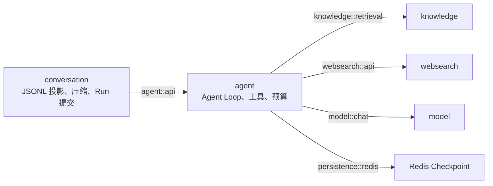

# Feature 003 Stage 05 Plan：多来源多轮上下文与最终验收

Status: Accepted

## 1. Stage 目标

Stage 05 是 Feature 003 的最后一个实施与验收 Stage。它不再增加新的知识来源，而是在 Stage 01–04 已交付的 Conversation、异步文档入库、本地混合检索和双网页工具之上，完成四个收口：

1. 让已持久化的 Local/Web Citation 以有界、可恢复的摘要进入后续轮次和 Compaction，同时保持 Run-local 引用身份不跨轮复用；
2. 让 system prompt、实际 Tool schema、JSONL 投影、当前 Run 的工具调用/结果预留和回答输出真正处于同一上下文预算合同中；
3. 验证本地资料、博查、SearchApi.io 与 Model Knowledge 可以在多轮对话中组合、降级、刷新和恢复，且 Redis Checkpoint 不成为隐藏权威；
4. 汇总 Stage 01–05 的可追溯证据，按 Feature Spec 的 21 条 Acceptance Criteria 完成最终验收，而不是只宣布 Stage 05 自身代码通过。

Stage 05 完成实现与自动化验证后，执行 Agent 只能把本 Plan 标为 `Implemented` 并交付验收包。`Accepted` 仍由开发者最终确认；真实 SiliconFlow、博查、SearchApi.io 或真实 Chat 模型调用也需要单独授权。

## 2. 当前基线与已确认缺口

### 2.1 当前代码事实

Plan 编写时基线为分支 `codex/feature-003-local-document-rag` 的提交 `51ddafb`：

- Stage 02–04 Plan 为 `Implemented`；Stage 01 实现已经进入 `6d85bd9`、`7eb2617`，但 Plan 状态仍为 `Draft`，这是最终验收时必须核对的文档状态不一致；
- 生产 Agent 已静态注册 `search_local_knowledge`、`search_web_bocha`、`search_web_searchapi`，三者共享每 Run 4 次调用预算；
- `RunSourceRegistry` 已能为当前 Run 分配 `L/W` 引用，最终只返回正文实际使用且能映射到真实工具结果的 Citation；
- Assistant JSONL 已持久化 Local/Web Citation，前端刷新后可以展示来源卡片；旧 JSONL 缺少 Citation 字段时仍可读取；
- 生产工具启用后 `requiresProjectionRebuild()` 为真，每次主调用都会释放旧 Checkpoint 并从 JSONL Active Path 重建；
- Conversation 已把模型/工具调用排除在数据库事务外，并在 Assistant JSONL 刷盘和短事务提交成功后再发送成功 SSE；
- 本地 Knowledge 已具备 Redis Stream 后台处理、Tika、2560 维 Qwen Embedding、BM25 + Vector → RRF → Qwen Rerank、诊断 UI 与本地工具；
- WebSearch 已有统一公开接口、博查/SearchApi.io Adapter、稳定错误和隐私边界。

实施前必须重新检查当前分支、提交和工作区。Plan 编写时 Spec 尚有已知未提交修改，实施 Agent 必须保护它，不得用 checkout/reset 覆盖。

### 2.2 Stage 05 必须解决的真实缺口

1. `ConversationRunCoordinator.messageOf` 只把 Assistant 正文投影给模型；结构化 Citation 没有进入下一轮。
2. `SummaryTemplate` 同样只序列化 Assistant 正文；被压缩出原文区后，来源边界无法稳定进入摘要。
3. `ConversationCompactionPolicy` 只按 User/Assistant 正文估算消息；引用摘要尚未计量。
4. 生产每轮强制从 JSONL 重建，但估算仍可能复用上一轮 `usage.totalTokens`。该 usage 可能包含 JSONL 不保存的旧 tool result，同时不包含本轮新追加的 Citation 摘要，不能再作为生产工具轮次的可靠锚点。
5. 当前 `system-prompt-tokens=256` 只是静态配置，不能证明覆盖实际 system prompt 与三个 Tool schema；工具定义变化后也不会自动更新。
6. 当前只有单次 `max-tool-result-chars=200000` 和每 Run 4 次调用限制，没有每 Run 工具结果总预算；最多四个大结果可能共同挤占回答输出空间。
7. `salmon.agent.max-prompt-chars`、`max-model-response-chars`、`max-tools`、`max-steps` 当前没有代码消费者。最终配置不能继续展示并不存在的安全边界；其中 Agent Loop 步数必须形成真实硬上限或明确停止重新设计。
8. 现有测试分别证明了各 Stage 能力，但还没有覆盖“带 Citation 的多轮投影 → 再检索 → Compaction → Redis 丢失重建 → 刷新”的完整闭环，也没有 Feature 级验收矩阵。

### 2.3 实施前置

- 开发者确认本 Plan 后才把状态改为 `Planned`；`Planned` 仍不等于允许修改业务代码，实施需要单独明确授权；
- 不重跑同一代码版本上已经由 Stage 01–04 可信报告的测试。Stage 05 修改跨越 Agent/Conversation 后，只补新增 Gate，并在最终代码版本统一运行一次必要全量验证；
- 自动化和默认手工验收使用确定性模型、本地 HTTP Stub 和非敏感文档 fixture，不访问付费 API；
- 真实外部 Smoke 是最终验收的一层，但必须在执行前单独询问授权。未授权时可以完成代码和本地验收，Feature 状态保持“等待最终验收”，不能伪造真实证据；
- 不删除开发者已有 Docker 容器或数据卷。需要隔离环境时使用独立容器名、端口、Bucket、Index 与 Redis Key 前缀。

## 3. 实施范围与禁止范围

### 3.1 本 Stage 包含

- Citation 感知的 Assistant 历史渲染，并复用于主投影、Compaction 摘要输入和 token 估算；
- 历史引用的 Run/Assistant 作用域、非可信数据边界和重新检索规则；
- Agent 向 Conversation 暴露的小型上下文预算合同；
- 实际 system prompt/Tool schema 静态开销估算和工具轮次动态预留；
- 每 Run 工具结果 token 总预算、完整 item 裁剪、预算耗尽错误和真实 Agent Loop 步数上限；
- usage 锚点与强制 JSONL 重建之间的语义修复；
- 本地 + 网页、双网页、Model Knowledge 的多来源多轮组合与降级；
- Citation、Compaction、Checkpoint、Redis 恢复、SSE 成功提交点和刷新恢复的跨模块验证；
- Stage 01–05 状态/证据审计、Spec 21 条验收矩阵、最终本地手工验收和需授权的真实外部 Smoke；
- 最终验收后必要的状态与稳定文档收口，但只在开发者明确确认 `Accepted` 后执行。

### 3.2 本 Stage 禁止

- 不增加 OCR、代码仓库扫描、目录监听、网页抓取/正文下载、URL 入库、网络笔记同步或新的知识来源；
- 不增加第三个网页 Provider、通用 Tool Marketplace、动态工具安装、多 Agent、子 Agent 或写操作工具；
- 不把 tool call、tool result、RRF 候选或网页摘要作为永久 JSONL Entry；
- 不把历史 `[L1]`/`[W1]` 自动复制成当前 Run 的合法 Citation，也不跨 Run 恢复 `RunSourceRegistry`；
- 不改变 Qwen Embedding/Rerank 模型、2560 维、RRF 参数、Top K、Tika/Redis Stream 入库合同或 Knowledge 数据权威；
- 不新增 PostgreSQL/Flyway 表来保存上下文预算、Citation 摘要或验收结果；
- 不为验收建立新的通用测试框架、长期 benchmark 平台或大规模相关性评测集；
- 不修改公开部署、登录、多用户、远程访问或生产运维；这些仍在 Feature 003 Out of Scope；
- 不把最终验收等同于自动化测试通过。真实外部调用、浏览器行为、恢复链路和开发者确认必须分别记录；
- 不提交、不推送、不创建 PR。任何 Git 提交仍需开发者单独明确允许。

## 4. 模块边界与深接口

### 4.1 目标依赖不变



- Conversation 继续拥有“哪些 durable Entry 对模型可见、如何压缩和如何提交 Run”的语义；
- Agent 继续拥有 system prompt、实际 ToolDefinition、Agent Loop、当前 Run 工具结果和动态预算；
- Knowledge/WebSearch 不认识 Conversation、Citation 历史或上下文预算；
- Stage 05 不新增跨模块依赖，也不把框架类型暴露到 `agent::api`。

### 4.2 一个 Citation 感知的历史渲染点

在 Conversation 内建立一个小而集中的历史渲染能力（命名可按实现调整，例如 `AssistantContextRenderer`），以 `AssistantMessagePayload` 为输入，生成模型可见文本。它必须被以下三处共同使用：

1. `ConversationRunCoordinator` 的 Active Path 主投影；
2. `SummaryTemplate` 的首次/增量摘要输入；
3. `ConversationCompactionPolicy` 的消息 token 估算和 Retained Tail 切分。

不能在三个调用点分别拼接 Citation，否则显示内容、压缩输入和预算会再次漂移。渲染器只处理 durable payload，不访问 Knowledge/WebSearch，不读取 URL 内容，也不改变前端展示。

### 4.3 `agent::api` 上下文预算合同

`AgentStreamSession` 增加一个默认可为空的只读预算描述（建议使用不可变 `AgentContextBudget`），至少表达：

- 当前实际 system prompt、固定框架消息和已注册 ToolDefinition/schema 的保守静态输入 token；
- 当前 Run 为 tool call 参数、tool result 与必要框架封装保留的最大动态输入 token；
- 预算描述不初始化 ChatModel、Redis 或外部 Provider，配置缺失时也能获得；
- 测试替身默认返回零额外预算，保持不注册工具路径的兼容性。

Conversation 只消费“需要预留多少 token”，不读取 Agent 的 prompt/schema 文本，也不认识三个工具的内部字段。Agent 对报告的动态上限负责，并必须在工具拦截点实际执行同一个上限。

## 5. Citation 进入后续轮次的合同

### 5.1 历史来源摘要

有 Citation 的 Assistant 在模型投影中保持原正文，并追加一个机器可识别、长度有界的历史来源区块。区块至少包含：

- 当前 Assistant 的 `runId`，用于说明该组 `L/W` 编号的作用域；
- Local：referenceId、文档名、位置；不暴露绝对路径、Object Key 或内部索引；
- Web：referenceId、provider、标题、合法 HTTP(S) URL、站点、可选 date label、retrievedAt；
- 明确标签表明这些是历史来源元数据，不是当前 Run 已注册、可以直接引用的 Evidence。

字段进入模型前去控制字符并使用现有上限或更小的防御性上限。历史区块是工具数据的派生事实，仍按不可信内容处理；其中的标题、文档名、位置或 URL 不能覆盖 system prompt。

没有 Citation 的旧 Assistant 保持原文本，不添加空区块。JSONL 不新增重复的 `citationSummary` 字段；摘要始终由结构化 Citation 在读取时确定性渲染，避免双份权威。

### 5.2 Run-local 引用不能跨轮升级

- `[L1]`、`[W1]` 只在产生它们的 Assistant/Run 内有意义；不同轮次允许再次出现同名编号；
- 历史来源摘要只帮助模型理解“上轮依据了什么”，不能注册到当前 `RunSourceRegistry`；
- 当前回答若需要可点击 Citation，必须重新调用相应工具并获得本 Run 的新 Registry 身份；
- 只是在语言上回顾上一轮时，可以提到历史文档名/网页标题，但不能把旧编号伪装成本轮实时核验；
- `RunSourceRegistry.citationsFor` 仍只核对当前 Run 实际返回的来源，Stage 05 不增加“从历史找最近同名引用”的兜底。

### 5.3 Compaction 中的来源边界

- 摘要输入使用与主投影相同的 Citation 感知 Assistant 文本；
- Summary Prompt 增加一条固定规则：保留关键结论来自本地文档、网页还是 Model Knowledge 的边界，但历史 `L/W` 编号不能作为未来回答的活动 Citation；
- 进入 Retained Tail 的 Assistant 保留原始结构化 Citation，后续仍能确定性渲染；
- 已退出原文区的 Citation 不复制进 `CompactionPayload` 新字段，摘要只保存来源语义和必要名称；要重新验证原文时仍需调用工具；
- Citation 摘要 token 参与 Tail 切分与压缩前后重新计量，避免“投影看得到但预算没算到”。

## 6. 统一上下文预算与 Agent Loop Gate

### 6.1 不改变 Feature 002 的基础预算

以下已冻结部署值保持不变：

- physical context window：`1,000,000`；
- working context window：`262,144`；
- answer output reserve：`65,432`；
- 基础主输入触发阈值：`196,712`；
- retained tail target：`65,536`；
- summary max output：`32,768`。

Stage 05 不改这些数字，而是把此前遗漏的静态开销和工具轮次动态预留加入主输入估算：

```text
plannedMainInput
  = Agent 静态输入开销
  + 当前 JSONL 可重建投影（含 Citation 摘要）
  + 当前 Run 工具轮次动态预留

plannedMainInput >= 196,712 时，主调用前先压缩
```

回答输出的 `65,432` 仍由触发阈值单独预留，不能拿来容纳 tool result。压缩后必须用相同公式重新计量；仍超限则返回 `CONTEXT_LIMIT_REACHED`，不能抱着侥幸进入模型调用。

### 6.2 usage 锚点规则

当 `AgentStreamSession.requiresProjectionRebuild()` 为真时，禁用上一轮 Assistant usage 锚点，直接估算当前 JSONL 可重建投影。原因是上一轮 usage 可能包含已经丢弃的 tool call/result，同时不包含上一轮结束后才形成的 Citation 历史摘要。

不注册生产工具的既有测试/兼容路径仍可保留 Feature 002 的 usage 锚点算法。不能为了继续使用锚点而把旧 tool result 写入 JSONL，也不能用一个无法验证的修正系数猜测差额。

### 6.3 静态输入开销

- Agent 从实际 `SYSTEM_PROMPT` 和实际注册的三个 ToolDefinition（名称、描述、input schema）计算保守 token 估算；
- 现有 `salmon.compaction.system-prompt-tokens` 只作为部署配置下限，实际值取“配置下限与 Agent 报告值的较大者”，不再假定 256 就等于真实开销；
- 增删工具或修改 schema 后，估算自然变化；测试必须证明三个生产工具都被计入；
- 估算不要求引入新的 tokenizer 依赖，继续使用项目现有偏保守 UTF-8 估算，但同一文本必须在投影和预算中使用同一规则。

### 6.4 每 Run 工具动态预算

新增一个明确的每 Run 工具结果总预算，默认 `32,768 token`。Agent 报告的动态预留还应包含最多 4 次 schema 约束内参数和框架 tool message 的保守开销。

执行规则固定为：

1. 每次 stream 创建独立的工具 token 预算，不跨 Run、不写 JSONL/Redis；
2. 工具调用前若剩余预算已经不能容纳最小结构化结果，则不再访问外部 Provider，返回稳定 `TOOL_CONTEXT_BUDGET_EXCEEDED`；
3. 工具完成后以真正将送入模型的序列化结果计量；source-bearing envelope 按完整 item 从尾部裁剪，不能切断 JSON、Evidence 或 Citation 身份；
4. 只有最终保留下来的 item 可以留在 `RunSourceRegistry`，被预算裁掉的来源不能生成 Citation；
5. 单次 `max-tool-result-chars` 继续作为外围防御，但不能代替每 Run token 总预算；
6. 预算耗尽作为结构化工具失败返回 Agent，Agent 使用已有来源或 Model Knowledge 完成回答，不自动把 Run 变成 FAILED；
7. 工具调用次数预算和工具上下文预算分别可观察，但共享同一“停止继续搜索”的系统策略。

### 6.5 Agent Loop 步数与无效配置收口

S5-02 的第一个 Gate 必须在锁定的 Spring AI Alibaba `1.1.2.2` 上证明 `salmon.agent.max-steps` 真正限制一次 Agent Loop。若框架公开配置点存在，则接入并用重复工具请求场景验证；若无法可靠限制，停止 Stage 并回到设计，不能仅依赖模型自觉停止。

`max-prompt-chars`、`max-model-response-chars`、`max-tools` 若仍没有真实消费者，应从配置中删除，避免把无效配置写成安全保证：

- Prompt 使用本节的 token 预算；
- 模型输出使用 `maxTokens=65,432` 和 `finishReason=length` 失败语义；
- 生产工具集合固定为三个，不需要虚假的 64 工具上限；
- Agent Loop 使用真正接入的 `max-steps`，工具调用另有每 Run 4 次上限。

## 7. 多来源多轮与恢复语义

### 7.1 需要成立的多轮场景

至少覆盖以下独立路径：

1. 第一轮使用 Local Citation，第二轮根据历史正文和来源摘要继续讨论，但不自动生成新的可点击 Citation；
2. 第二轮明确要求再次核对原文，Agent 重新调用本地工具并取得本 Run 新的 Local Citation；
3. 第一轮使用一个网页 Provider，第二轮因时效更新重新搜索，旧 `W1` 不会映射为新 `W1`；
4. 同一轮先本地后网页，最终回答同时引用 Local/Web；
5. 同一轮按用户要求交叉核验博查与 SearchApi.io，两个 Provider 共用单调 `W` 序列并保留 provider；
6. 本地/网页为空或失败时使用 Model Knowledge，但不产生 Citation、不声称已经本地/联网验证；
7. 用户禁止联网时，即使历史里存在 Web Citation，也不能调用网页工具；
8. 工具次数、工具上下文或 Agent 步数耗尽时有界结束，不进入重复搜索循环。

### 7.2 Checkpoint 与 JSONL 权威

- 三个生产工具存在时，每次主 Agent Run 继续使用 `REBUILD_FROM_PROJECTION`；
- 重建输入只允许出现 Summary、Retained Tail、其后消息和由结构化 Citation 生成的历史摘要；不出现上一 Run 原始 tool call/result；
- Redis Checkpoint/叶子标记缺失、陈旧或 Redis 重启后，JSONL 投影仍能恢复同一 durable 对话语义；
- 当前 Run 成功后写入 Redis 标记失败仍按现有稳定失败语义处理，不能让 Redis 成为 Assistant 的回答权威；
- Compaction 推进叶子后旧 Checkpoint 必须结构性失效；强制 overflow 重试仍最多一次；
- 分支 Active Path 只看该分支上的 Assistant/Citation/Compaction，不读取另一分支来源。

### 7.3 Run、SSE 与刷新

Stage 05 不改变成功提交点：完整 Assistant（正文 + Citation）先写 JSONL，再用短事务提交 SUCCEEDED Run 和 Conversation 叶子，最后发送成功事件。工具失败、预算耗尽、Checkpoint 重建和 Compaction 均不得引入第二个 Run 终态。

最终验收必须重验一个“成功提交后 SSE 断流”的带 Citation 场景：刷新后正文和来源卡片仍存在，Run 保持 SUCCEEDED；不得因为新上下文逻辑回归为 FAILED。

## 8. 有序实施步骤

| ID | 检查点 | Blocked by | 可验证结果 |
| --- | --- | --- | --- |
| S5-01 | Citation 感知投影与 Compaction | Stage 04 基线稳定 | 主投影、摘要输入、Tail 切分和 token 估算使用同一历史来源渲染，旧引用不跨 Run 注册 |
| S5-02 | 静态/动态预算与 Agent Loop Gate | S5-01 | Tool schema、历史 Citation、整轮工具结果和输出各有真实边界，预算/步数耗尽可观察且有界 |
| S5-03 | 多来源多轮、Checkpoint 与恢复 | S5-02 | 本地/双网页/模型知识可以连续组合，Redis 丢失、Compaction、刷新和失败路径不丢 durable 语义 |
| S5-04 | Feature 级自动化与本地端到端验收 | S5-03 | Spec 1–21 均有通过证据、明确豁免或阻塞，不以 Stage 测试列表代替验收矩阵 |
| S5-05 | 真实 Smoke、开发者最终验收与文档收口 | S5-04、外部调用授权 | 开发者获得验收包并明确接受/拒绝；只有明确接受后才标记 Accepted 和更新稳定文档 |

### 8.1 S5-01：Citation 感知投影与 Compaction

1. 提取单一 Assistant 历史渲染器，定义来源区块、字段裁剪、控制字符处理和 Run 作用域；
2. 主 Agent 投影改用该渲染器；没有 Citation 的历史保持字节语义兼容；
3. SummaryTemplate 使用同一渲染结果，并加入来源边界/历史编号不可复用规则；
4. ConversationCompactionPolicy 对 Assistant 使用相同渲染文本计量，Retained Tail 切分因此包含 Citation 成本；
5. 为无压缩、首次压缩、增量压缩、retained tail 和分支 Active Path 增加聚焦断言；
6. 验证历史 Citation 只在模型消息中出现，不新增 JSONL 字段、不改变 HTTP/前端 Citation 卡片。

### 8.2 S5-02：上下文预算与 Agent Loop Gate

1. 在 `agent::api` 增加小型只读预算合同，生产 Adapter 从实际 prompt/tool definitions 报告静态预算和动态工具预留；
2. Conversation 在生产重建模式禁用 usage 锚点，按当前精确投影 + 静态开销 + 动态预留判断压缩；
3. 新增每 Run 32,768 token 工具结果预算，并与现有完整 item 裁剪、Registry、工具 SSE 合并到同一拦截点；
4. 对零剩余预算、单条超限、多次累计超限、重复来源裁剪和非 source-bearing 测试工具补最小 Gate；
5. 接入并证明 `max-steps`；覆盖模型在工具预算耗尽后继续请求工具的场景，确认循环按硬上限结束且只有一个 Agent/Run 终态；
6. 删除没有消费者的伪配置，更新配置注释与开发示例，不新增第二套互相矛盾的字符 Prompt 预算；
7. 验证压缩后重新计量和 provider `CONTEXT_OVERFLOW` 单次恢复路径仍成立。

### 8.3 S5-03：多来源多轮与恢复

1. 使用确定性 ChatModel、Local Retriever Stub 和两个 Web Stub 编排 Local → Web、Bocha → SearchApi.io、无工具和降级路径；
2. 验证下一轮能看到上轮来源摘要，但当前 `RunSourceRegistry` 初始为空，只有重新检索才产生新 Citation；
3. 构造低阈值 Compaction，证明摘要输入保留来源边界、Retained Tail Citation 可恢复、历史编号不会成为当前引用；
4. 删除/覆盖隔离测试使用的 Redis Checkpoint 标记后重跑下一轮，证明请求只由 JSONL 投影重建且无旧 tool result；
5. 验证分支、失败后重试、强制 overflow 重试、SSE 成功后断流和浏览器刷新；
6. 验证工具预算/Provider 失败只影响来源能力，不破坏普通 Model Knowledge 回答和唯一 Run 终态。

### 8.4 S5-04：Feature 级本地最终验收

1. 审计 Stage 01–04 提交、Plan 状态和既有测试报告，列出可复用证据与必须补验的缺口；
2. 在 Stage 05 最终代码版本运行一次全量后端、前端和结构验证；不在各检查点之后机械重跑同一命令；
3. 使用隔离基础设施和非敏感 TXT/MD/PDF/DOCX fixtures 完成上传 → Redis Stream → 后台 Tika → Embedding/ES → READY → 诊断检索 → Agent → Citation → 下一轮 → 刷新链路；
4. 覆盖 OCR_REQUIRED、加密/伪装/空文档、Redis 恢复、重复投递、检索降级、网页未配置/失败、工具预算和 SSE 断流；
5. 按 Spec 21 条标准逐条记录“证据、结果、环境、是否真实外部调用、剩余风险”，不能只给一个总的 pass；
6. 对 Stage 01 Plan 的 `Draft` 与实现事实做状态审计：证据成立时只修正为 `Implemented`，不提前写成 `Accepted`；
7. 生成一次性实施/验收报告并停下等待 S5-05，不自行提交或更新 README 为已验收事实。

### 8.5 S5-05：真实 Smoke 与开发者最终验收

S5-04 通过后，执行 Agent 先向开发者说明将发送哪些非敏感数据、可能调用哪些付费服务和预计最小调用次数，再请求单独授权。获准后只运行一轮最小真实 Smoke：

1. SiliconFlow `Qwen/Qwen3-Embedding-4B` 返回 2560 维向量，并经真实 ES 8.13 mapping/kNN 使用；
2. SiliconFlow `Qwen/Qwen3-Reranker-4B` 对真实候选返回可映射 index/score；
3. 博查和 SearchApi.io 各执行一个无敏感信息的普通查询，核对 provider、URL、retrievedAt 和稳定错误边界；
4. 真实 Chat 模型完成至少两轮：第一轮组合本地 + 一个网页来源，第二轮根据历史继续并在需要时重新检索；
5. 浏览器刷新后正文/Citation 保持，Knowledge 中没有网页 Source，日志/SSE/前端没有凭据或原始大结果。

如果开发者未授权、缺少某一 Provider 凭据或明确不希望产生费用，验收包记录该项为“开发者豁免/未执行”，不能写成通过。是否在该缺口下接受 Feature 由开发者决定。

开发者最终确认后，才执行文档收口：

- `spec.md` 与五个 Stage Plan 的状态按确认结果更新为 `Accepted`；
- 只有此时才把 Feature 003 已成立能力写入 README/稳定 docs；
- 状态收口仍是文档修改，提交需要再次取得明确授权。

## 9. 兼容与配置

- 不新增 Flyway migration，不提升 JSONL `formatVersion`；Citation 仍使用 Stage 04 的向前兼容可选字段；
- 历史来源摘要只在读取投影时生成，旧 JSONL、旧 Compaction retained tail 和现有前端响应无需迁移；
- `CompactionPayload.estimatedInputTokens` 继续保存压缩触发时的预计输入，但新值包含 Agent 静态开销和工具动态预留，注释与测试必须同步更新；
- `system-prompt-tokens` 保持配置兼容但降级为静态开销下限；默认 256 不再被描述为完整 system/tool 开销；
- 新增 `salmon.agent.max-tool-result-tokens-per-run`，默认 32,768；配置必须为正且不得超过基础主输入阈值；
- `max-tool-result-chars` 与 `max-tool-calls-per-run` 保持现有默认；前者是单结果外围边界，后者是费用/循环边界；
- 接入现有 `max-steps=32`。若锁定框架最终需要不同字段名，只调整 Adapter 配置映射，不改变“每 Run 有硬步数上限”的合同；
- 删除无消费者配置前检查开发示例、环境变量文档与 compose，不留下失效注释；
- 不修改真实 API Key 的来源或落盘方式，验收报告也不得打印凭据。

## 10. 验证计划

### 10.1 聚焦自动化

只新增高价值测试面：

- Conversation 纯规则：Citation 历史渲染、相同 `L1/W1` 的跨 Run 作用域、token 估算和 Tail 切分；
- Conversation 集成：带 Citation 的下一轮投影、首次/增量 Compaction、分支、重试和成功后 SSE 断流；
- Agent 真实框架 Gate：实际三 Tool schema 静态预算、每 Run 结果累计预算、完整 item 裁剪、Registry 一致性和 max-steps；
- Agent + Redis：每轮重建、Redis 标记缺失/陈旧、上一轮原始 tool result 不可见；
- 多来源确定性场景：Local + Web、Bocha + SearchApi.io、失败回退、禁止联网、Model Knowledge 和重新检索；
- JSONL/前端：只在 Stage 05 变化触及兼容或渲染时补断言，不重复 Stage 04 已覆盖的普通 Citation round-trip 和纯样式测试。

### 10.2 最终代码版本统一验证

聚焦 Gate 通过且代码不再变化后，只运行一次：

```text
mvn -f apps/server/pom.xml test
docker compose -f compose.yaml config --quiet
npm run lint --prefix apps/web
npm run build --prefix apps/web
git diff --check
git status --short --branch
```

- 若当前 shell 没有 Java 21，按仓库约定从 `D:\Code` 选择 JDK 21，不修改机器级默认配置；
- Docker/Testcontainers 使用隔离资源，不删除开发者容器；端口冲突时改测试端口并报告；
- 如果某一命令已由同一执行 Agent 在相同最终代码上作为 S5 Gate 完整运行，最终报告复用该结果，不重复执行；
- 自动化不调用真实 SiliconFlow、博查、SearchApi.io 或 Chat API。

### 10.3 本地浏览器验收路径

1. 点击“新对话”后不输入，刷新并确认没有新增 Server Conversation；
2. 上传四种白名单 fixture，观察异步状态、详情、Evidence 和 READY；
3. 在诊断区确认 BM25/Vector/RRF/Rerank 与降级标记；
4. 第一轮询问本地资料并看到 Local Citation，第二轮追问出处并触发重新检索；
5. 询问时效事实并分别走两个 Web Provider Stub，确认来源卡片和失败说明；
6. 提一个同时需要本地和网页的问题，确认同一 Assistant 同时展示 Local/Web；
7. 提一般知识问题，确认无工具也能回答且没有虚假 Citation；
8. 触发低阈值压缩和 Redis Checkpoint 重建，确认对话仍能继续；
9. 在 Assistant/Run 已提交后模拟 SSE 断流，刷新确认 SUCCEEDED、正文与来源卡片仍存在；
10. 检查浏览器 Network、Server 日志和 Knowledge 页面，确认无凭据、原始大工具结果或网页入库。

## 11. Feature 最终验收矩阵

最终报告使用下表作为目录，并展开到 Spec 的每一个编号：

| Spec 条目 | 验收域 | 最低证据 |
| --- | --- | --- |
| 1–2 | 新对话草稿与首次发送 | 浏览器事实 + Conversation HTTP/集成测试 |
| 3–7 | 上传、Redis Stream、Tika、状态、恢复、Evidence | Knowledge 集成测试 + 四格式本地流程 + 失败 fixture |
| 8 | Qwen Embedding 2560 / ES mapping | Stub 自动化 + 获准后的真实 SiliconFlow/ES Smoke 或明确豁免 |
| 9–10 | BM25 + Vector → RRF → Rerank 与降级 | 规则/ES 集成 + 诊断 UI + 真实 Rerank Smoke 或明确豁免 |
| 11–14 | Local/Web/Model Knowledge 触发和边界 | 确定性多来源 Agent + 浏览器多轮 + 真实 Provider Smoke 或明确豁免 |
| 15–17 | 工具事件、Citation、重建和上下文预算 | Agent/Conversation Gate + Redis 恢复 + 预算/步数耗尽证据 |
| 18 | Assistant/Run/SSE 成功提交点 | 带 Citation 的断流集成与刷新事实 |
| 19 | 缺少外部配置仍可启动 | Spring Context/能力调用错误矩阵 |
| 20 | Modulith 与 Named Interface | `ApplicationModuleStructureTest` + 依赖审查 |
| 21 | 开发者可理解完整链路 | 调用链、权威边界、失败恢复和剩余风险说明 |

每项只能是：

- `PASS`：有当前最终代码版本证据；
- `WAIVED`：需要真实外部调用但开发者明确豁免，并记录未验证风险；
- `BLOCKED`：缺少授权/环境/凭据或实现不成立；
- `FAIL`：实际行为不符合 Spec。

存在 `FAIL` 时不能进入最终接受；存在 `BLOCKED` 时由开发者决定补齐还是停止。执行 Agent 不能把“之前应该测过”“代码看起来支持”写成 PASS。

## 12. Stage 05 验收标准

1. 有 Citation 的 Assistant 在下一轮模型上下文中包含有界来源摘要，无 Citation 历史保持兼容；
2. 历史引用按 Assistant/Run 隔离，只有当前 Run 实际工具结果能产生当前 Citation；
3. 主投影、摘要输入和 token 估算使用同一个 Citation 渲染合同；
4. 首次/增量 Compaction 保留来源类别和关键名称，不把旧 `L/W` 编号声明为当前证据；
5. 生产工具轮次不再复用语义不可靠的旧 usage 锚点；当前 JSONL 投影是估算和重建权威；
6. 实际 system prompt 和三个 Tool schema 进入静态预算，配置 256 只作为下限；
7. 每 Run 工具结果最多 32,768 token，单次字符上限、4 次调用和 32 步 Agent Loop 均真实生效；
8. 工具结果按完整 item 裁剪，被裁掉的来源不能产生 Citation，预算耗尽不会无限搜索或制造双终态；
9. Local + Web、双 Web、Model Knowledge 和禁止联网路径在多轮中符合触发/降级边界；
10. Redis Checkpoint 丢失或陈旧后可以只从 JSONL 恢复，上一轮原始 tool result 不会泄漏到下一轮；
11. Citation + Compaction + 重试 + 成功后 SSE 断流后，JSONL/Run/Conversation/前端刷新仍一致；
12. 无效 Agent 配置已删除或真正接入，不再把未实现限制写成当前事实；
13. 全量后端、Modulith、前端 lint/build、compose 配置与 diff 检查在最终代码版本通过；
14. Spec 1–21 每项都有 PASS/WAIVED/BLOCKED/FAIL 和可追溯证据；
15. 开发者收到完整验收包并亲自决定是否接受；执行 Agent 不自行把 Feature 标成 Accepted。

## 13. 风险、停止条件与恢复点

### 13.1 必须停止并回到讨论

- 锁定的 ReactAgent 无法获得实际 ToolDefinition/schema，静态预算只能继续硬编码猜测；
- 无法在 tool result 返回模型前执行每 Run 累计 token 上限或完整 item 裁剪；
- 锁定框架没有可靠 Agent Loop 步数上限，重复预算错误可能形成无限循环；
- Citation 历史摘要必须写入永久 tool message 或恢复旧 Registry 才能进入下一轮；
- 禁用生产 usage 锚点后，现有 Compaction 无法在冻结预算内稳定工作且需要改变 Feature 002 核心预算；
- Compaction 摘要会把历史编号当作当前可引用 Evidence，且无法通过结构/系统规则隔离；
- RedisSaver 无法在每轮可靠释放/重建，或重建后仍带入 JSONL 不存在的工具结果；
- Stage 01–04 的权威边界、数据身份或验收标准在最终审计中被证明不成立，修复需要超出本 Plan；
- 真实 Provider 当前合同与冻结模型/接口不兼容，继续实现需要换模型、维数、搜索产品或知识来源。

普通实现缺陷、fixture、配置注释和 UI 展示问题由执行 Agent 在本 Stage 范围内修复，不作为扩大 Feature 的理由。

### 13.2 可恢复检查点

- S5-01：历史 Citation 已进入投影/摘要/计量，预算与多轮尚未收口；
- S5-02：上下文和 Agent Loop 硬边界成立，尚未完成跨模块多轮恢复；
- S5-03：Stage 05 功能链成立，尚未进行 Feature 级最终验收；
- S5-04：本地确定性验收包完整，等待外部 Smoke 授权和开发者决定；
- S5-05：开发者已明确接受或拒绝；只有接受后才能完成文档状态收口。

## 14. 实施与最终验收报告要求

执行 Agent 完成或停止时一次性报告：

1. S5-01 至 S5-05 的完成、阻塞或豁免状态；
2. Citation 历史区块的实际格式、字段上限、Run 作用域和注入防护；
3. 主投影、SummaryTemplate、Compaction 计量如何共享同一渲染逻辑；
4. 生产 usage 锚点为何禁用，以及冻结预算下的最终计算公式和实测边界；
5. 实际 system prompt/Tool schema 静态估算、32,768 token 工具总预算、4 次调用和 max-steps 的 Gate 证据；
6. Local/Web/Model Knowledge 多轮选择、重新检索、失败降级与 Citation 核对；
7. Redis 丢失/陈旧、Compaction、分支、重试、SSE 断流和刷新恢复证据；
8. Spec 1–21 的逐项矩阵及其证据链接/测试名/手工步骤；
9. Stage 01–04 哪些证据被复用、哪些因 Stage 05 代码变化而重新验证，避免重复测试；
10. 所有最终验证命令、结果、Java/Docker/浏览器环境和隔离资源边界；
11. 是否调用真实 SiliconFlow、博查、SearchApi.io、Chat 模型；若调用，报告模型/Provider、最小调用次数、耗时和非敏感 trace，不打印正文/查询/凭据；
12. 未授权或被开发者豁免的真实 Smoke、剩余风险和对最终接受的影响；
13. Stage/Spec 最终状态是否只依据开发者明确确认更新；
14. 当前 Git 状态、受保护的既有修改，以及明确停点：`Feature 003 等待开发者最终验收；未提交、未推送、未创建 PR。`

开发者确认本 Plan 后才把状态改为 `Planned`；Stage 05 实施、真实外部 Smoke、最终 `Accepted` 状态和 Git 提交分别需要对应的明确授权。

## 15. 设计参考说明

本 Plan 参考了成熟 Agent Runtime 中“工具消息参与当前上下文计量、Compaction 只吸收可恢复输入、Provider usage 优先但必须与真实投影一致”的做法，但没有照搬永久保存 tool result 的模型。SalmonMind 的权威仍是 JSONL User/Assistant/Compaction 与结构化 Citation；原始工具结果保持 Run-local，这也是本 Stage 必须禁用生产旧 usage 锚点、引入 Citation 摘要和每轮重建的原因。
