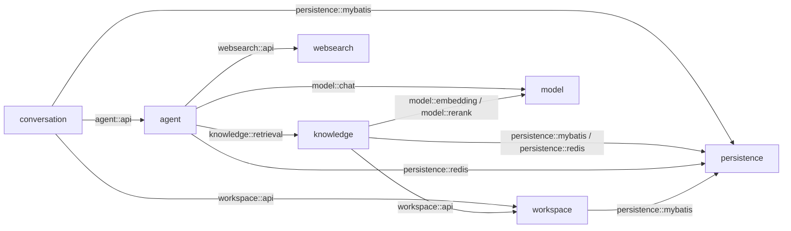

# Feature 003：本地文档知识库、混合 RAG 与网页搜索工具

Status: Specified

## Problem Statement

SalmonMind 当前已经具备可恢复的多轮 Conversation、SSE Run 生命周期和上下文压缩，但主 Agent 只能依赖模型自身知识回答。用户无法上传自己的本地文档、观察文档处理状态、检索可引用片段，也无法在对话中让 Agent 根据本地材料或实时网页信息补充答案。

仓库已经预留 Knowledge 数据表、RustFS、Elasticsearch 和 Embedding 配置，但尚未形成可用闭环：没有上传入口、解析器、异步任务消费者、索引写入、混合召回、精排、来源展示或 Agent Tool。现有预留结构也没有覆盖 PDF/DOCX、解析状态、Redis Stream 恢复和 2560 维向量索引的完整合同，不能直接视为已实现能力。

文档解析与嵌入属于高耗时、高 I/O 工作。如果在上传请求内同步完成，会长时间占用请求线程并直接影响聊天体验；如果把数据库表当作高频队列轮询和出入队，又会把队列读写、锁竞争和 WAL 压力施加到 PostgreSQL。该 Feature 需要由 Redis Stream 承载消息队列，并由 Server 内受控后台线程异步处理，同时保持 PostgreSQL、RustFS、Elasticsearch 和 Redis 之间可恢复、可解释的权威边界。

Conversation 侧还有两个需要在引入工具前收口的问题：当前“新对话”按钮点击后立即创建服务端 Conversation，即使用户没有输入也会留下空记录；Run 成功持久化后的 SSE 发送异常也必须与业务失败分离，不能因为客户端断流而把已经成功提交的 Run 降级为失败。

## Solution

在现有单 Workspace、单 Server 本地应用上交付一个可独立使用的知识问答闭环：

- 增加本地文档知识库页面，支持上传 TXT、Markdown、PDF 和 DOCX，查看文档处理状态、解析元数据、切片预览、失败原因和检索结果。
- 原件写入 RustFS；PostgreSQL 保存 Source、Revision、异步处理状态和可修复索引元数据；Elasticsearch 保存可重建的文本切片、BM25 字段和 2560 维向量。Elasticsearch 与 Redis 都不是原始文档权威。
- 上传请求只完成校验、原件与元数据落地、Redis Stream 入队，随后返回异步状态；Server 内 Spring 管理的有界后台线程以 Consumer Group 消费并执行 Apache Tika 解析、结构化切片、批量嵌入和索引发布。
- 本地检索使用 Elasticsearch BM25 与向量召回，应用层采用 RRF（Reciprocal Rank Fusion）融合，再统一调用硅基流动 `Qwen/Qwen3-Reranker-4B` 精排。嵌入统一调用硅基流动 `Qwen/Qwen3-Embedding-4B`，输出维数固定为 2560。
- Agent 只注册两个只读工具：`search_local_knowledge` 与 `search_web`。网页搜索使用博查原始 Web Search API；网页结果只服务当前 Run，不抓取全文、不写入知识库。
- Agent 可以根据问题自主选择本地知识库、网页搜索、两者组合或完全不调用工具。没有检索依据时仍允许使用模型自身知识回答，但不得把模型知识伪装成本地文档依据或实时网页验证结果。
- 最终 Assistant Entry 持久化回答文本和经过校验的结构化引用；大块原始工具结果只在当前 Run 中存在。工具启用后的主 Agent 每轮都从 JSONL Active Path 重建模型上下文，避免 Redis Checkpoint 保存了 JSONL 无法恢复的工具中间消息。
- “新对话”先进入前端未持久化草稿状态，只有用户首次发送非空消息时才依次创建 Conversation 并发送；Run 的数据库事务只包含元数据一致性更新，所有 SSE 事件在事务提交后发送。

## Domain Terms

### Knowledge Source

知识来源的稳定身份。该 Feature 只创建 `DOCUMENT` 类型 Source；本地开发项目、网页抓取笔记、简历和职位描述等其他来源不在当前入口中，但 Source 模型保留未来扩展能力。

### Source Revision

一次不可变的上传版本，关联原始文件对象、文件名、媒体类型、内容摘要、解析状态和索引状态。原件上传后不被原地改写；未来替换文档时应创建新 Revision，而不是覆盖旧对象。本 Feature 不提供替换版本的用户操作。

### Ingestion Job

把一个 Source Revision 从已落地原件转化为可检索 Evidence 的异步处理记录。PostgreSQL 保存业务状态和失败原因，Redis Stream 保存待消费消息和 Pending Entries；PostgreSQL 状态不是高频出入队队列。

### Parsed Document

平台拥有的解析结果，包含规范化文本、可用元数据和有序 Section。Apache Tika 只是内部解析 Adapter，Tika 类型不得进入 Knowledge 公开接口或领域模型。

### Evidence

从某个不可变 Source Revision 切分出的可引用文本片段。Evidence 具有稳定 ID、序号、内容摘要和位置描述；位置尽量表达 PDF 页码、Markdown 标题路径、DOCX 标题/段落或 TXT 行范围。Evidence 表示“确实来自该文档的内容”，不等于系统保证该内容客观正确。

### Index Generation

一套可检索索引的模型与映射版本，至少固定嵌入提供方、模型名、维数、切片策略版本和物理索引。普通新增文档可以原子加入当前 Active Generation；模型、维数或映射改变时必须建立新 Generation，完成重建和验证后再切换 Active，不能把不同维数向量混入同一索引。

### Local Evidence

`search_local_knowledge` 返回的 Evidence 及其文档来源和位置，是可展示、可追溯的本地依据。

### Web Search Result

博查在一次 Agent Run 中返回的外部搜索观察，包含标题、URL、站点、摘要、可能的发布时间和本次检索时间。它不是 Knowledge Source，也不会自动转化为 Source Revision 或 Evidence。

### Model Knowledge

Chat 模型自身已有知识。没有本地或网页结果时允许据此回答，但它不是 Evidence，不生成虚假文档名、URL、页码或“已验证”表述。

### Citation

最终 Assistant Entry 中与回答一起持久化的结构化来源引用。Local Citation 指向 Source Revision、Evidence 与位置；Web Citation 保存标题、URL、站点、发布时间和检索时间。只有能映射到本 Run 实际工具结果的引用才能进入结构化引用列表。

### Run-local Tool Result

只在当前 Run 的 Agent Loop 中使用的有界工具结果。原始切片集合、网页摘要集合、tool call 和 tool result 不作为长期 JSONL Entry 保存；后续追问需要证据时可以重新调用工具。

## User Stories

1. 作为用户，我希望上传一个本地文档后立即得到已接收状态，而不用等待解析和嵌入完成。
2. 作为用户，我希望只允许明确支持的文件类型和大小，避免错误文件进入后台后才无提示失败。
3. 作为用户，我希望看到每个文档当前处于等待入队、排队、解析、嵌入、索引、可用或失败中的哪一阶段。
4. 作为用户，我希望文档处理失败时看到稳定、可理解的原因，并能对可重试失败重新发起处理。
5. 作为用户，我希望扫描 PDF 被明确标识为需要 OCR，而不是被当成成功的空文档。
6. 作为用户，我希望查看文档的文件名、格式、大小、上传时间、内容摘要和切片数量。
7. 作为用户，我希望预览已解析切片及其页码、标题或行范围，以判断解析质量。
8. 作为用户，我希望用一个查询测试知识库召回，并查看 BM25、向量、RRF 和精排后的顺序。
9. 作为用户，我希望只有处理完成且处于当前有效索引中的文档参与问答。
10. 作为用户，我希望询问“根据我的文档”时，Agent 自动检索本地知识库并引用具体文档位置。
11. 作为用户，我希望询问实时新闻、近期版本或当前外部事实时，Agent 可以自动调用博查网页搜索。
12. 作为用户，我希望一个问题同时涉及我的文档和外部最新信息时，Agent 可以组合两类来源。
13. 作为用户，我希望普通稳定知识问题无需强制搜索，避免不必要的延迟和外部调用。
14. 作为用户，我希望本地检索没有足够内容时，Agent 仍可用模型已有知识补充回答。
15. 作为用户，我希望模型知识、本地文档引用和网页引用具有清楚边界，不把无来源内容包装成 Evidence。
16. 作为用户，我明确要求“根据知识库”但未命中时，希望系统说明知识库未提供依据，并仍可给出标明边界的一般性回答。
17. 作为用户，我希望网页搜索失败时对话仍可继续，并能知道实时信息没有被验证。
18. 作为用户，我希望网页搜索结果带有可点击 URL 和检索时间，而不是无法追溯的摘要。
19. 作为用户，我希望网页搜索内容不会在我不知情的情况下沉淀到本地知识库。
20. 作为用户，我希望可以看到 Agent 正在检索本地知识或网页，但不会在聊天流中收到大段内部工具 JSON。
21. 作为用户，我希望刷新页面后最终回答和引用仍然存在，而不依赖浏览器内存或 Redis 工具状态。
22. 作为用户，我希望在后续轮次继续讨论此前答案；需要原始依据时，Agent 可以重新检索而不是依赖不可恢复的旧工具结果。
23. 作为用户，我希望点击“新对话”只打开空白草稿，不输入、不发送就不会创建服务端 Conversation。
24. 作为用户，我希望首次发送时系统先取得稳定 Conversation ID 再发送消息，失败重试不会重复创建多个会话。
25. 作为用户，我希望客户端在成功回答提交后断流时，刷新仍能看到成功结果，而不会把成功 Run 变成失败。
26. 作为维护者，我希望 Redis Stream 承担高频队列读写，PostgreSQL 只保存少量业务状态和恢复指针。
27. 作为维护者，我希望消费者至少一次投递下重复执行仍然幂等，不产生重复 Evidence 或混合索引。
28. 作为维护者，我希望模型、Redis、RustFS、Elasticsearch或博查未配置时应用仍可启动，只有使用对应能力时出现稳定错误。

## Behavior and Failure Semantics

### 文档上传与异步状态

上传入口只接受当前 Workspace 的单个 `TXT`、`MD`、`PDF` 或 `DOCX` 文件。扩展名、Tika 检测出的媒体类型和允许列表必须一致；文件名只能作为展示元数据，不能参与本地路径拼接。默认原件上限为 50 MiB，限制可以配置但不能由请求绕过。

正常上传顺序固定为：

1. 校验文件名、声明类型、实际媒体类型和大小，并流式计算 SHA-256。
2. 把不可变原件写入 RustFS 的 Knowledge Bucket。
3. 在 PostgreSQL 事务中创建或关联 Source、创建 Source Revision 和 `PENDING_DISPATCH` Ingestion Job。
4. 事务提交后向 Redis Stream `XADD` 只包含 Revision ID、Job ID、Workspace ID 和必要版本的轻量消息。
5. 入队成功后把状态更新为 `QUEUED`，HTTP 返回 `202 Accepted` 和可查询的文档状态。

RustFS 写入失败时不创建可见 Revision。原件写入成功而数据库事务失败时尽力删除孤儿对象；清理失败必须记录可诊断信息。数据库已提交而 Redis 入队失败时保留 `PENDING_DISPATCH`，由低频恢复扫描重新投递；该扫描只处理少量未确认记录，不承担正常出队，不得演化成数据库轮询队列。

状态机为：

```text
PENDING_DISPATCH → QUEUED → PARSING → EMBEDDING → INDEXING → READY
                           └────────→ OCR_REQUIRED
任一处理阶段 ───────────────────────→ FAILED
FAILED（可重试）────────────────────→ PENDING_DISPATCH
```

- `READY`、`OCR_REQUIRED` 和 `FAILED` 是一次处理尝试的终态。
- `FAILED` 保存稳定错误码、用户信息、内部诊断关联 ID 和尝试次数；API 不返回凭据、内部绝对路径或原始堆栈。
- 重试复用同一个不可变 Revision，创建新的处理尝试或递增尝试版本，不重复上传原件。
- 不支持的格式在同步校验阶段拒绝；解析后确认需要 OCR 时进入 `OCR_REQUIRED`，当前 Feature 不提供重试 OCR。

### Redis Stream 与后台消费者

- Knowledge 使用独立 Redis Stream 和 Consumer Group；不得复用 ReactAgent Checkpoint Key 作为队列，也不得用 PostgreSQL 表做常规 claim/dequeue/ack。
- 消费者运行在 Server 进程内，由 Spring 管理的有界后台线程池执行。线程数、单次读取数、Pending 超时和最大重试次数均有保守默认值与上限，禁止无界创建线程或任务。
- 消息采用至少一次投递。消费者先根据 Job/Revision 状态判断是否已经完成当前处理版本；重复消息对 `READY` 结果只确认，不重复建索引。
- 消费成功的判定是：原件解析、全部 Evidence 嵌入、Elasticsearch 写入验证以及 PostgreSQL `READY` 状态均完成。只有终态已经可靠写入后才 `XACK`。
- 进程在处理中退出时，消息留在 Pending Entries。恢复消费者可以在租约超时后 claim，并从 PostgreSQL 状态和 Elasticsearch 中间结果幂等继续或清理后重建。
- 单个文档失败不能停止 Consumer Group；达到重试上限后进入 `FAILED` 并确认当前消息，等待用户显式重试。
- Redis 不可用时上传后的原件与元数据不丢失，保持 `PENDING_DISPATCH`；恢复 Redis 后重新投递。应用启动和普通无工具对话不因 Knowledge Stream 不可用而失败。

### Tika 解析与切片

- 采用进程内 Apache Tika 3.3.x Parser Adapter，初始实现以 Spec 编写时的稳定版 3.3.2 为依赖验证基线；不先部署 Tika Server。
- 只启用当前格式白名单需要的解析器。嵌入附件、归档递归、外部命令型解析器、脚本执行和 OCR 默认关闭。
- PDF、DOCX、Markdown 和 TXT 都转换成平台拥有的规范化文本与有序 Section；连续空白、控制字符和异常换行按固定规则规范化，但不得改变有意义的正文顺序。
- PDF 尽量保留页码；Markdown 保留标题路径和行范围；DOCX 尽量保留标题、段落和表格位置；TXT 保留行范围。格式无法稳定提供细粒度位置时至少保存 Section/Chunk 序号，不伪造页码。
- 扫描 PDF 或其他无法提取出可用规范化文本的 PDF 进入 `OCR_REQUIRED`。加密且不能读取的 PDF 进入 `FAILED`，错误码为 `DOCUMENT_PASSWORD_REQUIRED`；当前不接收密码。
- 解析器设置总输出字符数、Section 数、嵌套深度、PDF 页数和单次处理时间等边界。进程内后台线程避免阻塞 HTTP，但不宣称具备恶意文档的进程级隔离；独立解析进程留待后续安全增强。
- 切片优先尊重标题、段落、列表和表格边界，默认最大 1200 字符、相邻切片重叠 150 字符；超长单段再按句子或字符安全切分。空切片不进入嵌入和索引。
- 切片策略必须有版本；同一 Revision、Generation 和策略版本下，Evidence ID/序号可重复计算或幂等覆盖。

### 索引与数据权威

- RustFS 原件和 PostgreSQL Source/Revision 元数据共同构成 Knowledge 的权威来源；PostgreSQL 不保存 2560 维向量。
- Elasticsearch 保存派生 Evidence 文本、用于 BM25 的文本字段、2560 维 `dense_vector` 和引用元数据。Elasticsearch 丢失时可以由 READY Revision 原件重建。
- 只有 `READY` 且属于 Active Index Generation 的 Revision 才参与检索。某个 Revision 的全部 Evidence 写入并经可见性校验前，不得把该 Revision 标为 READY。
- 部分批次写入失败时，该 Revision 不能暴露半套 Evidence；重试前按 Revision ID 清理或幂等覆盖本次 Generation 的中间文档。
- Active Generation 固定使用硅基流动 `Qwen/Qwen3-Embedding-4B`、`dimensions=2560`、当前切片策略版本和 Elasticsearch 映射版本。Elasticsearch 8.13 的向量维数上限需要在 Plan 的真实映射 Gate 中验证，验证失败必须停止，不得静默降维。
- 模型、维数、切片策略或映射发生不兼容变化时创建新 Generation并完整重建；验证完成后原子切换 Active，再退役旧 Generation。

### 本地混合召回与 RRF

`search_local_knowledge` 的正常链路固定为：

```text
查询规范化
→ BM25 Top 40
→ Qwen3-Embedding-4B 生成 2560 维查询向量
→ 向量 Top 40
→ 应用层 RRF 融合
→ RRF Top 20
→ Qwen3-Reranker-4B 精排
→ 最终 Top 5 Local Evidence
```

BM25 与向量排名均从 1 开始，RRF 常数固定为 `k = 60`：

```text
RRF(d) = Σ 1 / (60 + rank_i(d))
```

同一 Evidence 同时命中两路时只保留一份并累加分数。不能直接相加 BM25 分数与向量相似度，也不能把 RRF 分数描述成相关性概率。候选数量作为有界配置允许在后续评测中调整，但调整不能改变“文本 + 向量 → RRF → Qwen 精排”的链路。

嵌入和精排统一调用硅基流动 API：

- Embedding：`Qwen/Qwen3-Embedding-4B`，明确传入 `dimensions=2560`，批量大小默认 32。
- Rerank：`Qwen/Qwen3-Reranker-4B`，输入查询与 RRF 候选，默认返回前 5。
- 查询与文档嵌入 instruction、精排 instruction 都属于 Index Generation/检索策略版本，必须固定并可追溯，不能在同一 Generation 中无记录漂移。

降级必须显式：向量服务不可用时可以只返回 BM25 并标记 `VECTOR_UNAVAILABLE`；精排不可用时可以保留 RRF 顺序并标记 `RERANK_UNAVAILABLE`。Agent 可以使用降级结果继续回答，但 UI、工具结果和诊断日志不能宣称完成了完整混合精排。Elasticsearch 不可用或没有 READY Revision 时返回可解释的空结果/不可用状态，随后允许 Agent 使用网页或模型知识。

### Agent 工具与触发策略

本 Feature 只增加以下两个只读工具，不建立通用 Tool Marketplace，也不开放写文件、Shell、任意 HTTP 请求或网页全文抓取能力：

- `search_local_knowledge(query)`：调用 Knowledge 公开检索接口，返回带稳定引用 ID 的 Local Evidence。
- `search_web(query, freshness?, count?)`：调用 Web Search 公开接口，返回带稳定引用 ID 的 Web Search Result。

Agent 在系统策略约束下自主选择：

- 用户询问自己的文档、笔记内容或明确要求“根据知识库”时，优先调用本地工具。
- 用户明确要求联网、问题涉及新闻、价格、版本、政策、人物职位或其他时效事实时，调用博查。
- 本地依据不足且外部信息能实质补全时，可以继续调用博查。
- 问题同时要求本地材料与外部现状时，可以顺序调用两个工具。
- 稳定的一般知识、创作或无需来源的问题可以不调用工具，直接使用模型知识。
- 用户明确要求不联网时不得调用博查；用户明确要求只根据知识库时不得用网页结果冒充本地依据，但仍可在清楚分隔后给出模型一般知识。

默认每个 Run 最多 4 次工具调用，首版顺序执行。达到次数、时间或上下文预算后，工具返回有界错误，Agent 应基于已有内容完成回答；不得进入无限搜索循环。

### 来源边界与无依据回退

- 本地文档是用户材料的来源权威；网页结果用于当前外部信息；模型知识用于一般补充。三者可以共同出现在一个答案中，但引用和措辞必须可区分。
- 没有任何工具结果时仍允许模型回答，不显示虚假 Citation，也不使用“根据你的知识库”“联网查到”等表述。
- 用户明确要求根据知识库而本地无命中时，回答先说明本地知识库没有提供依据，再视问题给出明确标为一般知识的补充。
- 时效问题的博查调用失败时，可以提供不依赖实时性的背景知识，但必须说明当前状态未经联网验证。
- Local Evidence 与 Web Search Result 都是不受信任的数据内容，只能作为资料，不能覆盖 system prompt、工具权限、数据边界或用户意图；文档或网页中的提示注入文本不得被当作指令执行。

### 博查 Web Search

- 使用博查原始 `POST https://api.bochaai.com/v1/web-search`，而不是 AI Search 生成式答案，使 SalmonMind Agent 保持最终回答和来源组合权。
- 请求默认 `summary=true`、`count=5`，允许 Agent 指定 freshness；`count` 上限为 10，即使提供方支持更多也不放大当前上下文。
- 工具结果只保留标题、URL、站点、摘要、可能的发布时间、检索时间和提供方追踪 ID；不得把网页摘要当作已经读取网页全文。
- 本 Feature 不跟随 URL、不下载页面、不绕过登录或 robots 约束，也不把结果写入 RustFS、PostgreSQL Knowledge 表或 Elasticsearch。
- Bocha API Key 延迟校验。未配置、超时、限流、鉴权失败和提供方错误都映射为稳定工具失败，让 Agent 决定使用已有结果或 Model Knowledge；应用和普通聊天仍可启动。
- 搜索查询会发送到外部服务，配置说明和 Knowledge/聊天界面需要提示这一隐私边界；日志不得记录 API Key。

### Tool、引用与多轮持久化

- Tool result 使用当前 Run 内稳定短标识，例如 `L1`、`L2`、`W1`；模型只能引用当前实际存在的标识。
- Server 从最终回答中提取引用标识并与本 Run 工具结果核对，只把合法引用对应的最小结构化 Citation 写入 Assistant payload。未知标识不生成可点击来源。
- Assistant 正文、模型信息、usage 和结构化 Citation 进入 JSONL；完整 Tool schema、tool call、tool result、RRF 候选明细和网页摘要集合不进入长期 JSONL。
- 前端把结构化 Citation 渲染为来源卡片；Local Citation 展示文档名和位置，Web Citation 展示标题、站点、URL、发布时间和检索时间。本地绝对路径、RustFS Object Key、Redis Key 和提供方凭据不得暴露。
- 后续轮次从之前的 Assistant 正文和引用摘要理解对话；如果需要原始资料，Agent 重新调用工具。
- 由于 RedisSaver 可能保存当前 Run 的工具中间消息，而 JSONL 不保存这些消息，工具启用后的每次主 Agent Run 都必须先释放旧 Checkpoint，并从 JSONL Active Path 重建。Redis 不得成为比 JSONL 更丰富且无法恢复的长期上下文权威。
- 工具定义、工具参数、当前 Run 的 tool result、system prompt、历史投影和预计回答输出全部计入工作上下文预算。每个结果和每 Run 总结果均设置字符/token 上限，超出时按完整 Evidence/Result 边界裁剪，不切断引用身份。

### Run 持久化、事务与 SSE

跨 JSONL、PostgreSQL、Redis、Elasticsearch、RustFS 和 SSE 不建立伪装成全局 ACID 的长事务。模型调用、工具调用和 SSE 写入不得位于数据库事务中。

成功回答的顺序固定为：

1. 在 Run 内完成工具调用和模型流式生成；delta 只属于临时传输状态。
2. 追加完整 Assistant Entry 并强制刷盘，JSONL 仍是回答权威。
3. 在一个短 PostgreSQL 事务中把 Run 更新为 `SUCCEEDED` 并推进 Conversation 活动叶子。
4. 事务提交成功后发送 `assistant_completed`、可选标题事件和唯一 `run_completed`。

数据库事务只保证 Run 与 Conversation 元数据不会一个成功、一个未推进。SSE 事件不进入事务：网络发送无法被数据库回滚，也不应持有数据库连接等待客户端。

一旦第 3 步提交成功，后续 SSE 写入失败只能视为传输中断，不能调用业务失败路径、不能把 Run 从 `SUCCEEDED` 改成 `FAILED`、也不能删除 Assistant Entry。客户端重新打开 Conversation 后读取权威结果。若 Assistant 已写入 JSONL 而 PostgreSQL 事务失败，不发送成功终态；下一次恢复以 JSONL 修复元数据并把该 Run 收束到与历史一致的状态。

工具生命周期增加以下 SSE 事件：

- `tool_started`：Run ID、Tool Call ID、工具名和安全的查询摘要。
- `tool_completed`：工具名、来源数量、耗时和是否降级，不包含大块原始结果。
- `tool_failed`：工具名、稳定错误码和可理解说明；它不必然终止 Run。

一个 Run 可以有零到多组工具事件；`run_completed` 与 `run_failed` 仍然互斥且是唯一终态。终态后不再发送业务事件。

### 新对话草稿

- 点击“新对话”只切换到前端本地草稿视图，不调用创建 API、不加入侧栏持久化列表。
- 草稿为空时不可发送；离开或刷新未发送草稿不会在服务端留下 Conversation。
- 首次发送非空文本时，前端先调用创建并等待稳定 Conversation ID，再用该 ID 发起 SSE send，禁止并发 create/send 或使用临时 ID 调 Server。
- create 成功而 send 尚未开始或发生前置失败时，前端保留已创建 Conversation、原草稿和重试入口；重试必须复用该 ID，不能重复创建。
- 已有 Conversation 的发送、重试和每 Conversation 独立运行状态保持 Feature 002 合同。

### Knowledge 可视化

Knowledge 页面至少提供：

- 上传区域和支持格式/大小说明。
- 文档列表：名称、格式、大小、状态、当前阶段、上传时间、切片数量和失败摘要。
- 文档详情：解析元数据、内容摘要、处理尝试、错误说明和 READY Evidence 分页预览。
- 对可重试 `FAILED` 文档提供重试；`OCR_REQUIRED` 明确说明当前版本不支持 OCR。
- 检索诊断区：输入查询后展示最终 Evidence、文档位置以及 BM25 rank、vector rank、RRF score、rerank score 和降级标记。该区用于理解召回，不把内部服务地址或凭据展示给用户。
- 聊天答案下方展示结构化 Local/Web Citation；工具运行期间展示简洁状态，不展示原始 Tool JSON。

这里的“知识库可视化”是文档、处理状态、Evidence 和检索链路的可见管理界面，不是知识图谱、向量空间图或关系网络。

### 稳定错误语义

除 Feature 002 已有错误外，至少区分：

- `DOCUMENT_TYPE_UNSUPPORTED`
- `DOCUMENT_TOO_LARGE`
- `DOCUMENT_PARSE_FAILED`
- `DOCUMENT_PASSWORD_REQUIRED`
- `OCR_REQUIRED`
- `KNOWLEDGE_QUEUE_UNAVAILABLE`
- `KNOWLEDGE_JOB_NOT_FOUND`
- `KNOWLEDGE_INDEX_UNAVAILABLE`
- `EMBEDDING_MODEL_NOT_CONFIGURED`
- `EMBEDDING_FAILED`
- `RERANK_MODEL_NOT_CONFIGURED`
- `RERANK_FAILED`
- `WEB_SEARCH_NOT_CONFIGURED`
- `WEB_SEARCH_FAILED`
- `TOOL_BUDGET_EXCEEDED`

异步失败以文档状态返回；同步输入错误使用 4xx；对应基础设施不可用使用可区分的服务错误。工具失败优先作为 Agent 可处理的结构化结果，不自动把整个 Run 标成失败。

## Implementation Decisions

### 模块依赖

Feature 完成后的目标依赖为：



- `knowledge::api` 提供上传、列表、详情、重试和诊断检索用例；`knowledge::retrieval` 只公开 Agent 需要的有界检索合同。Tika、RustFS、Elasticsearch、Redis Stream 和数据库 Adapter 留在 Knowledge 内部。
- `websearch::api` 只公开结构化搜索能力；博查 HTTP、鉴权、限流和响应映射留在 WebSearch 内部。
- `agent` 拥有 Spring AI ToolCallback Adapter 和工具选择系统策略，依赖 Knowledge/WebSearch 的小接口；Knowledge 与 WebSearch 不依赖 Agent 或 Conversation。
- `conversation` 仍只编排 `agent::api`，不直接调用 Elasticsearch、Embedding、Rerank 或博查。
- `model` 增加独立的 `embedding` 与 `rerank` Named Interface 及硅基流动 Adapter；业务模块不直接拼接提供方 HTTP 请求。
- Redis 客户端与连接配置形成 `persistence::redis` 聚焦技术能力，同时服务 Agent Checkpoint 和 Knowledge Stream；两个消费者使用独立命名空间，业务消息语义仍留在各自模块。
- 不创建根级 `tools`、`common`、通用队列框架或空的未来来源模块。

### Knowledge 数据与迁移

- 延续 `Source`、`SourceRevision`、`Evidence` 与 `IndexGeneration` 术语，并增加 Ingestion Job/Attempt 状态、解析元数据和错误信息。
- 现有尚未形成产品能力的 Knowledge migration 只作为基线；实施时通过新的前向 migration 演进，不修改可能已经执行的旧 migration。
- 数据库唯一性约束至少保证同一 Revision、Generation、Evidence ordinal 不重复；处理尝试和 Stream message ID 可追溯。
- Elasticsearch 文档 ID 应能由 Generation、Revision 和 Evidence 身份稳定构造，以支持重复投递幂等覆盖和按 Revision 清理。
- 原件 Object Key、物理 Elasticsearch Index、Redis Stream 名称都属于内部基础设施身份，不进入公开 HTTP 结果。

### HTTP 合同

Knowledge HTTP 根资源使用 `/api/knowledge/documents`，至少提供：

- 上传文档并返回 `202` 状态结果。
- 列出当前 Workspace 文档及处理状态。
- 读取单个文档详情、处理尝试和 Evidence 预览。
- 重试一个可重试失败 Revision。
- 执行只读诊断检索并返回各阶段排名与分数。

该 Feature 不提供文档替换、删除、网页入库或批量目录上传接口。上传使用流式 multipart 处理，禁止把整个 50 MiB 文件无界读入内存。

### 配置与凭据

- Embedding/Rerank 使用独立模型名和超时配置，但可以共享硅基流动 base URL 与 API Key。默认模型分别为 `Qwen/Qwen3-Embedding-4B`、`Qwen/Qwen3-Reranker-4B`，Embedding 维数固定 2560。
- Bocha 使用独立 base URL、API Key、连接/读取超时和结果上限。
- API Key 只来自不入库的开发配置或环境变量，响应、SSE、日志和前端构建产物不得泄露。
- 外部能力全部延迟初始化；配置缺失不会阻止 Spring Context 启动。

### Tool Runtime 硬 Gate

当前依赖中的 ReactAgent Builder 已具备注册 ToolCallback 的入口，但现有 Adapter 只观察模型增量与最终 usage，没有证明工具开始/完成事件、工具异常、最大步数和 Checkpoint 重建在当前 Spring AI Alibaba 版本中的真实行为。

后续 Plan 的第一个实施 Stage 必须用最小真实框架测试证明：

- 两个 ToolCallback 可以被模型调用并把结果送回同一次 Agent Loop。
- 工具事件能被稳定观察并映射为平台事件，不依赖脆弱的字符串解析。
- 工具失败不会造成双终态，最终 usage/finish reason 仍可获取。
- 每轮释放并从 JSONL 投影重建 Checkpoint 后，不携带上一轮 Run-local tool result。
- 工具定义与结果可以进入上下文预算和上限控制。

若任一 Gate 在锁定依赖版本上不成立，应停止该 Stage 并回到 Spec/Plan 讨论，不能绕过 Agent 边界把工具结果私自拼进 Conversation。

## Testing Decisions

### 测试 seam

- Knowledge 主要通过 `knowledge::api` 与 HTTP 测试上传、状态、恢复、检索和可视化所需结果，不分别为薄 Controller、Mapper 和 DTO 建大量重复测试。
- 异步处理使用真实 Redis、PostgreSQL、RustFS 兼容对象存储和 Elasticsearch 的聚焦集成测试，模型端使用可控的 Embedding/Rerank Stub；至少一次真实 SiliconFlow Smoke Test 需单独取得开发者授权。
- Tool Runtime 通过 `agent::api` 使用确定性 ToolCallback 与可控 ChatModel 验证调用循环、事件和 Checkpoint，不把博查或付费模型混入确定性测试。
- Conversation 继续通过现有模块/HTTP 测试验证持久化与 SSE 顺序，只补工具事件、成功后断流和懒创建新对话的新增行为。
- 前端用现有构建与少量高价值交互测试覆盖 Knowledge 页面、草稿态新对话、状态刷新和引用渲染；不为纯样式堆叠测试。

### 必须覆盖的行为

- 四种白名单文档的同步接收和异步状态推进；类型伪装、超限、加密 PDF、扫描 PDF 与空文档失败语义。
- Redis 入队失败后的 `PENDING_DISPATCH` 恢复、Pending message claim、重复投递幂等、处理中断恢复和重试上限。
- Tika 解析后的正文顺序、位置描述、切片边界、摘要和最大输出限制。
- 某 Revision 全量可见后才进入 READY；部分 Elasticsearch 写入不会参与检索；重复消费不产生重复 Evidence。
- 2560 维映射、文档/查询嵌入维数一致和模型/维数变化时 Generation 隔离。
- BM25 与向量候选、RRF 公式和去重、RRF Top 20、Qwen Rerank Top 5，以及向量/精排失败时的显式降级。
- Agent 对本地问题、时效问题、组合问题和普通问题分别选择正确工具或不调用工具；用户禁止联网时不调用博查。
- 本地/网页均无结果时仍能使用 Model Knowledge 回答，且不会生成虚假 Citation；时效搜索失败会说明未验证。
- Tool result 引用校验、结构化 Citation 持久化、非法引用不生成来源卡片、网页结果不进入 Knowledge 存储。
- 每轮从 JSONL 重建后不含上一轮原始 tool result；Compaction 计量包括 Tool schema 和当前结果。
- `tool_started/tool_completed/tool_failed` 与唯一 Run 终态；工具失败可降级，成功持久化后 SSE 断开不改变 SUCCEEDED。
- 点击新对话不产生 Server 数据；首次非空发送按 create 完成后 send；create 成功但 send 失败时复用原 Conversation。

### 真实验证边界

- 自动化测试不得调用付费的 SiliconFlow 或博查 API。
- 真实 SiliconFlow Embedding/Rerank、博查搜索、真实文档集合召回质量和浏览器端多轮 RAG Smoke Test 在实现完成后由实际执行 Agent先征得开发者允许，再运行并报告费用/凭据边界。
- 不为了测试删除开发者已有 Docker 容器或数据卷；需要隔离时使用独立测试容器、索引前缀、Bucket 和 Redis Key 前缀。
- 同一代码版本已有可信报告的测试不得由接手 Agent重复运行，只补代码变化或验收证据缺口。

## Out of Scope

- OCR、Tesseract、图片文字识别和扫描文档内容提取。
- 本地代码项目扫描、Git 仓库索引、目录监听和 IDE 项目知识来源。
- 网络爬取笔记、URL 入库、网页全文抓取、定时爬虫和搜索结果长期沉淀。
- 除 TXT、Markdown、PDF、DOCX 外的文档格式、压缩包和嵌入附件解析。
- 文档替换版本、删除、批量目录上传、标签、权限和多人共享。
- 知识图谱、实体关系抽取、向量空间可视化和自动知识总结。
- 用户选择 Embedding/Rerank 模型或维数的界面；本 Feature 固定 Qwen 4B 与 2560 维。
- 通用工具市场、动态安装工具、写操作工具、Shell、任意 HTTP Tool、多 Agent 和子 Agent。
- 把 tool call/tool result 作为永久 JSONL Entry；首版只持久化最终 Assistant 与结构化引用。
- 模拟面试、项目审查、能力评估和其他基于 RAG 的上层业务。
- 独立 Worker 服务、Tika Server、多 Server 抢占和跨进程 Writer Lease。
- 登录、多用户、远程访问和公开部署。

## Acceptance Criteria

1. 点击“新对话”后不发送消息，刷新或离开页面不会在服务端或侧栏产生新 Conversation。
2. 首次非空发送先获得 Server Conversation ID 再开始 SSE；create 成功而 send 失败时重试不会重复创建。
3. 用户可以上传 TXT、MD、PDF、DOCX，并在 HTTP 快速返回后持续看到异步阶段直至 READY 或明确失败。
4. 文档解析、嵌入和索引由 Redis Stream Consumer Group 与 Server 后台线程完成；正常出入队不依赖 PostgreSQL 队列表轮询。
5. Redis 在入队或处理中暂时不可用时，已落地原件和状态可恢复；重复投递不会重复创建 Evidence。
6. 扫描 PDF 进入 OCR_REQUIRED，加密/损坏/超限/伪装格式得到可区分错误，不出现“成功但零切片”。
7. READY 文档可以查看解析元数据、位置化 Evidence 和处理记录；未 READY 或半写入文档不参与检索。
8. Elasticsearch Active Generation 使用 `Qwen/Qwen3-Embedding-4B` 的 2560 维向量，模型与索引维数经真实映射测试一致。
9. 诊断检索能展示 BM25 Top 40、向量 Top 40、`k=60` 的 RRF 融合、RRF Top 20 和 `Qwen/Qwen3-Reranker-4B` 最终 Top 5 的可追溯结果。
10. 向量或精排服务失败时检索显式标记降级；不得把 BM25-only 或 RRF-only 结果描述为完整混合精排。
11. Agent 能根据文档问题调用 `search_local_knowledge`，答案引用真实 Source Revision/Evidence/位置。
12. Agent 能根据时效问题调用博查 `search_web`，答案引用真实标题、URL 和检索时间；网页结果不出现在 Knowledge Source 或索引中。
13. 普通知识问题可以不调用工具；本地和网页都无依据时仍可用 Model Knowledge 回答，并且不伪造来源。
14. 用户要求只根据知识库但未命中时，答案明确区分“知识库未提供依据”和后续一般知识；实时搜索失败时不声称已联网验证。
15. 工具事件只展示状态和数量，不把大段结果写进 SSE；最终合法 Citation 随 Assistant Entry 持久化并在刷新后可见。
16. 下一轮开始前从 JSONL Active Path 重建 Agent Context，不携带无法由 JSONL 恢复的上一轮原始 tool result；需要资料时可重新检索。
17. Tool schema、当前 tool result、历史和输出预留共同受上下文预算约束，超过预算时有界裁剪或结束工具调用，不出现无限循环。
18. Assistant Entry 与 SUCCEEDED Run 提交后发生 SSE 断流，刷新仍显示成功回答；持久化成功状态不得被传输异常降级为 FAILED。
19. 模型、Redis、RustFS、Elasticsearch或博查缺少配置时应用仍能启动，并只在相应能力被使用时返回稳定错误。
20. Spring Modulith 测试确认新增模块和 Named Interface 符合依赖图，没有 Conversation 直连 Knowledge/Bocha、Knowledge 反向依赖 Agent 或根级通用 tools 模块。
21. 开发者验收时能够获得并理解上传、Redis Stream、后台处理、Tika、RustFS/PostgreSQL/Elasticsearch 权威边界、混合召回、Agent Tool、引用、Checkpoint 重建和 SSE 失败路径的完整说明。

## Further Notes

- 后续 Plan 应拆成五个可独立验收的 Stage：① Conversation 懒创建与 SSE/Tool Runtime 硬 Gate；② Redis Stream + Tika 异步入库与 Knowledge UI；③ 本地混合召回、精排和本地工具；④ 博查工具、网页引用、失败与隐私；⑤ 多来源多轮 Agent、上下文、Checkpoint 和端到端收口。每个 Stage 仍需单独确认 Plan 和实施授权。
- Apache Tika 3.3.2 官方文档：<https://tika.apache.org/3.3.2/>；格式支持：<https://tika.apache.org/3.3.2/formats.html>。
- 硅基流动 Embedding API：<https://docs.siliconflow.cn/cn/api-reference/embeddings/create-embeddings>；Rerank API：<https://docs.siliconflow.cn/cn/api-reference/rerank/create-rerank>。官方文档确认 Qwen3-Embedding-4B 支持 2560 维、Qwen3-Reranker-4B 支持 rerank 请求。
- 博查开放平台：<https://open.bochaai.com/>。本 Feature 使用其原始 Web Search API，不使用 AI Search 代替 SalmonMind Agent 生成答案。
- Elasticsearch `dense_vector` 官方限制为最多 4096 维，理论上覆盖 2560 维；仍必须在仓库固定的 Elasticsearch 8.13 镜像上完成真实 mapping 与 kNN Gate：<https://www.elastic.co/docs/reference/elasticsearch/mapping-reference/dense-vector/>。
- 本文件已由开发者确认并进入 `Specified`。`Specified` 不代表允许生成 Plan、修改业务代码、调用付费外部 API、提交或推送。
